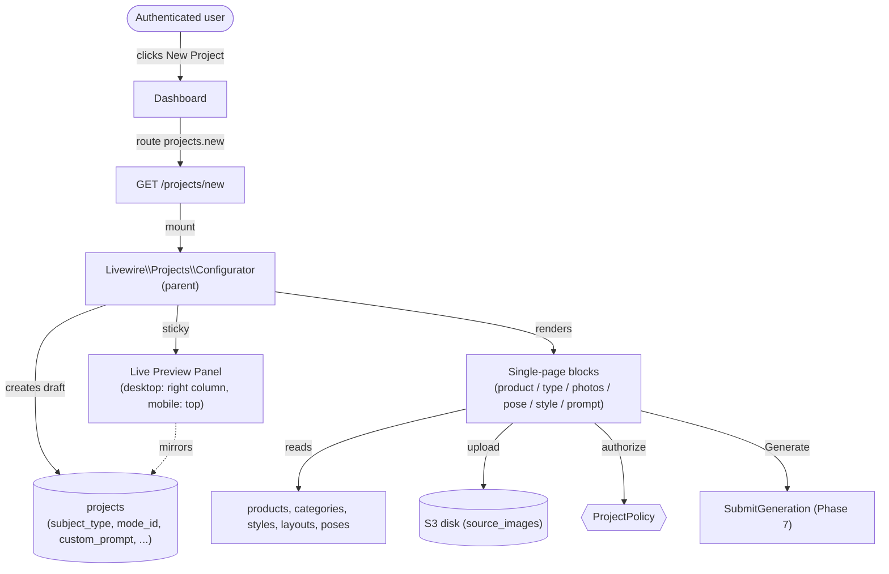

# SPEC: project-wizard-v2 (single-page configurator)

<!-- inputs: project-wizard/SPEC.md project-phases.md user-stories.md database-schema.md design/tokens.md design/screens.md design/components.md kindrad-canvas/AGENTS.md -->

## Overview

The current `project-wizard` (Phase 6, 7 steps with sticky footer, progress bar, and per-step navigation) is being **replaced** by a **single-page configurator** that exposes all input blocks on one scroll, inspired by Midjourney / Ideogram / ChatGPT Images. The user never feels they are filling a form: every block is a visual card-based selector, the right side (desktop) or top (mobile) shows a sticky live preview, and the `Generate` button is the only CTA at the bottom.

The configurator keeps the **same output contract** as the current wizard: a single `projects` row is created on mount, incrementally updated as the user makes selections, and passed to the existing Phase 7 generation pipeline (`SubmitGeneration` + `GenerateArtworkJob` + `PromptAssembler`) without any change to the generation subsystem. What changes is **how** the user reaches that row: instead of 7 steps, one scroll with progressive disclosure driven by selections.

This SPEC scopes the **configurator UI + state model + schema delta only**. It does **not** re-define generation rules (Phase 7), authorization rules (Phase 2.5), credit rules (Phase 4.1/4.2), or admin CRUD (Phase 5). Those subsystems are consumed as-is.

The primary users are authenticated end users creating a single draft project in under a minute. The configurator is the single entry point for new personalization projects in v2.

## Decisions (user-approved, 2026-07-14)

| Decision | Choice | Rationale |
|---|---|---|
| Initial product catalog | **Mug + Free Art** only | Smaller scope; T-shirt/quadro deferred to Phase 9.3 per `project-phases.md` |
| Product selection UI | Cards with image + label (not radio) | Matches Midjourney/Ideogram visual language; per user request |
| Poses (couple/family only) | 8 fixed rows in new `poses` table | Pre-curated set; admin CRUD in 5.2-5.8 later |
| Art styles | 8 fixed rows in existing `styles` table | Reuse existing styles table; admin manages content |
| Subject types | enum Pessoa / Casal / Família / Pet / Outra on `projects.subject_type` | New column; replaces 4-tuple-driven `category` lookup for subject |
| Single vs paired photos | derived from `subject_type` (Pessoa/Pet/Outra = 1 slot; Casal/Família = 2 slots) | Simpler than separate toggle |
| Multi-photo storage | **third table `project_photos`** (pivot) | Forward-compat: 1-N photos, reorder via `position`, FK constraints; not JSON or 2 FK columns |
| Category block | **kept, required** | Captures *occasion* (birthday/wedding/pets) distinct from *composition* (subject type); needed for 4-tuple `PromptTemplate` lookup |
| Free-form prompt | new `projects.custom_prompt` (text, max 500) | User can override the auto-built prompt |
| Live preview side | desktop: sticky `<aside>` right column; mobile: top accordion | "Topo da página" per user |
| Generate button | sticky footer (always visible) | Same pattern as current wizard |
| Empty states / dropzones | all drag-and-drop cards, not separate upload screens | Per user mockup |
| One-page scroll vs stepper | **one-page scroll, no stepper** | Per user mockup; progress shown in preview panel |

## Context

### Bounded Contexts Touched

- **Identity & Credits** (read-only): `users.credit_balance` drives `Generate` enable state. No ledger writes here.
- **Personalization Catalog** (read-only): `products`, `categories`, `styles`, `layouts`, `category_styles`, `style_layouts`, new `poses` table. The configurator never mutates catalog entities.
- **Project Lifecycle** (read+write): single `projects` row created on mount; incrementally updated; `source_images` inserted on upload; `credit_transactions` NOT touched here (Phase 7.3).
- **Object Storage**: source-image uploads land on the `s3` disk under user-scoped keys (unchanged from current wizard).
- **Authorization**: every action method still invokes `ProjectPolicy` via `Gate::authorize` or `authorize('...', $project)` (unchanged).
- **Generation pipeline** (Phase 7): `PromptAssembler` extended with new placeholders (`{{custom_prompt}}`, `{{pose}}`); otherwise consumed as-is.

### Architecture Reference

- `php artisan make:livewire` for new components; `--class` flag to stay consistent with current wizard.
- Server-side state; never trust client.
- Pest feature tests in `tests/Feature/Projects/`.
- No inline comments unless asked.
- Flux components where applicable; custom Blade components for new card patterns.

### AS IS — Current state

The current `project-wizard` (Phase 6, 33/33 tasks `[x]` per `.spec/features/project-wizard/PHASES.md`) is a 7-step Livewire flow:
- 1 parent `App\Livewire\Projects\Wizard`
- 7 step children under `App\Livewire\Projects\Wizard\Steps\`
- Wizard-only layout `components/layouts/wizard.blade.php` (topbar + progress + sticky footer)
- 7/7 step components, 17 feature tests passing (228/229 total)

Generation pipeline (Phase 7.1–7.3) is functional and unchanged. Schema (`projects` + 6 FKs) is stable. Authorization (`ProjectPolicy`) is enforced on every action.

### TO BE — Proposed state

A single Livewire page at `GET /projects/new` that renders all input blocks on one scroll. Same `projects` row is created and incrementally updated. Same Phase 7 handoff.



_Caption: One page, one Livewire parent (`Configurator`), all blocks render together, live preview mirrors the in-progress `projects` row in real time._

## Schema delta

| Table | Change | Why |
|---|---|---|
| `products` | INSERT row `slug='free_art'` | Second product per user decision |
| `poses` | CREATE TABLE (new) | Curated pose list for Casal/Família flows |
| `pose_statuses` | CREATE TABLE (lookup) | `active` / `inactive` rows |
| `project_photos` | CREATE TABLE (new pivot) | 1-N photos per project with `position` for ordering; FK constraints |
| `project_statuses` | unchanged |  |
| `projects` | ADD COLUMN `subject_type` (enum: pessoa, casal, familia, pet, outra, nullable) | Replaces category lookup for subject selection |
| `projects` | ADD COLUMN `custom_prompt` (text, nullable, max 500) | Free-form user override |
| `projects` | ADD COLUMN `pose_id` (FK poses, nullable) | For Casal/Família |
| `projects` | DROP COLUMN `source_image_id` | Replaced by 1-N rows in `project_photos` |
| `projects` | ADD COLUMN `product_id` was already FK | Already present, no change |
| `category_styles`, `style_layouts` | unchanged | Pivots still drive catalog filters |
| `source_images` | unchanged | Still 1-N rows per project (linked via `project_photos`) |

`projects.mode_id` and the existing 4-tuple (product/category/style/layout) remain. The new columns are **additive**; the wizard's existing REQ-01 through REQ-08 acceptance criteria are preserved (the configurator writes the same fields; it just exposes them differently).

### `poses` table

```sql
CREATE TABLE poses (
  id          BIGSERIAL PRIMARY KEY,
  slug        VARCHAR(64) UNIQUE NOT NULL,    -- e.g. 'abracados', 'beijo', 'sentados'
  name        VARCHAR(128) NOT NULL,           -- human label
  thumbnail_path VARCHAR(255) NULL,           -- preview image
  status_id   BIGINT REFERENCES pose_statuses(id),
  sort_order  INT DEFAULT 0,
  created_at  TIMESTAMP,
  updated_at  TIMESTAMP
);
```

8 seed rows: `abracados`, `beijo`, `sentados`, `caminhando`, `natal`, `praia`, `sofa`, `flores`. New lookup table `pose_statuses` with rows `active` / `inactive`.

### `project_photos` table (pivot)

```sql
CREATE TABLE project_photos (
  id              BIGSERIAL PRIMARY KEY,
  project_id      BIGINT NOT NULL REFERENCES projects(id) ON DELETE CASCADE,
  source_image_id BIGINT NOT NULL REFERENCES source_images(id) ON DELETE CASCADE,
  position        INT NOT NULL DEFAULT 0,  -- 0=primary, 1=secondary, etc.
  created_at      TIMESTAMP,
  updated_at      TIMESTAMP,
  UNIQUE (project_id, source_image_id),
  UNIQUE (project_id, position)
);
```

Photos live in this table instead of as FK columns on `projects` so the count scales beyond 2 (Família could have 5+). The `position` column allows drag-to-reorder in a future phase. Cascade delete from `projects` keeps the DB clean.

## RIGID (Non-Negotiable)

### Functional Requirements

- **REQ-01:** `GET /projects/new` creates exactly one `projects` row owned by `auth()->id()` with `status_id=draft`, on mount. Same REQ as current wizard.
- **REQ-02:** The configurator exposes a **Product block** as 2 cards (Mug, Free Art). The product selection writes `projects.product_id` and re-evaluates the visibility of subsequent blocks.
- **REQ-03:** The configurator exposes a **Subject Type block** as 5 cards (Pessoa, Casal, Família, Pet, Outra). The selection writes `projects.subject_type` and toggles the Photos block between 1-slot and 2-slot mode.
- **REQ-04:** The **Photos block** has 1 or 2 drag-and-drop slots, derived from `subject_type`. Each slot accepts jpeg/png/webp ≤ 10 MiB, uploads to S3 with user-scoped key, creates one `source_images` row, and inserts a `project_photos` row linking the project to the source image with `position = 0` (first) or `1` (second). For `subject_type ∈ {casal, familia}`, both slots are required (no generate button until both are filled).
- **REQ-05:** When `subject_type` ∈ {`casal`, `familia`}, the configurator exposes a **Pose block** as 8 cards (the 8 `poses` rows). The selection writes `projects.pose_id`. For other subject types, the Pose block is hidden.
- **REQ-06:** The **Style block** is always visible and renders as 8 cards (existing `styles` rows). The selection writes `projects.style_id`.
- **REQ-07:** The **Free-Form Prompt block** is always visible and renders a `<flux:textarea>` with `maxlength=500`. The value is persisted to `projects.custom_prompt` on every blur. The block is labeled "Optional" with helper text "Describe anything we should add — colors, mood, objects, scene."
- **REQ-08:** A live **Preview Panel** (sticky `<aside>` on desktop, top accordion on mobile) renders the current selections read-only with check_circle badges. As the user makes a selection, the corresponding row in the preview updates within the same Livewire request.
- **REQ-09:** The `Generate` button is at the bottom of the page, always visible (sticky footer or in-flow button — see OQ-4). It is `disabled` (with tooltip `You're out of credits`) when `auth()->user()->credit_balance == 0`. Clicking it calls the existing `SubmitGeneration` and redirects to `projects.show`.
- **REQ-10:** All write actions (selecting product/type/style/pose, uploading photo, generating) are authorized via `ProjectPolicy` on the current draft `projects` row. Same REQ as current wizard.
- **REQ-11:** The configurator is reachable only by authenticated users. Guests are redirected to `login`. Same as current.
- **REQ-12:** The configurator preserves the **first_generated_at** mode-locking rule from the current wizard (REQ-11): once a `Project.first_generated_at` is set, the Product, Subject Type, Photos, Pose, and Style blocks are read-only. Only `custom_prompt` remains editable (re-generate).
- **REQ-13:** All selections are recoverable on reload (no client-only state). Reloading `/projects/new?id={n}` rehydrates the configurator from the `projects` row.
- **REQ-14:** The configurator never mutates the catalog (products, categories, styles, layouts, poses) — it only reads.

### UI Requirements

- **REQ-U1:** The configurator uses the **app layout** (with the existing user sidebar) — NOT a wizard-only layout. Sidebar visible, no special topbar.
  - _Rationale:_ One-page flow fits in the main canvas; removing the sidebar was a wizard-specific choice that no longer applies.
- **REQ-U2:** All input blocks (Product, Subject Type, Photos, Pose, Style, Free-Form Prompt) are visually distinct glass-cards (`.glass-card` from existing `app.css` design tokens). Each block has:
  - A label (e.g. `Subject type`) in `font-mono-sm uppercase tracking-widest text-on-surface-variant`
  - A block-specific icon (Material Symbols) on the left of the label
  - Cards as the primary input
  - Block-specific helper text in `font-body-md text-body-md text-on-surface-variant`
- **REQ-U3:** All selection cards (Product, Subject Type, Style, Pose) share a single visual pattern: aspect-square (or aspect-4/5) card with a thumbnail/illustration, label (`font-label-md text-label-md`), and an active state with `.selection-glow` ring + `check_circle` Material Symbols icon in the top-right corner when selected.
- **REQ-U4:** The Photos block drag-and-drop dropzone is `border-2 border-dashed border-primary/20 bg-primary/5` with the icon `cloud_upload`, headline `Drag your photo here`, and helper `JPEG / PNG / WEBP up to 10 MB`. After upload, the area collapses to a thumbnail preview with `Replace` and `Remove` buttons (same as current wizard's source image step).
- **REQ-U5:** The Preview Panel renders each selection as a row: icon + label + value. Rows that are not yet filled render as `—` in `text-on-surface-variant`. The panel is sticky on desktop (`sticky top-margin-page`) and an accordion on mobile (`<details>` with `open` attribute toggled by the user).
- **REQ-U6:** Empty states use `.glass-card` with a Material Symbols icon and a copy line. Reuses `components.md` F.1 pattern.
- **REQ-U7:** The `Generate` button is a primary pill `bg-primary text-on-primary` with shadow `shadow-[0_0_20px_rgba(192,193,255,0.4)]` on hover (per tokens.md `.active-glow`). When disabled, opacity 50% and tooltip `You're out of credits` (per `components.md` H status pill pattern).

### Non-Functional Requirements

- **REQ-N1:** Server-side validation on every action; never trust client. Photo upload validates `mimes:jpeg,png,webp|max:10240` server-side; `custom_prompt` validates `nullable|string|max:500` server-side.
- **REQ-N2:** DB writes inside `DB::transaction` where atomicity matters (e.g. project creation + first photo upload, generation submit).
- **REQ-N3:** The configurator must keep the existing 4-tuple (`product/category/style/layout`) `category_styles` and `style_layouts` pivot filtering pattern. Adding `subject_type` does NOT replace the category picker; the configurator keeps the current Category picker as a 4th input block between Subject Type and Style. (See Open Question OQ-1 — this REQ is the safe default.)
- **REQ-N4:** No new external dependencies. Reuses existing services (`CreditLedger`, `PromptAssembler`, `GenerationProvider`).
- **REQ-N5:** Dark-mode first; light mode deferred (unchanged from current).

## FLEXIBLE (Implementer's Choice)

- **FLEX-1:** Whether to render Pose + Style as a single combined grid or as two separate blocks. Default: two blocks.
- **FLEX-2:** Whether the Preview Panel uses Flux `<flux:card>` or a custom `.glass-card` directly. Default: `.glass-card`.
- **FLEX-3:** Whether the configurator shows a 1-line progress indicator (e.g. "Step 1 of 4: 25% complete" calculated from blocks filled) or no progress at all. Default: no progress, since the preview panel shows completeness.
- **FLEX-4:** The block order top-to-bottom. Default: Product → Subject Type → Photos → Category → Style → Pose → Free-Form Prompt → Generate. (Category kept for backward compatibility with REQ-N3.)
- **FLEX-5:** Whether the configurator replaces the wizard route entirely (delete the old `app/Livewire/Projects/Wizard.php` and friends) or coexists as a new route (`/projects/new` becomes the configurator, `/projects/configure` adds the new experience for A/B comparison). Default: replace — the old wizard route is deleted once configurator is approved and tests pass.

## Generation pipeline impact (Phase 7)

`PromptAssembler` needs **additive changes** to support the new fields:

| Placeholder | Source | Currently renders |
|---|---|---|
| `{{name}}` | `projects.inputs['name']` | name |
| `{{phrase}}` | `projects.inputs['phrase']` | phrase |
| `{{theme}}` | `projects.inputs['theme']` | theme |
| `{{image_tags}}` | empty (Phase 9.4) | empty string |
| `{{print_specs}}` | product.print_width/height + dpi | mug mode only |
| `{{dedicatoria}}` | `projects.inputs['dedicatoria']` | dedicatoria |
| `{{custom_prompt}}` | `projects.custom_prompt` | new |
| `{{pose}}` | `pose.name` (e.g. "abraçados") | new |
| `{{subject_type}}` | `projects.subject_type` (e.g. "casal") | new |

`PromptTemplate.body` seeder is updated to include the new placeholders (e.g. `"A {{subject_type}} portrait in the {{pose}} pose. {{name}} {{phrase}} {{dedicatoria}} {{custom_prompt}} Style: {{print_specs}}."`). The CatalogSeeder migration adds 3 new placeholders to the 120 existing prompt templates.

`constraints_snapshot` includes the new fields:
```php
$constraints = [
  'width' => ..., 'height' => ..., 'dpi' => ...,
  'safe_area_mm' => ..., 'print_width_mm' => ..., 'print_height_mm' => ...,
  'subject_type' => $project->subject_type,           // new
  'pose' => $pose?->name,                              // new
  'custom_prompt' => $project->custom_prompt,         // new
];
```

`GenerationProvider::generate()` now receives a `?SourceImageCollection` (or `array<SourceImage>`) instead of `?SourceImage`, ordered by `project_photos.position`. The first photo is passed as the "primary" image for providers that only support one input (e.g. OpenAI's `/v1/images/edits`). Providers that support multi-image input (Gemini, Replicate) can use the full array.

`SubmitGeneration` is updated to:
1. Lock the `projects` row
2. Validate `subject_type` is set
3. Validate `project_photos` has the right count (1 for Pessoa/Pet/Outra, 2 for Casal/Família)
4. Read `project_photos` ordered by `position`
5. Pass to `PromptAssembler` and `GenerationProvider`
6. Debit credit, dispatch job

`GenerateArtworkJob` is updated to:
1. Load the project with `photos` eager-loaded
2. Pass `?array<SourceImage>` to the provider
3. Same retry/refund semantics

## Component tree (proposed)

```
App\Livewire\Projects\Configurator           (new — replaces Wizard)
  └── uses <livewire:projects.configurator.block-product>     (new child)
  └── uses <livewire:projects.configurator.block-subject-type> (new child)
  └── uses <livewire:projects.configurator.block-photos>       (new child, multi-slot, writes to project_photos)
  └── uses <livewire:projects.configurator.block-category>     (refactored from Steps\Category)
  └── uses <livewire:projects.configurator.block-style>        (refactored from Steps\Style)
  └── uses <livewire:projects.configurator.block-pose>         (new child, conditional on subject_type)
  └── uses <livewire:projects.configurator.block-prompt>       (new child, free text)
  └── uses <livewire:projects.configurator.preview>            (new child, sticky aside)
```

`Wizard.php` + 7 step children are deleted after configurator is approved (per FLEX-5).

`Resources/views/livewire/projects/configurator.blade.php` (parent view) — single-page layout with all blocks + preview panel.

`resources/views/components/blocks/product-card.blade.php` (new) — reusable card with image + label + check_circle.
`resources/views/components/blocks/pose-card.blade.php` (new) — same pattern.

`resources/views/livewire/projects/configurator/block-product.blade.php` (new) — the 2-card grid.
... (one view per block)

## Scope

**In:**
- `GET /projects/new` route, now mounting `App\Livewire\Projects\Configurator`
- 7 block Livewire children (Product, SubjectType, Photos, Category, Style, Pose, Prompt) + 1 preview child
- Schema migration adding `subject_type`, `custom_prompt`, `pose_id` to `projects` + new `poses` and `pose_statuses` tables
- `CatalogSeeder` update: 8 `poses` rows + 1 `free_art` product + updated prompt templates
- `PromptAssembler` extension with 3 new placeholders
- `ProjectPolicy` extension (still owner-or-admin; no behavior change)
- Single-page Blade layout
- Pest feature tests in `tests/Feature/Projects/ConfiguratorTest.php` (replaces 17 wizard tests)
- Removal of `app/Livewire/Projects/Wizard.php` and 7 step children + their views (per FLEX-5)

**Out:**
- Generation pipeline (Phase 7) logic change — only `PromptAssembler` placeholders added; `SubmitGeneration` / `GenerateArtworkJob` untouched.
- Admin CRUD for `poses` (Phase 5.2-5.8 covers general catalog admin; pose admin follows the same pattern later).
- New products beyond Mug + Free Art (deferred to Phase 9.3).
- Multi-photo beyond 2 slots (Casal/Família only; 1+1=2 total).
- Live updates via Reverb (Phase 7.4) — generation pipeline is unchanged.
- Real-time image generation (depends on `OPENAI_API_KEY` being set; not the configurator's concern).
- A/B test infrastructure for old vs new wizard.
- Mobile-specific gesture handling (no swipe-to-dismiss for preview accordion; standard `<details>` only).

## Acceptance criteria

A user landing on `/projects/new`:

1. Sees a single scrollable page with 7 input blocks + a sticky preview panel on the right (desktop) or top (mobile).
2. Selecting a Product card updates the preview panel within the same request.
3. Selecting a Subject Type card reveals Photos block (1 or 2 slots based on type) and conditionally reveals Pose block.
4. Uploading a photo creates a `source_images` row and writes the FK on the `projects` row.
5. Selecting a Pose card (when visible) updates the preview.
6. Selecting a Style card updates the preview and persists the FK.
7. Typing in the free-form prompt updates the preview "Prompt" row in real time.
8. The `Generate` button is disabled when `credit_balance == 0` and enabled otherwise.
9. Clicking `Generate` creates a `Generation` row, debits 1 credit, dispatches `GenerateArtworkJob`, redirects to `projects.show`.
10. Reloading the page rehydrates all selections from the `projects` row (no client-only state).
11. Server-side: every write action is authorized via `ProjectPolicy`; non-owners get 403; admins pass.
12. After first generation: Product, Subject Type, Photos, Pose, Style blocks become read-only; only `custom_prompt` remains editable for re-generate.

## Open Questions (need user input)

- **OQ-1:** ~~Category picker in configurator?~~ **Resolved 2026-07-14: keep Category as a required block.** Category captures the *occasion* (birthday/wedding/pets/etc.), distinct from Subject Type which captures *composition* (pessoa/casal/família). Both are needed for the 4-tuple `PromptTemplate` lookup in `PromptAssembler` (REQ-N3). User picks Subject Type first (composition) → Category second (occasion) → Style third.
- **OQ-2:** ~~Number and content of poses~~. **Resolved 2026-07-14: 8 poses as proposed** (`abracados`, `beijo`, `sentados`, `caminhando`, `natal`, `praia`, `sofa`, `flores`). Seed as 8 fixed rows. Admin CRUD in Phase 5.2-5.8 to add more later.
- **OQ-3:** ~~Storage of multiple photos~~. **Resolved 2026-07-14: third table `project_photos` (pivot).** A new `project_photos` table with `(project_id, source_image_id, position)` lets us:
  - store 1-N photos (not capped at 2 — Família can have 5+)
  - reorder via `position` (drag-to-reorder later, Phase 9+)
  - enforce FK constraints at the DB level (no orphan source_image_ids)
  - avoid denormalizing an array into the `projects` row (which would mix JSON queries with relational lookup)

  ```sql
  CREATE TABLE project_photos (
    id              BIGSERIAL PRIMARY KEY,
    project_id      BIGINT NOT NULL REFERENCES projects(id) ON DELETE CASCADE,
    source_image_id BIGINT NOT NULL REFERENCES source_images(id) ON DELETE CASCADE,
    position        INT NOT NULL DEFAULT 0,  -- 0=primary, 1=secondary, etc.
    created_at      TIMESTAMP,
    updated_at      TIMESTAMP,
    UNIQUE (project_id, source_image_id),
    UNIQUE (project_id, position)
  );
  ```

  The configurator's Photos block writes here instead of a JSON column. The `GenerationProvider` receives `photos: SourceImage[]` (ordered by position) instead of a single `sourceImage`. The Phase 7 `PromptAssembler` substitutes `{{image_tags}}` with a comma-joined list of all photos' tags (Phase 9.4 fills the tags; for now, an empty string per photo).
- **OQ-4:** ~~Where does `Generate` live?~~ **Resolved 2026-07-14: sticky footer.** Same pattern as current wizard. Always visible at the bottom of the screen. Disabled state shows tooltip `You're out of credits`.

## Test plan

| Layer | Coverage |
|---|---|
| `ConfiguratorTest::test_guest_is_redirected_to_login` | REQ-11 |
| `ConfiguratorTest::test_authenticated_user_creates_draft_on_mount` | REQ-01 |
| `ConfiguratorTest::test_selecting_mug_product_persists_product_id` | REQ-02 |
| `ConfiguratorTest::test_selecting_free_art_product_persists_product_id` | REQ-02 |
| `ConfiguratorTest::test_selecting_subject_type_casal_reveals_pose_block` | REQ-03, REQ-05 |
| `ConfiguratorTest::test_selecting_subject_type_pessoa_hides_pose_block` | REQ-03 |
| `ConfiguratorTest::test_uploading_photo_creates_source_image_and_sets_photo_1` | REQ-04 |
| `ConfiguratorTest::test_uploading_oversized_photo_rejected_with_validation_error` | REQ-N1 |
| `ConfiguratorTest::test_uploading_gif_rejected_with_mime_validation` | REQ-N1 |
| `ConfiguratorTest::test_selecting_pose_persists_pose_id` | REQ-05 |
| `ConfiguratorTest::test_selecting_style_persists_style_id` | REQ-06 |
| `ConfiguratorTest::test_typing_custom_prompt_persists_to_state` | REQ-07 |
| `ConfiguratorTest::test_preview_panel_renders_current_selections` | REQ-08 |
| `ConfiguratorTest::test_preview_panel_shows_dash_for_unset_fields` | REQ-08 |
| `ConfiguratorTest::test_generate_button_disabled_when_credit_balance_zero` | REQ-09 |
| `ConfiguratorTest::test_generate_button_enabled_with_tooltip_when_balance_positive` | REQ-09 |
| `ConfiguratorTest::test_generate_creates_generation_and_debits_credit` | REQ-09 (delegated to existing SubmitGenerationTest) |
| `ConfiguratorTest::test_non_owner_gets_403_on_every_write_action` | REQ-10 |
| `ConfiguratorTest::test_admin_can_execute_all_configurator_actions` | REQ-10 |
| `ConfiguratorTest::test_blocks_become_readonly_after_first_generated_at` | REQ-12 |
| `ConfiguratorTest::test_custom_prompt_remains_editable_after_first_generation` | REQ-12 |
| `ConfiguratorTest::test_full_configurator_flow_end_to_end` | integration |
| `PromptAssemblerTest::test_prompt_includes_custom_prompt_when_set` | generation impact |
| `PromptAssemblerTest::test_prompt_includes_pose_name_when_set` | generation impact |

Migration tests:
- `MigrationTest::test_poses_table_has_expected_columns`
- `MigrationTest::test_projects_has_subject_type_and_custom_prompt_and_pose_id`

## Out of MVP (deferred to later phases)

- Re-generate with new prompt (only the **same** `Generation` row is shown in history; re-generate creates a new one). Already works via existing `Show::regenerate()`.
- Pose search/filtering (8 cards fit visually; if more are added, add filter).
- Multi-photo beyond 2 (Casal/Família only for MVP).
- Subject Type "Outra" with custom text input (currently just a card; expand later if needed).
- Internationalization of the configurator copy (en only for MVP; pt-BR deferred).
- A/B testing framework for old wizard vs new configurator.
- Drag-and-drop photo reordering.
- Pose recommendations based on subject type (e.g. couple on beach → suggest "Praia" pose).

## Trace

- US-3.1 Start Project → REQ-01, REQ-02 (Product block)
- US-3.5 Upload Source Image → REQ-04 (Photos block)
- US-3.7 Review and Submit → REQ-08, REQ-09 (Preview panel, Generate button)
- US-6.1 Choose Mode → REQ-12 (mode-locking carries over from current wizard)
- US-8.1 Authorization → REQ-10
- US-2.1 View Balance → REQ-09 (Generate gating by credit_balance)

This SPEC deliberately does **not** reference US-3.2 / US-3.3 / US-3.4 (Category/Style/Layout) directly because the configurator's visual flow is different — but the underlying `category` and `style` FKs are still written and still drive `PromptAssembler` lookup.
