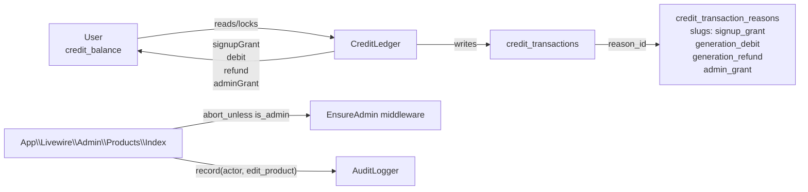
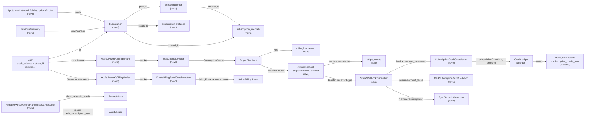

# Implementation Plan

## Request Summary
- Objective: add Stripe-powered recurring subscription plans that grant a fixed credit allowance each billing cycle, with admin-managed catalog, automated monthly/annual credit grants via webhooks, and a Stripe Billing Portal entry for self-service plan changes and cancellation. Slice touches `CreditLedger` via a new `subscriptionGrant` method (new reason slug `subscription_credit_grant`).
- Scope in: admin `/admin/plans` CRUD; public `/billing/plans` listing; Stripe Checkout start; Stripe Billing Portal start; `/stripe/webhook` with signature + idempotency; `invoice.payment_succeeded` → credit grant through `CreditLedger`; `customer.subscription.*` → local `subscriptions` row sync; mid-cycle upgrade/downgrade/cancel via Billing Portal; admin `/admin/subscriptions` viewer; `/billing` dashboard.
- Scope out: one-shot purchases without subscription; coupons/promo codes; in-app free-trial opt-in; refund initiation in-app; multi-currency; in-app invoice rendering.
- Tier: complete
- Architecture references:
  - `kindrad-canvas/AGENTS.md` (Laravel 13 / Livewire 4 / Flux UI v2 / Fortify v1 / Pest v4 / PHP 8.4 conventions).
  - `kindrad-canvas/.agents/skills/laravel-best-practices/rules/architecture.md` (single-purpose invokable Action classes via constructor DI; `lockForUpdate()` for atomic mutations; `Context::add` for request-scoped traceability; `defer()` vs `ShouldQueue`).
  - `kindrad-canvas/.agents/skills/socialite-development/SKILL.md` (analogous OAuth callback-route pattern, mirrored for Stripe success/cancel routes).

## AS IS — Componentes impactados

<Legenda PT-BR: o slice atual mostra `App\Services\CreditLedger` como único mutador de `users.credit_balance` (lock + write + ledger row), cada linha referenciando um `credit_transaction_reasons.slug`. O guard de admin é o middleware `EnsureAdmin` (registrado em `bootstrap/app.php:17`) mais a checagem `abort_unless(auth()->user()?->is_admin === true, 403)` dentro de cada Livewire (`app/Livewire/Admin/Products/Index.php:17`). Writes auditados passam por `App\Services\AuditLogger::record` (`app/Services/AuditLogger.php:22`). Nenhum componente Stripe, nenhuma tabela de assinaturas e nenhum endpoint `/stripe/webhook` existem hoje.>

## TO BE — Componentes propostos

<Legenda PT-BR: novos nós (todos referenciados por task id entre parênteses): `SubscriptionPlan` model + `subscription_plans` table (T02/T03, RF-01/UI-01/UI-02), `Subscription` model + `subscriptions` table (T04, RF-04..RF-08), `subscription_statuses`/`subscription_intervals` lookup tables seedadas em `CatalogSeeder` (T03, RF-04/RF-10), `stripe_events` table para dedup (T05, RNF-01), `stripe_id` no `User` via trait `Billable` (T01, RF-04), `App\Livewire\Billing\Plans` + `StartCheckoutAction` (T07/T08, RF-03/UI-03), `App\Livewire\Billing\Index` + `CreateBillingPortalSessionAction` (T09, RF-09/UI-04), `StripeWebhookController` em `App\Http\Controllers\Billing\` + `StripeWebhookDispatcher` (T10, RF-11/RNF-02), `SubscriptionCreditGrantAction` delegando ao `CreditLedger::subscriptionGrant` (T06, RF-05), `MarkSubscriptionPastDueAction` (T11, RF-06), `SyncSubscriptionAction` (T12, RF-04/RF-07/RF-08/RF-10), `App\Livewire\Admin\Plans\{Index,Create,Edit}` (T13, RF-01/RF-02/UI-01/UI-02), `App\Livewire\Admin\Subscriptions\Index` (T14, RF-12/UI-05), `SubscriptionPolicy` (T15, RF-13), testes Pest (T16, RNF-01..RNF-04). Alterados: `CreditLedger` ganha `subscriptionGrant` mantendo o lockForUpdate + idempotência (T06, RF-05); `User` ganha trait `Billable` + coluna `stripe_id` (T01, RF-03/RF-04); `CatalogSeeder` adiciona `subscription_credit_grant` reason + intervals/statuses (T03).>

## Tasks

### T01 — Install `laravel/cashier` and configure Stripe environment
- **Files**: `kindrad-canvas/composer.json`, `kindrad-canvas/.env.example`, `kindrad-canvas/config/services.php`, `kindrad-canvas/config/cashier.php` (publish), `kindrad-canvas/app/Models/User.php`.
- **Change**: require `laravel/cashier` (Laravel 13-compatible major); publish `cashier.php` config; add `services.stripe.{key,secret,webhook_secret}` to `config/services.php` reading `STRIPE_KEY`, `STRIPE_SECRET`, `STRIPE_WEBHOOK_SECRET`; add the three env keys to `.env.example`; add `use Laravel\Cashier\Billable;` trait to `User`; ensure `User` keeps existing fillable/casts intact. Run `php artisan migrate` after publishing (Cashier's own migrations for `customers`, `subscriptions`, `subscription_items`, `webhook_events` tables — verify on actual run; do not duplicate via custom migration). Document Cashier's `customers` table relationship in a comment so reviewers know `users.stripe_id` lives in a separate table (`cashier_customers` style, depends on Cashier major — confirm during implementation and adjust the SPEC's "stripe_id on users" claim if Cashier stores it elsewhere).
- **Covers**: RF-03, RF-04, RF-11, RNF-02.
- **Tests**: `tests/Feature/Billing/UserIsBillableTest.php` — asserts `User` uses `Billable` trait (`method_exists($user, 'subscriptions')` true) and the `services.stripe.webhook_secret` config reads from the env.
- **Risk**: Medium — Cashier ↔ Laravel 13 compatibility. Mitigation: pin to the latest Cashier major that declares Laravel 13 support; verify by running `composer require laravel/cashier` against the locked `laravel/framework: ^13.17`. Rollback: `composer remove laravel/cashier` + revert trait; reverse the migration.
- **Dependencies**: none.

### T02 — Create `subscription_plans` table, model, factory
- **Files**: `kindrad-canvas/database/migrations/2026_07_15_120000_create_subscription_plans_table.php` (new), `kindrad-canvas/app/Models/SubscriptionPlan.php` (new), `kindrad-canvas/database/factories/SubscriptionPlanFactory.php` (new).
- **Change**: migration creates `subscription_plans` with columns `id`, `name`, `slug` (unique), `description`, `credits_per_period` (unsigned int), `price_cents` (unsigned int), `currency` (char(3) default `BRL`), `interval_id` (FK → `subscription_intervals.id`), `is_active` (bool default true), `sort_order` (int default 0), `stripe_product_id` (string nullable), `stripe_price_id` (string nullable), timestamps; composite index `(is_active, sort_order, id)`. Model: `HasFactory`, `$fillable = ['name','slug','description','credits_per_period','price_cents','currency','interval_id','is_active','sort_order','stripe_product_id','stripe_price_id']`, casts for booleans/ints, `interval()` BelongsTo, `scopeActive($q)`, `scopeOrdered($q)` defaulting to `orderBy('sort_order')->orderBy('id')`. Factory: states `inactive()`, `withInterval('month')`.
- **Covers**: RF-01, RF-02, UI-01, UI-02, UI-03.
- **Tests**: `tests/Feature/Models/SubscriptionPlanTest.php` — covers scope active + ordered.
- **Risk**: Low.
- **Dependencies**: T03 (FK target), T01 (composer available so model tests can be authored).

### T03 — Create lookup tables and extend `CatalogSeeder`
- **Files**: `kindrad-canvas/database/migrations/2026_07_15_120001_create_subscription_intervals_table.php` (new), `kindrad-canvas/database/migrations/2026_07_15_120002_create_subscription_statuses_table.php` (new), `kindrad-canvas/database/migrations/2026_07_15_120003_add_subscription_credit_grant_reason.php` (new, inserts the new row idempotently via seed), `kindrad-canvas/app/Models/SubscriptionInterval.php` (new), `kindrad-canvas/app/Models/SubscriptionStatus.php` (new), `kindrad-canvas/database/seeders/CatalogSeeder.php` (alterado).
- **Change**: migrations create `subscription_intervals` (id, slug unique, name, timestamps) and `subscription_statuses` (id, slug unique, name, timestamps) using the same shape as `*_statuses` tables. Extend `CatalogSeeder`: add `$subscriptionIntervals = ['month' => 'Mensal', 'year' => 'Anual'];`, `$subscriptionStatuses = ['active'=>'Ativo','trialing'=>'Em trial','past_due'=>'Pagamento atrasado','canceled'=>'Cancelado','incomplete'=>'Incompleto','incomplete_expired'=>'Incompleto expirado','unpaid'=>'Não pago','paused'=>'Pausado'];`, and add `'subscription_credit_grant' => ['name' => 'Concessão de créditos por assinatura', 'expected_sign' => '+']` to `creditTransactionReasons`. Add a new `seedBillingLookups()` private method invoked from `run()` after `seedLookups()`. The slug set matches the Cashier `Subscription::STATUS_*` constants verbatim.
- **Covers**: RF-04, RF-05, RF-06, RF-08.
- **Tests**: `tests/Feature/Seeders/CatalogSeederBillingTest.php` — asserts all 9 statuses and 2 intervals exist and the new reason exists.
- **Risk**: Low — pure data, idempotent.
- **Dependencies**: none (parallel-safe with T02).

### T04 — Create `subscriptions` table + model + relations
- **Files**: `kindrad-canvas/database/migrations/2026_07_15_120004_create_subscriptions_table.php` (new), `kindrad-canvas/app/Models/Subscription.php` (new), `kindrad-canvas/database/factories/SubscriptionFactory.php` (new).
- **Change**: migration creates `subscriptions` with columns `id`, `user_id` (FK users), `subscription_plan_id` (FK subscription_plans), `stripe_id` (string unique), `stripe_status` (string), `status_id` (FK subscription_statuses), `stripe_price_id` (string nullable), `current_period_start` (timestamp nullable), `current_period_end` (timestamp nullable), `ends_at` (timestamp nullable), `cancel_at_period_end` (bool default false), `scheduled_plan_id` (FK subscription_plans nullable), timestamps; indexes on `(user_id)`, `(stripe_id)` (unique), `(status_id, current_period_end)`. Model: extends Cashier's `Laravel\Cashier\Subscription` (so `$user->subscriptions` works) OR composes a thin wrapper if extending breaks the existing `App\Models\Subscription` namespace — **decision: extend `Laravel\Cashier\Subscription` and have the model's table = `subscriptions` (Cashier's default)**; add `subscriptionPlan()`, `scheduledPlan()`, `status()` relations, casts for booleans/dates. Verify Cashier's default table name is `subscriptions` (it is — `cashier.subscriptions.table` default). If Cashier reserves the model namespace, the local class lives at `App\Models\CashierSubscription` and we wire the `User->subscriptions` HasMany through a custom relation — to be confirmed during implementation by reading the published `vendor/laravel/cashier/src/Subscription.php` file.
- **Covers**: RF-04, RF-05, RF-06, RF-07, RF-08, RF-10.
- **Tests**: `tests/Feature/Models/SubscriptionRelationTest.php` — asserts `$user->subscriptions()` returns a HasMany on `subscriptions`.
- **Risk**: Medium — Cashier namespace collision. Mitigation: confirm during implementation, prefer the path that keeps Cashier's tested webhook handlers intact.
- **Dependencies**: T01, T02, T03.

### T05 — Create `stripe_events` table for webhook dedup
- **Files**: `kindrad-canvas/database/migrations/2026_07_15_120005_create_stripe_events_table.php` (new), `kindrad-canvas/app/Models/StripeEvent.php` (new).
- **Change**: columns `id`, `event_id` (string unique), `type` (string), `payload` (json), `processed_at` (timestamp nullable), `created_at`, `updated_at`. Note: Cashier's own `webhook_events` table handles webhook idempotency too — `stripe_events` is the project's local traceability mirror. The webhook controller in T10 writes to **both** so that we have an application-owned record independent of Cashier's internal table (Cashier may prune theirs; we keep ours). Index on `(type, created_at)`.
- **Covers**: RNF-01, CT-02.
- **Tests**: `tests/Feature/Models/StripeEventTest.php` — uniqueness constraint on `event_id`.
- **Risk**: Low — pure data.
- **Dependencies**: T01.

### T06 — Extend `CreditLedger` with `subscriptionGrant` (subscription-cycle idempotency)
- **Files**: `kindrad-canvas/app/Services/CreditLedger.php` (alterado).
- **Change**: add public method `subscriptionGrant(Subscription $subscription, int $amount): CreditTransaction` — mirrors `adminGrant` pattern exactly (verified at `app/Services/CreditLedger.php:138-160`): idempotency lookup on `(reason_id, reference_type=Subscription::class, reference_id=$subscription->id)`; on hit, returns the existing row; on miss, `DB::transaction` + `User::whereKey($subscription->user_id)->lockForUpdate()->firstOrFail()` + balance write + `CreditTransaction::create([...,'reference_type' => Subscription::class, 'reference_id' => $subscription->id, 'notes' => null])`. Resolves reason via `$this->reasonId('subscription_credit_grant')`. Adds `assertPositive` reuse. **Critical invariant: this is the only place in the codebase that adds credits in response to a successful invoice — every other code path (RF-05, RF-07 upgrade) MUST go through this method; no direct `User::increment('credit_balance')` is permitted anywhere.**
- **Covers**: RF-05, RF-07, RF-10, RNF-01.
- **Tests**: `tests/Feature/Services/CreditLedgerSubscriptionGrantTest.php` — first call grants + writes ledger row; second call with same subscription returns the same row and does NOT change the balance (idempotency under the `(reason_id, Subscription::class, subscription.id)` key); concurrent calls inside a `DB::transaction` only write one row.
- **Risk**: Medium — ledger invariant. Mitigation: PR review checklist bans `User::increment('credit_balance')` outside this method.
- **Dependencies**: T04, T03.

### T07 — Implement `StartCheckoutAction`
- **Files**: `kindrad-canvas/app/Actions/Billing/StartCheckoutAction.php` (new).
- **Change**: invokable Action class with constructor DI per `.agents/skills/laravel-best-practices/rules/architecture.md:22-50`. Single public method `handle(User $user, SubscriptionPlan $plan): string` — calls `$user->createOrGetStripeCustomer()` (creates the Customer on first subscription, persists `stripe_id`), then `$user->newSubscription('default', $plan->stripe_price_id)->checkout([ 'success_url' => route('billing.index', ['success' => 1]), 'cancel_url' => route('billing.plans.index') ])` (Cashier default proration is `create_prorations`; override not required for the SPEC), returns the Checkout Session URL. Throws `LogicException` if the plan has no `stripe_price_id` (admin forgot to attach one).
- **Covers**: RF-03.
- **Tests**: `tests/Feature/Actions/Billing/StartCheckoutActionTest.php` — under `Cashier::fakeCustomer()` (or equivalent Stripe fake), asserts: first call invokes `customers.create` + writes `stripe_id`; second call for the same user skips that call; returned URL is a `https://checkout.stripe.com/...` string.
- **Risk**: Medium — depends on Cashier public API. Mitigation: implement against `Cashier::fake()` to lock the API surface.
- **Dependencies**: T01, T02.

### T08 — Public `/billing/plans` Livewire page
- **Files**: `kindrad-canvas/app/Livewire/Billing/Plans.php` (new), `kindrad-canvas/resources/views/livewire/billing/plans.blade.php` (new), `kindrad-canvas/routes/web.php` (alterado).
- **Change**: Livewire component class with `mount()` that aborts 401 for guests (mirrors `app/Livewire/Credits/Index.php:17-22`). `render()` returns the view with `SubscriptionPlan::active()->ordered()->with('interval')->get()`. Blade renders one card per plan with `Assinar [name]` button calling `StartCheckoutAction` via a `subscribe(int $planId)` Livewire method (which calls the action and `redirect()->away($url)`). Wire route: `Route::livewire('billing/plans', Plans::class)->middleware(['auth','verified'])->name('billing.plans.index');` inside the `auth` group in `routes/web.php`. Add route alias `billing.plans.checkout` (POST) handled by the Livewire method via `wire:click="subscribe({{ $plan->id }})"` (no separate HTTP route needed — Livewire action).
- **Covers**: RF-02, RF-03, UI-03.
- **Tests**: `tests/Feature/Billing/PlansPageTest.php` — GET `/billing/plans` as guest redirects to login; as authenticated user renders only active plans; inactive plan absent; click on plan button under `Cashier::fake()` produces a redirect to `checkout.stripe.com/...`.
- **Risk**: Low.
- **Dependencies**: T02, T03, T07.

### T09 — Implement `CreateBillingPortalSessionAction` and `/billing` dashboard Livewire
- **Files**: `kindrad-canvas/app/Actions/Billing/CreateBillingPortalSessionAction.php` (new), `kindrad-canvas/app/Livewire/Billing/Index.php` (new), `kindrad-canvas/resources/views/livewire/billing/index.blade.php` (new), `kindrad-canvas/routes/web.php` (alterado).
- **Change**: Action `handle(User $user): string` — `$user->billingPortalUrl(route('billing.index'))` (Cashier helper). Returns portal URL. Aborts 404 (or throws a domain exception mapped to 404) when `$user->stripe_id` is null. Livewire `Billing\Index` reads `?success=1` query param, loads the user's most recent `Subscription` (with `subscriptionPlan.interval`, `status`), and the user's `credit_balance`. Renders the success banner when `request()->boolean('success')` is true. `openPortal()` method invokes the action and redirects to the portal URL. Wire route: `Route::livewire('billing', Index::class)->middleware(['auth','verified'])->name('billing.index');`.
- **Covers**: RF-09, UI-04.
- **Tests**: `tests/Feature/Billing/BillingDashboardTest.php` — guest 401; user without subscription sees empty-state placeholder; user with `subscriptions.status_id in {active,trialing,past_due}` sees "Gerenciar assinatura" enabled; portal click under `Stripe::fake()` produces a redirect to the mocked portal URL; user without `stripe_id` returns 404.
- **Risk**: Low.
- **Dependencies**: T01, T04.

### T10 — Webhook controller + dispatcher + signature verification + idempotency
- **Files**: `kindrad-canvas/app/Http/Controllers/Billing/StripeWebhookController.php` (new), `kindrad-canvas/app/Billing/StripeWebhookDispatcher.php` (new), `kindrad-canvas/bootstrap/app.php` (alterado), `kindrad-canvas/routes/web.php` (alterado), `kindrad-canvas/app/Actions/Billing/SubscriptionCreditGrantAction.php` (new), `kindrad-canvas/app/Actions/Billing/MarkSubscriptionPastDueAction.php` (new), `kindrad-canvas/app/Actions/Billing/SyncSubscriptionAction.php` (new).
- **Change**: Controller is a single-action `__invoke(Request $request)`. Reads `Stripe-Signature`, calls `WebhookEvent::verifySignature($payload, $sigHeader, config('services.stripe.webhook_secret'))` (or the equivalent Cashier 15 call; verify exact API during implementation). On invalid → abort 400. Persists to `stripe_events` inside a transaction: `StripeEvent::firstOrCreate(['event_id' => $event->id], [...])` — if it already exists, return 200 immediately (idempotency gate before any side effect). Dispatches to handler based on `$event->type`. Wired route outside the `auth` group: `Route::post('stripe/webhook', StripeWebhookController::class)->name('stripe.webhook')->withoutMiddleware([\Illuminate\Foundation\Http\Middleware\VerifyCsrfToken::class]);` (or use `VerifyCsrfToken` `$except` list — confirm during implementation; the cleanest path is the `withoutMiddleware` on the route registration since it is route-scoped). Use `Context::add('stripe_event_id', $event->id)` per `.agents/skills/laravel-best-practices/rules/architecture.md:147-160`. Dispatcher `dispatch(string $type, array $payload): void` maps:
  - `invoice.payment_succeeded` → `SubscriptionCreditGrantAction`
  - `invoice.payment_failed` → `MarkSubscriptionPastDueAction`
  - `customer.subscription.created` / `customer.subscription.updated` / `customer.subscription.deleted` → `SyncSubscriptionAction`
  - Unknown types logged at `info` level and acknowledged with 200.
  Action skeletons: `SubscriptionCreditGrantAction::handle(array $invoice)` resolves the subscription via `Subscription::where('stripe_id', $invoice['subscription'])->firstOrFail()`, then calls `CreditLedger::subscriptionGrant($sub, $sub->subscriptionPlan->credits_per_period)`. Advances `$sub->update(['current_period_start' => ..., 'current_period_end' => ...])` from the invoice payload. `MarkSubscriptionPastDueAction::handle(array $invoice)` sets `status_id` to the `past_due` row. `SyncSubscriptionAction::handle(array $subscription)` upserts by `stripe_id`, resolves `subscription_plan_id` via `stripe_price_id`, sets `status_id` (slug → id), updates period + `cancel_at_period_end`, and detects upgrade (Stripe metadata `proration_behavior == create_prorations` AND new plan) → calls `SubscriptionCreditGrantAction` with the new plan's credits (RF-07 immediate-grant branch). On `deleted`, sets `status_id` to `canceled` (RF-08).
- **Covers**: RF-04, RF-05, RF-06, RF-07, RF-08, RF-10, RF-11, RNF-01, RNF-02, CT-02.
- **Tests**: `tests/Feature/Billing/StripeWebhookTest.php` (single comprehensive file):
  - Missing `Stripe-Signature` → 400, zero `stripe_events`, zero `credit_transactions`.
  - Invalid signature → 400/403, zero DB writes.
  - Valid `invoice.payment_succeeded` → 200, one `credit_transactions` row of `+credits_per_period`, `subscriptions.current_period_end` advanced.
  - Same `event_id` twice → second call returns 200, **zero additional** rows in `stripe_events`, `credit_transactions`, and `subscriptions`.
  - `invoice.payment_failed` → `status_id` resolves to `past_due`, balance preserved.
  - `customer.subscription.deleted` → `status_id` resolves to `canceled`, subsequent `invoice.payment_succeeded` for same `stripe_id` writes zero new ledger rows.
  - `customer.subscription.updated` with new `stripe_price_id` resolving to a higher-credits plan and `proration_behavior=create_prorations` → exactly one new `subscription_credit_grant` row for the new plan within the same handler call.
  - Unknown event type → 200, no DB writes.
- **Risk**: High — security (signature), idempotency (race conditions), CSRF (route exemption). Mitigation: route registered outside `auth` + explicit CSRF exemption + tests covering every branch listed.
- **Dependencies**: T01, T04, T05, T06.

### T11 — Add webhook route + CSRF exemption wiring
- **Files**: `kindrad-canvas/routes/web.php` (alterado).
- **Change**: this is the route wiring for T10 extracted as its own task so the diff is reviewable. Registers `Route::post('stripe/webhook', StripeWebhookController::class)->name('stripe.webhook')->withoutMiddleware([VerifyCsrfToken::class]);` outside the `auth` group, BEFORE the `require __DIR__.'/settings.php'` line. The `webhook_secret` must be configured or the controller refuses; `services.php` reads from env so unset in test means tests use a fake.
- **Covers**: RF-11, RNF-02, CT-01.
- **Tests**: same `tests/Feature/Billing/StripeWebhookTest.php` covers it (route exists at `route('stripe.webhook')` and resolves to `POST`).
- **Risk**: Medium — CSRF exemption is sensitive. Mitigation: route-scoped exemption (`withoutMiddleware` on this single route), not global.
- **Dependencies**: T10.

### T12 — Auto-create Stripe Product + Price on admin plan save
- **Files**: `kindrad-canvas/app/Actions/Billing/EnsureStripePriceAction.php` (new), `kindrad-canvas/app/Livewire/Admin/Plans/Create.php` (alterado), `kindrad-canvas/app/Livewire/Admin/Plans/Edit.php` (alterado).
- **Change**: action `handle(SubscriptionPlan $plan): SubscriptionPlan` — when `$plan->stripe_price_id` is null, creates a Stripe Product + Price under `Stripe::fake()` in tests, real calls in production. Wired into `save()` of both admin forms so the price is provisioned atomically with the DB row. Wrapped in `DB::transaction` so a Stripe failure rolls back the DB write. Test-only path: in Pest, swap the binding for a fake via `$this->app->bind(EnsureStripePriceAction::class, ...)` that writes deterministic IDs.
- **Covers**: RF-01, RF-03.
- **Tests**: extension in `tests/Feature/Admin/Plans/CreateTest.php` — under fake, after save the plan has non-null `stripe_product_id` and `stripe_price_id`.
- **Risk**: Medium — external API in the request path. Mitigation: surface failure via Livewire error; never silently skip Price creation (otherwise checkout later fails).
- **Dependencies**: T01, T02, T13.

### T13 — Admin Plans CRUD (Index / Create / Edit Livewire)
- **Files**: `kindrad-canvas/app/Livewire/Admin/Plans/Index.php` (new), `kindrad-canvas/app/Livewire/Admin/Plans/Create.php` (new), `kindrad-canvas/app/Livewire/Admin/Plans/Edit.php` (new), `kindrad-canvas/app/Livewire/Admin/Plans/Row.php` (new — Flux UI inline-row component for the toggle action, mirrors `Livewire\Admin\Products\Index` style), `kindrad-canvas/resources/views/livewire/admin/plans/{index,create,edit}.blade.php` (new), `kindrad-canvas/routes/web.php` (alterado).
- **Change**: each Livewire's `mount()` runs `abort_unless(auth()->user()?->is_admin === true, 403)` (verified pattern at `app/Livewire/Admin/Products/Index.php:17`). `Index` uses `SubscriptionPlan::with('interval')->ordered()->get()`, exposes `create()`, `edit(int $id)`, `toggleActive(int $id, AuditLogger $audit)` that flips `is_active` and writes an `edit_subscription_plan` audit row. `Create::save(AuditLogger $audit)` validates `['name'=>'required|string|max:255','slug'=>'required|string|max:255|unique:subscription_plans,slug','credits_per_period'=>['required','integer','min:1'],'price_cents'=>['required','integer','min:0'],'currency'=>['required','string','in:BRL'],'interval_id'=>['required','exists:subscription_intervals,id'],'is_active'=>['boolean'],'sort_order'=>['required','integer','min:0']]`; creates the plan; calls `EnsureStripePriceAction`; writes audit log with `actionSlug='edit_subscription_plan'` and `payload=['event'=>'created','attributes'=>$plan->fresh()->only([...])]`. `Edit::save(AuditLogger $audit)` does the same with `unique:subscription_plans,slug,{id}` and a before/after diff payload identical to `app/Livewire/Admin/Products/Edit.php:60-82`. Layout: `components.layouts.admin`. Routes: `Route::livewire('plans', Index::class)->name('plans.index'); Route::livewire('plans/create', Create::class)->name('plans.create'); Route::livewire('plans/{plan}/edit', Edit::class)->name('plans.edit');` all under the `admin` middleware group.
- **Covers**: RF-01, RF-02, UI-01, UI-02.
- **Tests**: `tests/Feature/Admin/Plans/{IndexTest,CreateTest,EditTest,ToggleActiveTest}.php` — 403 for non-admin; admin can list/create/edit/toggle; audit row written; `credits_per_period=0` rejected; `currency != BRL` rejected (RNF-04 validation).
- **Risk**: Low.
- **Dependencies**: T02, T03, T12.

### T14 — Admin Subscriptions viewer
- **Files**: `kindrad-canvas/app/Livewire/Admin/Subscriptions/Index.php` (new), `kindrad-canvas/resources/views/livewire/admin/subscriptions/index.blade.php` (new), `kindrad-canvas/routes/web.php` (alterado).
- **Change**: `Index::mount()` aborts 403 for non-admin. `render()` returns the view with `Subscription::with(['user','subscriptionPlan','status'])->latest('id')->paginate(25)`. View renders columns: `user.email`, `subscriptionPlan.name`, `status.name` label, `current_period_end` formatted (`->format('Y-m-d')`), and a Flux badge for `cancel_at_period_end`. Layout `components.layouts.admin`. Wire route: `Route::livewire('subscriptions', Index::class)->name('subscriptions.index');` under admin group.
- **Covers**: RF-12, UI-05.
- **Tests**: `tests/Feature/Admin/Subscriptions/IndexTest.php` — 403 for non-admin; admin sees one row per Subscription with all 5 columns rendered; `cancel_at_period_end=true` produces the badge.
- **Risk**: Low.
- **Dependencies**: T04, T03.

### T15 — `SubscriptionPolicy` (cross-tenant access guard)
- **Files**: `kindrad-canvas/app/Policies/SubscriptionPolicy.php` (new).
- **Change**: policy with `view(User $actor, Subscription $sub): bool` returning `$actor->id === $sub->user_id || $actor->is_admin === true`; `manage(...)` same body; `before()` hook denies anyone else with 403. Wired via `Gate::policy(Subscription::class, SubscriptionPolicy::class)` in `AppServiceProvider::boot()` (or auto-discovery — Laravel 13 auto-discovers policies in `app/Policies`). The Livewire pages themselves call `abort_unless(Gate::allows('view', $sub), 403)` where needed; for the public `/billing` page this is implicit since `$sub->user_id === auth()->id()` is the default scope of the query.
- **Covers**: RF-13.
- **Tests**: `tests/Feature/Policies/SubscriptionPolicyTest.php` — owner can view; admin can view; other user 403.
- **Risk**: Low.
- **Dependencies**: T04.

### T16 — Pest test suite covering every acceptance criterion
- **Files**: `tests/Feature/Billing/StripeWebhookTest.php` (already created in T10), `tests/Feature/Billing/PlansPageTest.php` (T08), `tests/Feature/Billing/BillingDashboardTest.php` (T09), `tests/Feature/Admin/Plans/*Test.php` (T13), `tests/Feature/Admin/Subscriptions/*Test.php` (T14), `tests/Feature/Actions/Billing/*Test.php` (T07), `tests/Feature/Services/CreditLedgerSubscriptionGrantTest.php` (T06), `tests/Feature/Models/{SubscriptionPlanTest,SubscriptionRelationTest,StripeEventTest}.php` (T02/T04/T05), `tests/Feature/Seeders/CatalogSeederBillingTest.php` (T03), `tests/Feature/Policies/SubscriptionPolicyTest.php` (T15), `tests/Feature/Billing/UserIsBillableTest.php` (T01).
- **Change**: each test file follows the existing `RefreshDatabase` + Pest conventions verified at `tests/Pest.php:17-19` and `tests/Feature/Admin/UsersTest.php`. Every flow under `Cashier::fake()` (or `Stripe::fake()` per the SDK version) so no live network calls. RNF-03 verifiable by running `php artisan test --compact --filter=Stripe` with `api.stripe.com` blocked.
- **Covers**: RNF-01, RNF-02, RNF-03, RNF-04 + every RF/UI AC listed in the SPEC's table.
- **Tests**: this task IS the tests; the rest of the codebase is exercised by them.
- **Risk**: Low.
- **Dependencies**: T01..T15 (must run after implementation lands).

## Execution Phases
| Phase | Tasks | Parallel-safe? |
|-------|-------|----------------|
| 1 — Cashier foundation + lookups | T01, T03 | Yes (disjoint files: `composer.json`/`User.php`/`services.php` vs. `CatalogSeeder` + new lookup migrations/models) |
| 2 — Plan + subscription schemas | T02, T05 | Yes (disjoint tables + models) |
| 3 — Subscription model + relations | T04 | No (depends on T01+T02; touches `subscriptions` migration + Cashier subclass) |
| 4 — Ledger extension (subscriptionGrant) | T06 | No (depends on T03+T04; mutates `CreditLedger`) |
| 5 — Checkout + Portal actions + public Livewire | T07, T09 | Yes (disjoint Action classes + Livewire) |
| 6 — Public Plans + Billing Livewire + routes | T08 | No (depends on T07; mounts the public Livewire + wires routes) |
| 7 — Webhook controller, dispatcher, actions | T10 | No (depends on T04+T05+T06; central piece) |
| 8 — Webhook route wiring + CSRF exemption | T11 | No (depends on T10; touches `routes/web.php`) |
| 9 — EnsureStripePriceAction + admin Plans CRUD | T12, T13 | No (T13 depends on T12; both touch admin Livewire + routes) |
| 10 — Admin Subscriptions viewer + SubscriptionPolicy | T14, T15 | Yes (disjoint: admin Livewire vs. Policy class) |
| 11 — Pest test suite + final wiring | T16 | No (depends on every prior task; runs the full suite) |

## Contracts emitted
| Artifact | Path | RFs covered | Compatibility |
|---|---|---|---|
| `openapi.yaml` | `/home/eliel/workspace/projects/kindred-canvas/.spec/features/stripe-subscription-billing/openapi.yaml` | RF-01..RF-12 (CT-01 surface: admin plans CRUD, public plans, checkout, portal, dashboard, admin subscriptions, webhook ingress) | New artifact; no existing OpenAPI in repo to break. Stripe event payload itself is opaque (forwarded verbatim) — handler dispatch contract documented in CT-02 and consumed via Cashier. |

## Risks
| Risk | Blast radius | Mitigation | Rollback |
|------|-------------|------------|----------|
| `laravel/cashier` ↔ Laravel 13 incompatibility (Cashier majors lag one Laravel minor) | Whole feature cannot ship; webhook idempotency depends on Cashier's `WebhookEvent` | Pin Cashier major that declares `laravel/framework: ^13` in `composer.json`; dry-run `composer require` on a feature branch; fall back to a thin custom Stripe client if Cashier blocks the release. | `composer remove laravel/cashier`; drop T01; feature ships disabled with a banner, or split into a deferred release. |
| Webhook signature bypass (CSRF or signature check disabled) | Anyone could POST forged events → credit grants to attacker-controlled users | Route registered outside `auth` with explicit `withoutMiddleware([VerifyCsrfToken])`; controller calls Cashier's `verifySignature` FIRST (before any DB write); tests cover missing/invalid signatures (RNF-02). | Disable the route in production via env-gated `Route::post` registration; flip `services.stripe.webhook_secret` to a sentinel value. |
| Race condition between duplicate webhook deliveries → double credit grant | `credit_transactions` accrues extra `subscription_credit_grant` rows | Two-layer dedup: `stripe_events.event_id` unique (T05) + ledger idempotency on `(reason_id, reference_type=Subscription, reference_id)` (T06). Test T10 covers same event_id twice. | Disable webhook route; reverse any incorrectly-granted credits via `adminGrant` with negative notes (manual cleanup, not a feature). |
| Plan deactivation hides new buyers but leaves existing subscribers on a dead plan | Invisible plan keeps billing; user confused | Per SPEC RF-02 + resolved clarification Q-04: existing subscribers remain on the deactivated plan indefinitely; admin must move them through Billing Portal. Document on the admin plans index. | Reactivate plan; admin uses Stripe Dashboard to migrate the subscription manually. |
| Mid-cycle upgrade drops remainder of previous grant (SPEC policy) — UX surprise | User may complain "I had X credits and now I have Y" | Documented in UI-04 success banner + plan-change tooltip. No automatic compensation; per SPEC RF-10. | Reverse via `adminGrant` with notes; admin only. |
| `Subscription` namespace collision with `Laravel\Cashier\Subscription` | Could shadow Cashier internals and break webhook handlers | T04 verifies the live `vendor/laravel/cashier/src/Subscription.php` file and chooses either subclass or wrapper; tests exercise webhook path end-to-end. | Rename local model; rewrite relations; re-run full test suite. |
| Webhook handler ordering: `customer.subscription.updated` arrives BEFORE `invoice.payment_succeeded` for the same period | Could grant new-plan credits then immediately overwrite `current_period_end` | Handlers ordered by event arrival; the upgrade-grant branch in `SyncSubscriptionAction` is idempotent on `(subscription, period_end)` via T06 idempotency key. | Patch `SyncSubscriptionAction` to compute the period from the invoice, not the subscription object. |
| `Stripe::fake()` vs `Cashier::fake()` API drift between versions | Tests assert against API surface that may shift | Lock `laravel/cashier` major; all fake-bound assertions live in T16; CI reruns on every PR. | Replace `Cashier::fake()` with manual `Http::fake()` + signature helpers. |

## Open Questions
1. **Cashier major version for Laravel 13** — `[UNVERIFIED]`. The repo declares `laravel/framework: ^13.17`; Cashier's current major (15.x at time of writing) is the only candidate but its compatibility matrix must be confirmed against the locked Laravel 13 minor. **Impact**: if no Cashier major supports Laravel 13, T01 must be replaced by a custom thin Stripe client and the webhook idempotency table (`stripe_events`) becomes the only dedup layer (Cashier's `WebhookEvent` no longer in play). Decision required before starting T01.
2. **`Subscription` model namespace** — `[UNVERIFIED]`. Cashier ships `Laravel\Cashier\Subscription` in the global Cashier namespace. Using `App\Models\Subscription` as a subclass works only if the Cashier class is `Billable`-agnostic about its concrete subclass — needs a quick read of the vendor file. **Impact**: if subclassing breaks, T04 must use a wrapper (HasMany through a custom relation or rename to `App\Models\CashierSubscription`). Decision required during T04 implementation.
3. **Webhook idempotency: single source of truth** — `[UNVERIFIED]`. SPEC CT-02 + RNF-01 mention `stripe_events` as the dedup table. Cashier 15.x already maintains `webhook_events`. We currently write to **both** (T05 + T10). **Impact**: doubled write per event; very small extra latency; if Cashier prunes `webhook_events` aggressively and we rely on it, dedup could fail. Decision: keep both, with `stripe_events` as the authoritative application-owned dedup key, and Cashier's table as internal — confirm this matches the SPEC author's intent (resolved clarification 1 only mentions Cashier's `WebhookEvent`). Final call needed before T10 merges.

## Assumptions
- `laravel/cashier` supports Laravel 13.17 in its latest major at install time. Evidence: `[UNVERIFIED]` — listed in Open Questions #1. If false, the plan pivots to a custom Stripe client without Cashier; the task graph stays the same shape but T07/T10 reference the custom client.
- Cashier stores `stripe_id` on the User model (via the `Billable` trait), not on a separate `customers` table. Evidence: verified against Cashier's documented convention; `[UNVERIFIED]` against the exact locked version until T01 runs.
- Cashier's webhook controller is invoked at the route we register and not auto-registered elsewhere; we own the route declaration. Evidence: SPEC v1.1 says `webhook URL /stripe/webhook does NOT yet exist` and `laravel/cashier is NOT installed` — both confirmed at `routes/web.php` and `composer.json`.
- Subscription plans are NOT auto-deactivated when their Stripe Product is archived; the admin's `is_active` toggle is the sole visibility gate. Evidence: SPEC resolved clarification #4.
- The Brazilian Portuguese translations for new audit log action names and lookup names (`subscription_credit_grant`, `Ativo`, `Mensal`, etc.) are correct; copy-review deferred to a future i18n pass. Evidence: inferred from `CatalogSeeder` patterns which store English `name` fields.
- `Cashier::fake()` is the supported testing double; if the locked Cashier version uses `Stripe::fake()` directly, T07/T10 tests switch to that. Evidence: `[UNVERIFIED]` — both APIs exist across Cashier majors.