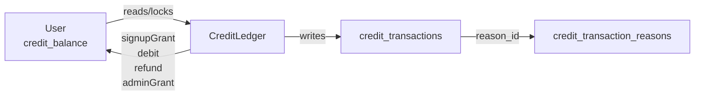
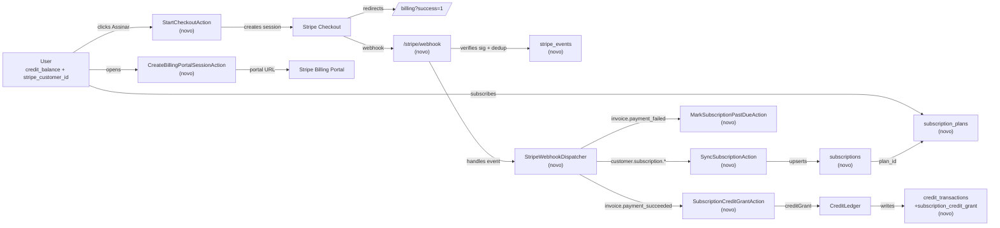

# SPEC: stripe-subscription-billing

## Metadata
- Source: developer description via /plan
- Service: kindrad-canvas
- Tier: complete
- Version: 1.1
- Architecture references:
  - `kindrad-canvas/AGENTS.md` — Laravel 13 / Livewire 4 / Flux UI v2 / Fortify v1 / Pest v4 / PHP 8.4 conventions.
  - `kindrad-canvas/.agents/skills/laravel-best-practices/rules/architecture.md` — single-purpose invokable Action classes with constructor DI; code-to-interfaces at system boundaries; `lockForUpdate()` for atomic credit mutations; `mb_*` strings (UTF-8); `defer()` for post-response non-critical work vs. `ShouldQueue` for survival-required work.
- Established patterns cited: admin CRUD via Livewire under `App\Livewire\Admin\*` with `abort_unless(auth()->user()?->is_admin === true, 403)` guard (verified at `app/Livewire/Admin/Products/Index.php:17`); audited writes go through `AuditLogger->record(actor, actionSlug, target, payload)` (verified at `app/Services/AuditLogger.php:22`); credit mutations go through `CreditLedger` with `User::whereKey(...)->lockForUpdate()->firstOrFail()` plus idempotency keyed on `(reason_id, reference_type, reference_id)` (verified at `app/Services/CreditLedger.php:37-52` and `app/Services/CreditLedger.php:75-95`); lookup enum-tables (`product_statuses`, `category_statuses`, ...) seeded via `firstOrCreate` arrays in `CatalogSeeder` (verified at `database/seeders/CatalogSeeder.php:106-111`); admin route group uses `middleware('admin')->prefix('admin')->name('admin.')` (verified at `routes/web.php:23`); webhook URL `/stripe/webhook` does NOT yet exist (verified at `routes/web.php`, grep returns 0 matches); `laravel/cashier` is NOT installed (verified at `composer.json`); `STRIPE_WEBHOOK_SECRET` env var is NOT yet present (verified at `.env.example`); no Stripe SDK in `composer.json`.

## Context
The product sells credits (1 credit ≈ 1 AI generation) through a one-time signup grant and per-generation debit, tracked via `users.credit_balance` and a `credit_transactions` ledger (`App\Services\CreditLedger`, `app/Services/CreditLedger.php`). Today, recurring top-ups require manual admin grants — there is no customer-facing self-service purchasing flow. This feature introduces Stripe-powered recurring subscription plans that grant a fixed credit allowance each billing cycle, with admin-managed catalog, automated monthly/annual credit grants via webhooks, and a Stripe Billing Portal entry for self-service plan changes and cancellation. The slice touched is the credit ledger: the new `subscription_credit_grant` ledger reason flows through the same `CreditLedger` infrastructure so balance invariants and auditability are preserved.

## AS IS — Estado atual

<Legenda PT-BR: o slice atual mostra o caminho do saldo de créditos do usuário: `User.credit_balance` é mutado atomicamente por `App\Services\CreditLedger` (lock + write + ledger row) e cada linha referencia um `credit_transaction_reasons.slug` (signup_grant, generation_debit, generation_refund, admin_grant) semiautomaticamente seedado por `CatalogSeeder`.>

## TO BE — Estado proposto

<Legenda PT-BR: novos nós do TO BE: `subscription_plans` (catálogo admin-managed, RF-01/UI-01/UI-02), `subscriptions` (espelho do estado Stripe por usuário, RF-04..RF-08), `stripe_events` (deduplicação de webhooks, RF-11), `StartCheckoutAction` (RF-03), `CreateBillingPortalSessionAction` (RF-09), `SubscriptionCreditGrantAction` (RF-05) que delega a `CreditLedger::creditGrant`, `MarkSubscriptionPastDueAction` (RF-06), `SyncSubscriptionAction` (RF-04/RF-07/RF-08), e o endpoint `/stripe/webhook` (RF-11/RNF-02) que verifica assinatura e despacha ao handler por evento. O fluxo de upgrade/downgrade/cancel mid-cycle passa pelo Billing Portal (RF-09) e webhook `customer.subscription.updated` (RF-07).>

## Scope
- **In**: admin-managed plan catalog (`/admin/plans`); public plan listing (`/billing/plans`); Stripe Checkout session start; Stripe Billing Portal session start; Stripe webhook endpoint at `/stripe/webhook` with signature verification and idempotent persistence; automatic credit grants on `invoice.payment_succeeded`; status mirroring (active/trialing/past_due/canceled/incomplete) from Stripe events; mid-cycle upgrade (immediate prorated charge + immediate credit grant), downgrade (scheduled at `current_period_end`), and cancellation (access through paid period); admin listing of all subscriptions; self-service "Gerenciar assinatura" entry from `/billing`. Deactivating a plan hides it from new subscriptions but never auto-downgrades existing subscribers, who remain on that invisible plan indefinitely unless an admin changes the subscription through the Stripe Billing Portal.
- **Out**: one-shot credit purchases without subscription; coupons/promotion codes; in-app free trial opt-in UI; refunds initiated from the app UI; multi-currency support (only `BRL` for now); invoice rendering inside the app (user is redirected to Stripe Billing Portal for invoices).

## RIGID (Non-Negotiable)

### Functional Requirements
- RF-01 [Event-Driven — Admin writes the catalog]: When an authenticated admin submits the create/edit/toggle-active form for a plan at `/admin/plans`, the system shall persist the plan attributes (`name`, `short_description`, `credits_per_period` integer ≥ 1, `price_cents` integer ≥ 0, `currency` default `BRL`, `interval_id` referencing a `subscription_intervals` lookup row whose slug is `month` or `year`, `is_active` boolean, `sort_order` integer) and shall record an `audit_logs` row via `AuditLogger` with action slug `edit_subscription_plan` (verified at `app/Services/AuditLogger.php:22`).
  - AC: A POST to `/admin/plans` by an admin user (`is_admin === true`) creates exactly one `subscription_plans` row with the supplied attributes and exactly one `audit_logs` row whose `action_id` resolves to `edit_subscription_plan`; a non-admin POST returns HTTP 403.
- RF-02 [State-Driven — Public catalog visibility]: While a `SubscriptionPlan` row has `is_active = false`, it shall not appear in the `/billing/plans` listing; while `is_active = true` it shall appear ordered by `sort_order` ASC then `id` ASC (the default sort pattern, verified at `.agents/skills/laravel-best-practices/rules/architecture.md:83`).
  - AC: With three plans (active sort=0, inactive sort=1, active sort=2), a GET to `/billing/plans` as an authenticated user returns exactly two plans in the order [sort=0, sort=2]; flipping `is_active` on the sort=2 row makes the next GET return only the sort=0 plan.
- RF-03 [Event-Driven — Checkout start]: When an authenticated user clicks "Assinar [plan_name]" on `/billing/plans`, the system shall create a Stripe Checkout Session for the selected plan's Stripe Price (creating the Stripe Customer on first subscription and persisting `users.stripe_customer_id`) and shall redirect the user to the Stripe-hosted checkout URL.
  - AC: A click on a plan's subscribe button by an authenticated user without `stripe_customer_id` results in (a) a `customers.create` call to Stripe, (b) a `users.stripe_customer_id` write, (c) a `checkout.sessions.create` call with that customer ID and the plan's Stripe Price ID, and (d) a 302 redirect to the session URL; the same flow for a user who already has `stripe_customer_id` skips (a) and (b).
- RF-04 [Event-Driven — Initial subscription state]: When a webhook `checkout.session.completed` or `customer.subscription.created` arrives through Cashier's webhook routes and `WebhookEvent::process`, the system shall use Cashier's billable user and `$user->subscriptions` relationship to upsert a subscription row keyed by `stripe_id` with `user_id`, `subscription_plan_id`, `stripe_status` mapped from Stripe's status string (`active`/`trialing`/`past_due`/`canceled`/`incomplete`), `current_period_start`, `current_period_end`, `stripe_price_id`, and `cancel_at_period_end` boolean. The existing `users` table shall receive Cashier's required customer columns, and the `User` model shall extend Cashier's `Billable` trait.
  - AC: After dispatching a `customer.subscription.created` webhook with `status="active"`, exactly one `subscriptions` row exists with `stripe_subscription_id` set, `status_id` resolving to slug `active`, and `current_period_end` equal to the Stripe-provided Unix timestamp converted to UTC; re-dispatching the same event (`event_id` reused) creates zero additional rows.
- RF-05 [Event-Driven — Recurring credit grant]: When Cashier processes a webhook `invoice.payment_succeeded` for a subscription found through `$user->subscriptions`, the system shall credit exactly `credits_per_period` of the linked plan to `users.credit_balance` via `CreditLedger` using a new `creditGrant(subscription, amount)` method with `reason_id` resolving to slug `subscription_credit_grant` (extension to `credit_transaction_reasons` seeded in `CatalogSeeder`), with idempotency enforced by Cashier's `WebhookEvent` processing and the ledger key `(reference_type='subscriptions', reference_id, reason_id='subscription_credit_grant')`, and shall advance `current_period_start` / `current_period_end` on the subscription row to the Stripe-provided values.
  - AC: After dispatching one `invoice.payment_succeeded` for a subscription whose plan grants 200 credits, the user's `credit_balance` increases by exactly 200, exactly one `credit_transactions` row exists with `reason_id` resolving to slug `subscription_credit_grant` and `reference_type='subscriptions'`, and `subscriptions.current_period_end` equals the Stripe-provided timestamp; re-dispatching the same event (`event_id` reused) leaves the balance unchanged (no second row, no second delta).
- RF-06 [Event-Driven — Payment failure]: When a webhook `invoice.payment_failed` arrives, the system shall set `subscriptions.status_id` to the `subscription_statuses` row with slug `past_due` and shall NOT debit or revoke any existing `credit_balance`.
  - AC: After dispatching `invoice.payment_failed` for an active subscription with balance 300, the `subscriptions.status_id` resolves to slug `past_due` and `users.credit_balance` remains 300.
- RF-07 [Event-Driven — Subscription updates]: When a webhook `customer.subscription.updated` arrives, the system shall update the matching `subscriptions` row's `status_id`, `current_period_start`, `current_period_end`, `subscription_plan_id` (resolved from `stripe_price_id`), and `cancel_at_period_end`; an immediate upgrade (Stripe `proration_behavior=create_prorations`) shall trigger an immediate credit grant of the new plan's `credits_per_period` via RF-05 in the same webhook handler invocation, losing any unused remainder of the previous plan's grant; a downgrade shall leave `subscription_plan_id` unchanged until the next `invoice.payment_succeeded` reflects the new price, at which time exactly the new plan's `credits_per_period` is granted with no carry-over.
  - AC: Dispatching `customer.subscription.updated` with `status="active"` and a new `current_period_end` of T+30d results in the local row's `current_period_end` updated to T+30d and `status_id` resolving to `active`; dispatching an upgrade event with `proration_behavior=create_prorations` produces exactly one `credit_transactions` row with `reason_id='subscription_credit_grant'` for the new plan's credits within the same handler invocation.
- RF-08 [Event-Driven — Subscription deletion]: When a webhook `customer.subscription.deleted` arrives, the system shall set `subscriptions.status_id` to slug `canceled`; no further `subscription_credit_grant` ledger rows shall be written for that subscription, and any previously credited but unspent balance shall remain available.
  - AC: After dispatching `customer.subscription.deleted` for a subscription whose previous grant left balance 150, `subscriptions.status_id` resolves to `canceled`, `users.credit_balance` remains 150, and a subsequent `invoice.payment_succeeded` for the same `stripe_subscription_id` writes zero new `credit_transactions` rows and does not change the balance.
- RF-09 [Event-Driven — Billing Portal]: When an authenticated user clicks "Gerenciar assinatura" on `/billing`, the system shall create a Stripe Billing Portal session for the user's `stripe_customer_id` and redirect to the portal URL.
  - AC: A click by a user with a `stripe_customer_id` issues a `billingPortal.sessions.create` call and a 302 redirect to the returned URL; a click by a user without a `stripe_customer_id` returns HTTP 404 (no subscription to manage).
- RF-10 [Optional — Mid-cycle plan change]: When the user selects an upgrade in the Billing Portal, Cashier's default proration behavior shall charge a prorated amount, discard any unused remainder of the previous plan's credit grant, and immediately grant the new plan's full `credits_per_period`; when the user selects a downgrade, the new plan takes effect at `current_period_end`, the user keeps the current plan's credits until then, and the next cycle grants exactly the new plan's `credits_per_period` with no carry-over; when the user cancels, access (and credit grants) continues through the paid period end.
  - AC: Selecting "Upgrade to Pro" from Starter mid-cycle produces one prorated invoice in Stripe and one new `subscription_credit_grant` ledger row for `credits_per_period=200`; selecting "Downgrade to Starter" leaves `subscription_plan_id` and `credits_per_period` unchanged in the local row until a `customer.subscription.updated` with the new Stripe Price arrives; selecting "Cancel" sets `cancel_at_period_end=true` and no further grants occur after `current_period_end`.
- RF-11 [Event-Driven + Unwanted — Webhook security and idempotency]: Cashier's endpoint at `/stripe/webhook` shall (a) be exempt from CSRF verification, (b) verify the `Stripe-Signature` header against `services.stripe.webhook_secret`, configured from `STRIPE_WEBHOOK_SECRET` in `config/services.php` as a Laravel services-config convention, using Cashier's signature verification, and (c) process each accepted event through `WebhookEvent::process` and Cashier's `webhook_events` idempotency table before dispatching to handlers; duplicate events with a reused Stripe event ID shall be a no-op; requests with a missing/invalid signature shall be rejected with HTTP 400 or 403.
  - AC: A POST to `/stripe/webhook` without a `Stripe-Signature` header returns HTTP 400/403 and writes zero `stripe_events` rows; a POST with a valid signature creates exactly one `stripe_events` row keyed by `event_id` and dispatches the handler; a second POST with the same `event_id` and a valid signature returns 200 (success no-op) and creates zero additional rows.
- RF-12 [Event-Driven — Admin subscription listing]: When an authenticated admin visits `/admin/subscriptions`, the system shall list all Cashier subscription rows available through users' `$user->subscriptions` relationships with `user_id`, `subscription_plan_id`, status resolved to a label, `current_period_end`, and `cancel_at_period_end`; a non-admin GET returns HTTP 403.
  - AC: With three subscriptions (active, past_due, canceled), GET `/admin/subscriptions` as admin returns three rows with labels `Active`/`Past Due`/`Canceled`; GET as non-admin returns HTTP 403.
- RF-13 [Unwanted — Cross-tenant subscription access]: When a non-admin authenticated user attempts to read, update, or open the Billing Portal for a `subscriptions` row whose `user_id` does not match their own, the system shall return HTTP 403 and shall not return the row's attributes.
  - AC: An authenticated user U1 attempting any operation referencing U2's `subscriptions.id` receives HTTP 403 and no row data is leaked in the response.

### UI Requirements
- UI-01 [State-Driven — Admin plans index]: The admin plans index at `/admin/plans` shall render one row per `subscription_plans` row showing `name`, `price_cents` formatted in BRL (e.g. `R$ 19,90`), `credits_per_period`, `interval` label (`Mensal`/`Anual`), `is_active` badge, and `sort_order`; the page shall expose actions "Criar", "Editar", and "Ativar/Desativar" wired to `SubscriptionPlan` mutations.
  - AC: GET `/admin/plans` as admin renders all plans in a table with the columns above; the "Desativar" action on an active plan toggles `is_active` to false and the row immediately reflects the inactive badge after redirect.
- UI-02 [State-Driven — Admin plan form]: The admin plan create/edit form shall expose fields `name`, `short_description`, `credits_per_period` (numeric, integer ≥ 1), `price_cents` (numeric, integer ≥ 0), `currency` (default `BRL`, fixed for this release), `interval` (select with options `month` and `year`), `is_active` (checkbox), `sort_order` (integer); submission shall validate required fields and reject `credits_per_period < 1` or `price_cents < 0`.
  - AC: Submitting the form with `credits_per_period=0` shows a validation error and persists no row; submitting with valid values persists exactly one `subscription_plans` row and redirects to `/admin/plans`.
- UI-03 [State-Driven — Public plans index]: The public plans listing at `/billing/plans` (authenticated users only) shall render only plans with `is_active=true` ordered by `sort_order` ASC then `id` ASC, each with a button "Assinar [plan_name]".
  - AC: With three plans (two active, one inactive), GET `/billing/plans` as an authenticated user renders two plan cards with their respective "Assinar" buttons; the inactive plan is not present in the markup.
- UI-04 [State-Driven — Billing dashboard]: The billing dashboard at `/billing` shall render the current user's plan name, `credit_balance`, `current_period_end` formatted as date, and a "Gerenciar assinatura" button enabled iff the user has a `subscriptions` row with `status_id` ∈ {active, trialing, past_due}; when `?success=1` query string is present the page shall additionally render a success banner with the user's new `credit_balance`.
  - AC: GET `/billing?success=1` after a first successful checkout renders the success banner, the current plan name, and the credit balance that includes the first cycle's grant; a user without any subscription sees a "Você ainda não tem uma assinatura" placeholder and no "Gerenciar assinatura" button.
- UI-05 [State-Driven — Admin subscriptions index]: The admin subscriptions index at `/admin/subscriptions` shall render one row per `subscriptions` row showing `user.email`, `subscription_plan.name`, `status` label, `current_period_end` formatted as date, and `cancel_at_period_end` badge.
  - AC: GET `/admin/subscriptions` as admin renders all rows with the columns above; an admin viewing a `canceled` row sees the label `Cancelado` and a `Cancelará em fim do período` badge if `cancel_at_period_end=true`.

### Contracts
- CT-01 — REST surface for the feature (OpenAPI emission target):
  - `POST /admin/plans` — admin create plan (auth: `auth + admin`).
  - `PATCH /admin/plans/{plan}` — admin update plan (auth: `auth + admin`).
  - `PATCH /admin/plans/{plan}/toggle` — admin toggle `is_active` (auth: `auth + admin`).
  - `GET /billing/plans` — authenticated user lists active plans (auth: `auth`).
  - `POST /billing/plans/{plan}/checkout` — start Stripe Checkout Session for plan (auth: `auth`).
  - `POST /billing/portal` — create Stripe Billing Portal session (auth: `auth`).
  - `GET /billing` — billing dashboard (auth: `auth`); supports `?success=1`.
  - `GET /admin/subscriptions` — admin list all subscriptions (auth: `auth + admin`).
  - `POST /stripe/webhook` — Stripe webhook ingress (auth: signature, not session; CSRF-exempt).
- CT-02 — Stripe → app webhook event envelope (subscribed events: `checkout.session.completed`, `customer.subscription.created`, `customer.subscription.updated`, `customer.subscription.deleted`, `invoice.payment_succeeded`, `invoice.payment_failed`). Handler dispatch key is `event.type`; idempotency key is `event.id` (Stripe `evt_...`); signature header is `Stripe-Signature`. Schema is the standard Stripe Event object (`id`, `type`, `data.object`), full schema lives at `https://stripe.com/docs/api/events` — the SPEC does not duplicate Stripe's object definitions, only the dispatch/idempotency contract.

### Non-Functional Requirements
- RNF-01 [Idempotency under retry]: The webhook pipeline shall be idempotent across at-least-once delivery. Re-dispatching the same `event_id` with the same `event.type` produces exactly one side effect on each persisted entity (zero extra `credit_transactions` rows, zero extra `subscriptions` rows, zero extra `stripe_events` rows).
  - AC: A Pest test that calls the webhook handler twice with the same `invoice.payment_succeeded` payload asserts exactly one `credit_transactions` row exists and the user's balance matches a single grant.
- RNF-02 [Webhook signature enforcement]: Every POST to `/stripe/webhook` without a signature that verifies under `services.stripe.webhook_secret`, configured from `STRIPE_WEBHOOK_SECRET` in `config/services.php`, shall return HTTP 400 or 403 before any handler is invoked and before any DB write occurs.
  - AC: A Pest test posts a fabricated event payload without `Stripe-Signature` and asserts HTTP 400/403 + zero `stripe_events` rows + zero `credit_transactions` rows.
- RNF-03 [Test isolation with `Stripe::fake()`]: All feature tests that exercise checkout, portal, or webhook paths shall run under `Stripe::fake()` (or the equivalent cashier/SDK test double) so no live network calls occur in the test suite.
  - AC: `php artisan test --filter=Stripe` runs without contacting `api.stripe.com` (verifiable by running with network egress blocked to `api.stripe.com`).
- RNF-04 [Currency BRL-only]: All plan `price_cents` values are interpreted in BRL (ISO-4217 `BRL`), and the UI shall render prices prefixed with `R$` using Brazilian formatting (`R$ 19,90`). No multi-currency conversion is performed anywhere in this feature.
  - AC: A plan with `price_cents=1990` and `currency='BRL'` renders as `R$ 19,90` in UI-01 and UI-03; the system rejects creating a plan with `currency != 'BRL'` via UI-02 validation.

## FLEXIBLE (Implementation Suggestions)
- Install `laravel/cashier`; use its billable model, `$user->subscriptions`, webhook routes, signature verification, and `WebhookEvent` idempotency processing. Migrate the existing `users` table with Cashier's customer columns and add the `Billable` trait to `User`.
- `StartCheckoutAction` and `CreateBillingPortalSessionAction` are invokable single-purpose Action classes under `App\Actions\Billing\`, constructed via DI (verified pattern at `.agents/skills/laravel-best-practices/rules/architecture.md:22-50`).
- `CreditLedger::creditGrant(Subscription $subscription, int $amount)` follows the same pattern as `adminGrant` (verified at `app/Services/CreditLedger.php:138-160`): `DB::transaction` + `User::whereKey(...)->lockForUpdate()->firstOrFail()` + idempotency on `(reason_id, reference_type='subscriptions', reference_id)`.
- Webhook controller is a thin single-action controller in `App\Http\Controllers\Billing\StripeWebhookController` (route binding `/stripe/webhook`), using `Illuminate\Foundation\Http\Middleware\VerifyCsrfToken` exceptions list to skip CSRF for that path.
- The webhook idempotency table `stripe_events` columns: `id`, `event_id` (unique), `type`, `payload` (JSON), `received_at`; pre-dispatch lookup on `event_id` is the dedup gate.
- Admin subscription listing reuses `App\Livewire\Admin\Subscriptions\Index` mirroring the `App\Livewire\Admin\Products\*` pattern (verified at `app/Livewire/Admin/Products/Index.php:9-61`).
- For Cashier integration, use the Cashier `subscriptions` records available through `$user->subscriptions` as the local subscription source of truth and attach the feature's plan and period metadata required by RF-04..RF-10.
- Use `Context::add('stripe_event_id', $event->id)` in the webhook controller so downstream actions can include it in log context for traceability (verified pattern at `.agents/skills/laravel-best-practices/rules/architecture.md:147-160`).
- Tests follow Pest patterns verified by `tests/Feature/Actions/`, `tests/Feature/Admin/`, `tests/Feature/CreditsHistoryTest.php`.

## Acceptance Criteria Summary
| ID | Criterion | Testable? |
|----|-----------|-----------|
| RF-01 | Admin creates a plan; audit row written; non-admin blocked | Yes |
| RF-02 | Inactive plan hidden from `/billing/plans`; sort_order applied | Yes |
| RF-03 | Subscribe click creates Checkout Session + redirect | Yes |
| RF-04 | `checkout.session.completed`/`subscription.created` upserts row | Yes |
| RF-05 | `invoice.payment_succeeded` grants credits + advances period (idempotent) | Yes |
| RF-06 | `invoice.payment_failed` → past_due, balance preserved | Yes |
| RF-07 | `subscription.updated` syncs state + handles upgrade grant | Yes |
| RF-08 | `subscription.deleted` → canceled, no further grants, balance kept | Yes |
| RF-09 | "Gerenciar assinatura" opens Stripe Billing Portal | Yes |
| RF-10 | Mid-cycle upgrade immediate / downgrade deferred / cancel keeps access | Yes |
| RF-11 | Webhook signature verified; CSRF exempt; events deduped by `event_id` | Yes |
| RF-12 | Admin subscriptions index lists all rows; non-admin blocked | Yes |
| RF-13 | Cross-tenant subscription access returns 403 | Yes |
| UI-01 | Admin plans index renders table + toggle action | Yes |
| UI-02 | Admin plan form validates fields | Yes |
| UI-03 | Public plans index shows only active plans with subscribe button | Yes |
| UI-04 | Billing dashboard shows balance + manage button + success banner | Yes |
| UI-05 | Admin subscriptions index renders rows with status labels | Yes |
| CT-01 | REST surface endpoints defined | Yes (route inspection) |
| CT-02 | Webhook event envelope + signature contract defined | Yes |
| RNF-01 | Webhook idempotent on retry (same `event_id`) | Yes |
| RNF-02 | Unsigned/invalid webhook → HTTP 400/403, no DB write | Yes |
| RNF-03 | Tests run under `Stripe::fake()` | Yes |
| RNF-04 | BRL-only currency; UI formats as `R$` | Yes |

## Distribution by Repo
| Repo | RFs | Contracts |
|------|-----|-----------|
| kindrad-canvas | RF-01..RF-13, UI-01..UI-05 | CT-01, CT-02 |

## Resolved Clarifications
1. **Stripe integration approach** — Install `laravel/cashier`; use its billable model, `$user->subscriptions`, webhook routes, signature verification, and `WebhookEvent` idempotency table.
2. **Webhook secret configuration** — Configure `STRIPE_WEBHOOK_SECRET` as `services.stripe.webhook_secret` in `config/services.php`, matching `services.stripe.secret` and Laravel services-config convention.
3. **Mid-cycle credit policy** — Cashier's default policy applies: an immediate upgrade discards the previous plan's unused remainder and grants the new plan's full allowance; a downgrade grants exactly the new allowance at the next period with no carry-over.
4. **Deactivated subscribed plan** — Existing subscribers remain on the now-invisible plan indefinitely; deactivation never auto-downgrades them, and only an admin action through the Billing Portal changes the subscription.