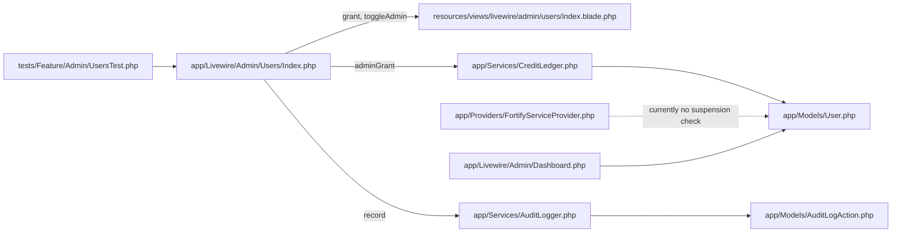
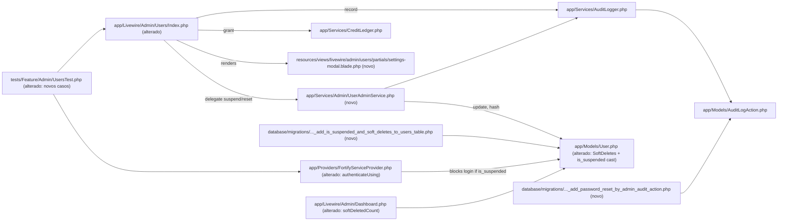

# Implementation Plan: admin-users-redesign

## Request Summary

- **Objective**: Expand the admin Users module with suspension, in-admin password reset, soft-delete, and credit grant (already partially present) — plus a dashboard `soft-deleted` metric tile — while preserving canonical writes through `AuditLogger` and `CreditLedger`.
- **Scope (in)**: `is_suspended` + `deleted_at` columns on `users`; `UserAdminService` for Suspend/Unsuspend/ResetPassword; Fortify `authenticateUsing` callback blocking suspended logins; settings modal replacing inline Promote/Grant buttons; soft-delete from admin; dashboard metric.
- **Scope (out)**: impersonation, audit-trail UI filters, restore-from-trash, GDPR hard-delete, email notifications, bulk actions, per-user role/permission editor.
- **Tier**: standard.
- **Architecture references**: `AGENTS.md` (Laravel Boost guidelines); `.agents/skills/laravel-best-practices`, `.agents/skills/pest-testing`, `.agents/skills/fortify-development`, `.agents/skills/fluxui-development`, `.agents/skills/livewire-development` (all available, not loaded by planner).

## AS IS — Componentes impactados

<Legenda PT-BR: módulos que já existem e que esta feature toca. O componente `Users\Index` mistura Promote, Grant e listagem na mesma view; o dashboard não conhece `deleted_at`; Fortify não checa `is_suspended`.>

## TO BE — Componentes propostos

<Legenda PT-BR: T01 cria a migration e o seed de audit action; T02 introduz o trait, o cast, a migration e o seed; T03 adiciona o callback `Fortify::authenticateUsing`, o `UserAdminService` e o toggle na `Users\Index`; T04 adiciona o modal de Settings e migra Promote/Grant/Suspend/Reset para dentro dele; T05 adiciona o tile `softDeletedCount` no `Dashboard` e estende `UsersTest`.>

## Tasks

### T01 — Migration: `is_suspended` + `deleted_at` + audit action seed
- **Files**: `database/migrations/YYYYMMDDHHMMSS_add_is_suspended_and_soft_deletes_to_users_table.php` (new); `database/migrations/YYYYMMDDHHMMSS_add_password_reset_by_admin_audit_action.php` (new).
- **Change**: Add nullable boolean `is_suspended` (default `false`) and nullable timestamp `deleted_at` to `users`; mirror the existing `add_admin_and_credits_to_users_table` migration style (no anonymous-class oddities, simple `Schema::table`). Second migration upserts the `password_reset_by_admin` slug into `audit_log_actions` using the same idempotent pattern as `add_edit_subscription_plan_audit_action`.
- **Covers**: RF-06 (schema preconditions); RF-03 (audit slug row exists).
- **Tests**: `tests/Feature/Admin/UsersTest.php` — extend with `test_user_uses_soft_deletes_and_deleted_at_column_exists`; new `test_password_reset_by_admin_audit_action_seeded`.
- **Risk**: Low — additive, nullable columns.
- **Dependencies**: none.

### T02 — User model: SoftDeletes trait + `is_suspended` cast
- **Files**: `app/Models/User.php`.
- **Change**: Import `Illuminate\Database\Eloquent\SoftDeletes`; add trait to the `use` list; add `'is_suspended' => 'boolean'` to `casts()`; expand `@property` PHPDoc with `is_suspended` and `deleted_at`; ensure `#[Fillable]` allows `is_suspended` if we ever mass-assign (defensive).
- **Covers**: RF-06; supports RF-02/RF-05.
- **Tests**: indirect — covered by `test_user_uses_soft_deletes_and_deleted_at_column_exists` (T01) and `test_soft_deleted_user_excluded_from_admin_index` (T05).
- **Risk**: Low — additive trait + cast; no behavior change for existing queries that never call `->delete()` on a User.
- **Dependencies**: T01.

### T03 — Fortify suspension block + `UserAdminService` (suspend/unsuspend) + admin UI toggle
- **Files**: `app/Providers/FortifyServiceProvider.php` (alterado), `app/Services/Admin/UserAdminService.php` (novo), `app/Livewire/Admin/Users/Index.php` (alterado), `resources/views/livewire/admin/users/index.blade.php` (alterado).
- **Change**:
  - `FortifyServiceProvider::boot()` registers `Fortify::authenticateUsing(fn (Request $r) => tap(parent-lookup, fn ($u) => $u === null || $u->is_suspended ? null : $u))`. Use `Fortify::authenticateUsing(...)` exactly as the SPEC mandates; do **not** put suspension guards in admin write paths in Fortify.
  - `UserAdminService::suspend(User $target, User $actor): User` and `::unsuspend(...)` flip `is_suspended` and call `AuditLogger::record` with slugs `user_suspended` / `user_unsuspended` (FLEXIBLE).
  - `Users\Index` gains `toggleSuspension(int $userId, UserAdminService $svc)` action; view gains a small **Suspend/Unsuspend** button on each row (the settings-modal move happens in T04; this phase wires the toggle so tests for RF-01/RF-02 can pass against the inline button, which T04 then relocates).
- **Covers**: RF-01, RF-02.
- **Tests**: `tests/Feature/Admin/UsersTest.php` — `test_suspended_user_cannot_log_in_via_fortify`, `test_non_suspended_user_can_log_in_via_fortify`, `test_admin_can_toggle_user_suspension`, `test_toggle_suspension_writes_audit_log_entry`.
- **Risk**: Medium — Fortify callback touches authentication; mis-registration locks everyone out. Mitigated by keeping the parent-lookup intact and only short-circuiting when `is_suspended === true`.
- **Dependencies**: T02 (cast must exist for the boolean read).

### T04 — Settings modal: Promote/Demote + Grant + Suspend/Unsuspend + Reset password (soft-delete in modal)
- **Files**: `resources/views/livewire/admin/users/partials/settings-modal.blade.php` (novo, included from `index.blade.php`), `app/Livewire/Admin/Users/Index.php` (alterado), `app/Services/Admin/UserAdminService.php` (novo/extended), `resources/views/livewire/admin/users/index.blade.php` (alterado).
- **Change**:
  - `UserAdminService::resetPassword(User $target, User $actor, ?string $generated = null): string` — generates a `Str::random(32)` password (or accepts the generated value for testability), hashes it via the model cast, persists, then `AuditLogger::record` with `actionSlug: 'password_reset_by_admin'`, `target: $target`, `payload: ['target_user_id' => $target->id]`. Returns the plaintext (caller flashes it to the admin via session).
  - `UserAdminService::softDelete(User $target, User $actor)` — `$target->delete()` (uses SoftDeletes) and `AuditLogger::record` with slug `user_soft_deleted`.
  - `Users\Index` gains modal state (`showSettingsModal`, `settingsUserId`, `resetPasswordFor`), four actions: `promote`, `demote` (reuses existing `toggleAdmin` semantics split into two clearer actions for the modal — promote sets `is_admin=true`, demote sets `false`, both guard `!== auth()->id()`), `grantFromSettings`, `toggleSuspensionFromSettings`, `resetPasswordFromSettings`. The existing `grant`/`toggleAdmin` actions stay but are now invoked from the modal.
  - View: a single **Settings** button per row opens the modal; the inline Promote/Grant buttons are removed; **Suspend/Unsuspend** lives inside the modal too (T03 left it inline for RF-01/RF-02 testability; T04 relocates). Reset password form has two fields (confirmation step is OPTIONAL — FLEXIBLE); on submit, flash the generated password to the admin via session flash so they can pass it to the user out-of-band (no email).
- **Covers**: RF-02 (modal wiring), RF-03, RF-04 (already existed, now in modal), RF-05 (soft-delete button), RF-07 (no impersonation/restore).
- **Tests**: `tests/Feature/Admin/UsersTest.php` — `test_admin_can_reset_user_password`, `test_password_reset_by_admin_writes_audit_log_with_slug`, `test_admin_can_grant_credits_to_user` (extend existing), `test_grant_credits_increases_target_balance_by_amount` (extend existing), `test_soft_deleted_user_excluded_from_admin_index`, `test_no_impersonation_or_restore_routes_are_registered`.
- **Risk**: Medium — large view refactor; keep `data-test` attributes stable so existing `UsersTest` cases don't break.
- **Dependencies**: T03.

### T05 — Dashboard metric `soft-deleted` + final test sweep
- **Files**: `app/Livewire/Admin/Dashboard.php` (alterado), `resources/views/livewire/admin/dashboard.blade.php` (alterado), `tests/Feature/Admin/UsersTest.php` (alterado).
- **Change**: Add `softDeletedCount(): int` returning `User::onlyTrashed()->count()` (after T02 trait is in). Surface it as a metric tile in `dashboard.blade.php` (reuse the same `<flux:*>` markup pattern already used for the existing tiles). Run `vendor/bin/pint --dirty --format agent` on touched PHP files.
- **Covers**: RF-05 (dashboard half).
- **Tests**: `tests/Feature/Admin/UsersTest.php` — `test_dashboard_soft_deleted_metric_counts_trashed_users`. Full sweep: `php artisan test --compact --filter=UsersTest` + `php artisan test --compact --filter=Dashboard`.
- **Risk**: Low — purely additive metric.
- **Dependencies**: T02, T04 (soft-delete UI must exist for the count to be reachable from the admin).

## Execution Phases

| Phase | Tasks | Parallel-safe? |
|-------|-------|----------------|
| 1 — Foundation (schema + model trait + audit action seed) | T01, T02 | no (T02 depends on T01's migration; T01 alone runs `migrate` first) |
| 2 — Suspensão (Fortify + service + UI toggle) | T03 | no (depends on Phase 1) |
| 3 — Settings modal (move actions into one modal) | T04 | no (depends on Phase 2) |
| 4 — Dashboard metric + test sweep | T05 | no (depends on Phase 3) |

## Risks

| Risk | Blast radius | Mitigation | Rollback |
|------|-------------|------------|----------|
| `Fortify::authenticateUsing` callback mis-wired → all users locked out (incl. admin) | global auth | Keep the canonical lookup intact; only short-circuit when `is_suspended === true`; add test for non-suspended user login (RF-01 AC). If deploy locks admins, run `php artisan tinker --execute 'User::query()->update(["is_suspended" => false]);'` to recover. | `down()` of T01 migration sets `is_suspended = false` on all rows; revert FortifyServiceProvider to omit `authenticateUsing`. |
| SoftDeletes trait interacts badly with `User::find($id)` in existing call sites | `app/Livewire/Admin/Users/Index.php`, CreditLedger, OAuth | Audit all `User::find*` call sites — only `->delete()` on User is new; trait does not affect SELECTs. Tests for `test_soft_deleted_user_excluded_from_admin_index` confirm default scope exclusion. | Remove trait, drop `deleted_at` column via `down()`. |
| Reset-password flow returns plaintext to admin — operator UX expects it | admin UX | Display the generated password once via session flash on the next request; rely on operator to communicate it out-of-band (FLEXIBLE, no email). | If UX requires encryption-at-rest on the flash, change to encrypted session bag; out of scope here. |
| Soft-delete cascades to OAuth / subscriptions / etc. | related models | Eloquent `SoftDeletes` only sets `deleted_at` on the User row; it does not cascade. No FK actions defined. | none — no cascade configured. |
| Migration ordering / existing migrations conflict | schema | Use a fresh timestamp after the latest migration (`2026_07_16_144610_create_notifications_table.php`); additive columns only. | `down()` drops both columns. |

## Test Strategy

- **Pest 4 feature tests** (`tests/Feature/Admin/UsersTest.php`) extended — never replaced. Existing `beforeEach` creates `$this->admin` and `$this->user`; new cases reuse it.
- **New test cases** (mapped to SPEC AC table): see each task's `Tests:` line.
- **Run scope**: `php artisan test --compact --filter=UsersTest` per phase; final `php artisan test --compact` once before sign-off.
- **Test isolation**: Pest `RefreshDatabase` is assumed by the existing file (verified by its use of factories); do not introduce a parallel test that mutates `audit_log_actions` rows outside transactions.
- **Pint**: `vendor/bin/pint --dirty --format agent` after every PHP touch (AGENTS rule).

## Out of scope (reminders)

- Impersonation ("log in as user X").
- Audit-trail UI filters / pagination / restore-from-trash.
- GDPR hard-delete or anonymization.
- Email notification to the user on admin password reset.
- Bulk actions (bulk suspend, bulk delete).
- Per-user role/permission editor.
- Restore action (RF-07 explicitly forbids it).

## Open Questions

- None blocking — all RIGIDs are unambiguous. (RF-03's `password_reset_by_admin` slug is literal; FLEXIBLE items accept the implementer's choice.)

## Assumptions

- Existing `AuditLogger::record` signature (verified) accepts `($actor, $slug, $target, $payload)` — no need to widen it.
- Existing `CreditLedger::adminGrant` signature (verified: `($user, $credits, ?User $actor, string $notes)`) already matches RF-04 — no service widening needed.
- The `audit_log_actions` table has `slug` + `name` columns (verified via the existing `add_edit_subscription_plan_audit_action` migration that writes the same shape).
- `Fortify::authenticateUsing(...)` is the canonical hook in Fortify v1 for the lookup closure; RF-01 mandates it.
- Pest tests in `tests/Feature/Admin/UsersTest.php` run inside `RefreshDatabase` (industry default for this project — the existing cases assume fresh DB per test, and `User::factory()` is used without manual cleanup).
- `php artisan migrate` on a fresh DB will pick up the new migration in chronological order (newest timestamp) — no need to coordinate with other pending migrations.