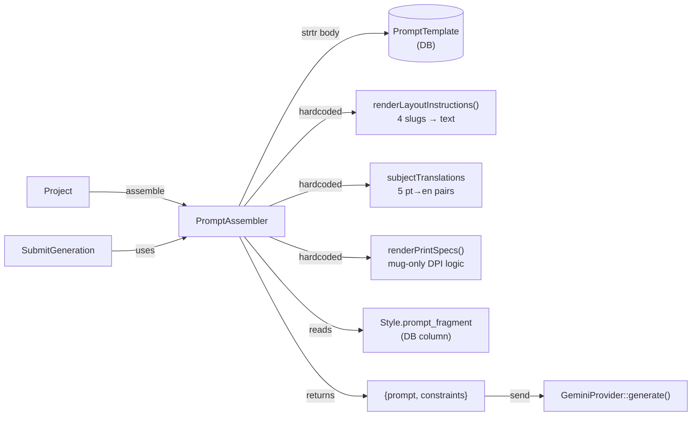
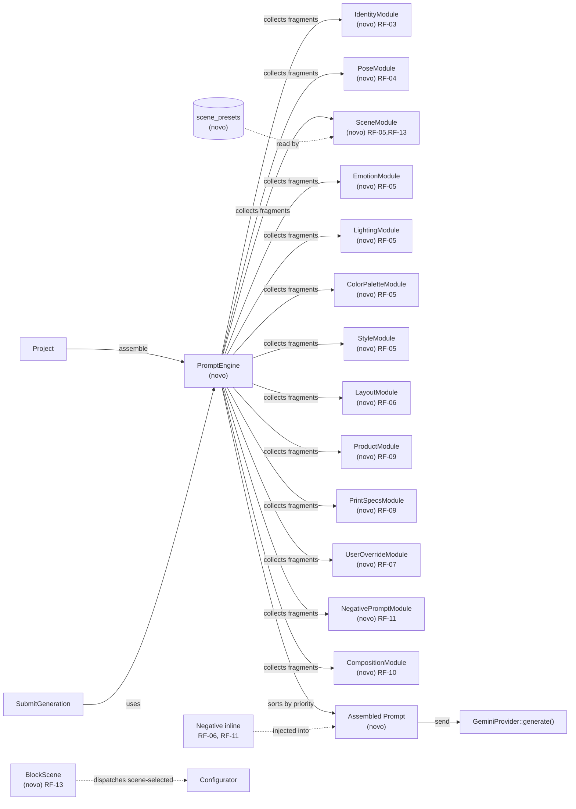

# Implementation Plan — creative-prompt-engine

## Request Summary

- **Objective**: Transform the monolithic `PromptAssembler` into a modular **Creative Prompt Engine** with 13 independent `PromptModule` implementations, each producing a `PromptFragment` (text + priority + optional negative fragment). The orchestrator (`PromptEngine`) collects fragments, sorts by priority, and concatenates them into a single rich prompt. Add a **Scene Preset system** giving users visual control over background/scene via selectable cards in the Configurator.
- **Scope**:
  - **In**: PromptEngine orchestrator, 13 PromptModule implementations, PromptFragment value object, PromptModule interface, migrations for 5 catalog tables (poses, categories, layouts, styles, products) adding new columns, scene_presets table (3-4 presets per category, ~18-24 records), scene_preset_id nullable FK in projects table, ScenePreset model with category relationship, BlockScene Livewire component for Configurator, SceneModule updated to read from preset or category default, CatalogSeeder updates for all 8 poses (English rich descriptions), 6 categories (scene/emotion/lighting/color), 4 layouts (prompt_fragment), styles (negative_fragment), products (product_prompt_rules), backward-compatible provider interface, existing test migration
  - **Out**: Admin UI for editing fragment fields (Fase 5), visual prompt preview in Configurator, new AI providers, changes to GenerationProvider contract signature
- **Tier**: complete
- **Architecture references**: `AGENTS.md` (Laravel 13, PHP 8.4, Pest v4, Livewire v4, Flux UI v2)

## Architecture snapshot

| Component | Source |
|---|---|
| `app/Services/PromptAssembler.php` | Current monolithic assembler (deprecated, kept for backward compat) |
| `app/Actions/Generation/SubmitGeneration.php` | Calls `PromptAssembler::assemble()`, will switch to `PromptEngine` |
| `app/Services/Generation/GeminiProvider.php` | Active AI provider; accepts `string $prompt, array $constraints` |
| `app/Contracts/GenerationProvider.php` | Provider contract — unchanged by this feature |
| `app/Models/Project.php` | Gains `scene_preset_id` FK |
| `app/Models/Category.php` | Gains `scene_prompt`, `emotion_hint`, `lighting_hint`, `color_palette` columns |
| `app/Models/Layout.php` | Gains `prompt_fragment` column |
| `app/Models/Style.php` | Gains `negative_fragment` column |
| `app/Models/Product.php` | Gains `product_prompt_rules` JSON column |
| `app/Models/Pose.php` | No schema change; seeder adds English rich description data |
| `app/Livewire/Projects/Configurator.php` | Parent component; will host BlockScene child |
| `app/Livewire/Projects/Configurator/BlockScene.php` | New — scene preset card selector |
| `database/seeders/CatalogSeeder.php` | Updated with enriched catalog data for all tables |

## AS IS — Componentes impactados

<Legenda PT-BR: O PromptAssembler atual realiza substituição simples de placeholders via `strtr` em um template do banco. Instruções de layout, traduções de assunto e specs de impressão estão hardcoded em métodos privados. O único fragmento enriquecido vem do `Style.prompt_fragment`. Não há suporte a negative prompts, nem a módulos independentes para cena, emoção, iluminação ou paleta de cores. A chamada parte de `SubmitGeneration::execute()`.>

## TO BE — Componentes propostos

<Legenda PT-BR: O novo `PromptEngine` orquestra 13 módulos independentes via interface `PromptModule`. Cada módulo retorna um `PromptFragment` com texto, prioridade e opcionalmente um negative fragment. O engine ordena por prioridade (User > Identity > Product/Print > Style/Scene/Lighting) e concatena tudo em um prompt único rico. O negative prompt é injetado inline no prompt positivo (RF-06, RF-11), pois o Gemini não suporta parâmetro nativo. Nós novos: T03 (PromptEngine + interface), T04–T16 (13 módulos), T17 (PromptAssembler wrapper), T18–T20 (Scene Presets), T21 (BlockScene), T22–T26 (CatalogSeeder), T27 (SubmitGeneration wiring).>

## Tasks

### T01 — Migrations: add enriched columns to catalog tables
- **Files**: `database/migrations/2026_07_23_000001_add_enriched_columns_to_categories_table.php`, `database/migrations/2026_07_23_000002_add_prompt_fragment_to_layouts_table.php`, `database/migrations/2026_07_23_000003_add_negative_fragment_to_styles_table.php`, `database/migrations/2026_07_23_000004_add_product_prompt_rules_to_products_table.php`, `database/migrations/2026_07_23_000005_add_rich_description_to_poses_table.php`
- **Change**: Add `scene_prompt` (text, nullable), `emotion_hint` (text, nullable), `lighting_hint` (text, nullable), `color_palette` (text, nullable) to `categories`. Add `prompt_fragment` (text, nullable) to `layouts`. Add `negative_fragment` (text, nullable) to `styles`. Add `product_prompt_rules` (json, nullable) to `products`. Add `rich_description` (text, nullable) to `poses`. All migrations reversible; down drops added columns.
- **Covers**: RF-05, RF-06, RF-09, RF-11, RNF-02
- **Tests**: `php artisan migrate` + `php artisan migrate:rollback` — verify columns exist/removed
- **Risk**: Medium — schema changes on existing tables; reversible to minimize downtime
- **Dependencies**: none

### T02 — Migrations: scene_presets table + scene_preset_id FK on projects
- **Files**: `database/migrations/2026_07_23_000006_create_scene_presets_table.php`, `database/migrations/2026_07_23_000007_add_scene_preset_id_to_projects_table.php`
- **Change**: Create `scene_presets` table with columns: `id`, `category_id` (FK constrained), `name`, `slug`, `prompt_fragment` (text), `sort_order` (int, default 0), `is_default` (boolean, default false), `timestamps`. Unique constraint on `(category_id, slug)`. Add nullable `scene_preset_id` FK to `projects` table with `SET NULL` on delete. Index on `category_id`.
- **Covers**: RF-13, RNF-02
- **Tests**: `php artisan migrate` + `php artisan migrate:rollback` — verify table created/dropped, FK works
- **Risk**: Medium — new table + FK addition; rollback safe
- **Dependencies**: none

### T03 — PromptFragment value object + PromptModule interface + PromptEngine orchestrator
- **Files**: `app/Services/PromptEngine/PromptFragment.php`, `app/Services/PromptEngine/PromptModule.php`, `app/Services/PromptEngine/PromptEngine.php`
- **Change**: Create `PromptFragment` as readonly value object with `public readonly string $text`, `public readonly int $priority`, `public readonly ?string $negativeFragment = null`. Create `PromptModule` interface with `public function fragment(Project $project): ?PromptFragment`. Create `PromptEngine` with constructor accepting `iterable<PromptModule>` (injected via container tagging). `assemble(Project $project): array{prompt: string, constraints: array}` collects non-null fragments, sorts by priority descending, concatenates text, merges negative fragments into an inline "Avoid:" block, and returns the assembled prompt + constraints (pixel dimensions computed from product).
- **Covers**: RF-01, RF-02, RF-08, RF-11, CT-01, CT-02, CT-03
- **Tests**: `tests/Unit/Services/PromptEngine/PromptFragmentTest.php`, `tests/Unit/Services/PromptEngine/PromptEngineTest.php`
- **Risk**: Low — new code, no existing behavior changed
- **Dependencies**: none

### T04 — IdentityModule
- **Files**: `app/Services/PromptEngine/Modules/IdentityModule.php`
- **Change**: Implement `PromptModule`. Extract `Project.inputs['name']` (default `'the subject'`). Translate `Project.subject_type` pt→en: pessoa→person, casal→couple, familia→family, pet→pet, outra→subject. Return `PromptFragment(text: "...", priority: 90)`.
- **Covers**: RF-03, RF-03a, RF-03b
- **Tests**: `tests/Unit/Services/PromptEngine/Modules/IdentityModuleTest.php`
- **Risk**: Low
- **Dependencies**: T03

### T05 — PoseModule
- **Files**: `app/Services/PromptEngine/Modules/PoseModule.php`
- **Change**: Implement `PromptModule`. Read `Project.pose.slug`, translate to English rich description (8 poses: abracados→embracing couple with warm body language, beijo→kissing couple in romantic embrace, sentados→sitting side by side in relaxed pose, caminhando→walking together hand in hand, natal→festive Christmas holiday scene, praia→beach scene with ocean waves, sofa→cozy living room sofa setting, flores→surrounded by colorful flowers). Priority: 85. Return null when `pose_id` is null.
- **Covers**: RF-04
- **Tests**: `tests/Unit/Services/PromptEngine/Modules/PoseModuleTest.php`
- **Risk**: Low
- **Dependencies**: T03

### T06 — SceneModule
- **Files**: `app/Services/PromptEngine/Modules/SceneModule.php`
- **Change**: Implement `PromptModule`. Check `Project.scene_preset_id` first — when set, use `ScenePreset.prompt_fragment`. When null, fall back to `Category.scene_prompt`. Return null when both are empty/null. Priority: 70.
- **Covers**: RF-05, RF-05a, RF-13, RF-13a, RF-13b
- **Tests**: `tests/Unit/Services/PromptEngine/Modules/SceneModuleTest.php`
- **Risk**: Low
- **Dependencies**: T03, T02

### T07 — EmotionModule
- **Files**: `app/Services/PromptEngine/Modules/EmotionModule.php`
- **Change**: Implement `PromptModule`. Read `Category.emotion_hint`. Return `PromptFragment(text: $hint, priority: 70)` or null when null/empty.
- **Covers**: RF-05, RF-05b
- **Tests**: `tests/Unit/Services/PromptEngine/Modules/EmotionModuleTest.php`
- **Risk**: Low
- **Dependencies**: T03

### T08 — LightingModule
- **Files**: `app/Services/PromptEngine/Modules/LightingModule.php`
- **Change**: Implement `PromptModule`. Read `Category.lighting_hint`. Return `PromptFragment(text: $hint, priority: 70)` or null when null/empty.
- **Covers**: RF-05
- **Tests**: `tests/Unit/Services/PromptEngine/Modules/LightingModuleTest.php`
- **Risk**: Low
- **Dependencies**: T03

### T09 — ColorPaletteModule
- **Files**: `app/Services/PromptEngine/Modules/ColorPaletteModule.php`
- **Change**: Implement `PromptModule`. Read `Category.color_palette`. Return `PromptFragment(text: $palette, priority: 65)` or null when null/empty.
- **Covers**: RF-05
- **Tests**: `tests/Unit/Services/PromptEngine/Modules/ColorPaletteModuleTest.php`
- **Risk**: Low
- **Dependencies**: T03

### T10 — StyleModule
- **Files**: `app/Services/PromptEngine/Modules/StyleModule.php`
- **Change**: Implement `PromptModule`. Read `Style.prompt_fragment` (existing column). Return `PromptFragment(text: $fragment, priority: 75)`. Include `Style.negative_fragment` (new column) as the fragment's `negativeFragment` when non-empty.
- **Covers**: RF-05
- **Tests**: `tests/Unit/Services/PromptEngine/Modules/StyleModuleTest.php`
- **Risk**: Low
- **Dependencies**: T03

### T11 — LayoutModule
- **Files**: `app/Services/PromptEngine/Modules/LayoutModule.php`
- **Change**: Implement `PromptModule`. Read `Layout.prompt_fragment` (new column from T01). Return `PromptFragment(text: $fragment, priority: 70)` or null when null/empty. This replaces the hardcoded `renderLayoutInstructions()` in PromptAssembler.
- **Covers**: RF-06
- **Tests**: `tests/Unit/Services/PromptEngine/Modules/LayoutModuleTest.php`
- **Risk**: Low
- **Dependencies**: T03

### T12 — ProductModule
- **Files**: `app/Services/PromptEngine/Modules/ProductModule.php`
- **Change**: Implement `PromptModule`. Read `Product.product_prompt_rules` (new JSON column from T01). Decode JSON array, concatenate rules into a text fragment. Priority: 80. Return null when column is null/empty.
- **Covers**: RF-09
- **Tests**: `tests/Unit/Services/PromptEngine/Modules/ProductModuleTest.php`
- **Risk**: Low
- **Dependencies**: T03

### T13 — PrintSpecsModule
- **Files**: `app/Services/PromptEngine/Modules/PrintSpecsModule.php`
- **Change**: Implement `PromptModule`. Replicate the `renderPrintSpecs()` logic from PromptAssembler: when `Project.mode.slug === 'mug'`, compute `widthPx = round(print_width_mm * min_dpi / 25.4)`, `heightPx = round(print_height_mm * min_dpi / 25.4)`, return fragment with landscape layout, aspect ratio, resolution, sublimation details. Priority: 80. Return null for non-mug modes.
- **Covers**: RF-09, RF-09a, RF-09b
- **Tests**: `tests/Unit/Services/PromptEngine/Modules/PrintSpecsModuleTest.php`
- **Risk**: Low
- **Dependencies**: T03

### T14 — UserOverrideModule
- **Files**: `app/Services/PromptEngine/Modules/UserOverrideModule.php`
- **Change**: Implement `PromptModule`. Read `Project.custom_prompt`. When non-empty, return `PromptFragment(text: $custom, priority: 100)`. When null/empty, return null.
- **Covers**: RF-07, RF-07a, RF-07b
- **Tests**: `tests/Unit/Services/PromptEngine/Modules/UserOverrideModuleTest.php`
- **Risk**: Low
- **Dependencies**: T03

### T15 — NegativePromptModule
- **Files**: `app/Services/PromptEngine/Modules/NegativePromptModule.php`
- **Change**: Implement `PromptModule`. Emit a base negative restriction block: "Avoid: blurry, distorted faces, extra limbs, low quality, watermark, text overlay". Priority: 60. Return `PromptFragment` with this as `text` and null as `negativeFragment` (this module is itself the negative block producer).
- **Covers**: RF-11
- **Tests**: `tests/Unit/Services/PromptEngine/Modules/NegativePromptModuleTest.php`
- **Risk**: Low
- **Dependencies**: T03

### T16 — CompositionModule
- **Files**: `app/Services/PromptEngine/Modules/CompositionModule.php`
- **Change**: Implement `PromptModule`. Emit composition instructions based on layout: read `Layout.slug` and provide composition guidance (centered → subject centered with clean background; border_wrap → full width seamless edges; full_bleed → repeating pattern; split_top_bottom → dual composition with empty center). Priority: 70. This supplements LayoutModule with composition-specific direction.
- **Covers**: RF-10
- **Tests**: `tests/Unit/Services/PromptEngine/Modules/CompositionModuleTest.php`
- **Risk**: Low
- **Dependencies**: T03

### T17 — Deprecate PromptAssembler, create backward-compatible wrapper
- **Files**: `app/Services/PromptAssembler.php`
- **Change**: Add `@deprecated` annotation to class. Rewrite `assemble()` to delegate to `PromptEngine::assemble()` — inject `PromptEngine` in constructor, proxy the call. This keeps all existing tests (RF-12) passing while the migration to PromptEngine happens in callers.
- **Covers**: RF-12, RF-12a, RF-12b
- **Tests**: `tests/Feature/Services/PromptAssemblerTest.php` — existing tests must continue passing
- **Risk**: Medium — breaking change if delegation is incorrect; mitigated by existing test suite
- **Dependencies**: T03, T04–T16

### T18 — ScenePreset model
- **Files**: `app/Models/ScenePreset.php`
- **Change**: Create Eloquent model with `$fillable = ['category_id', 'name', 'slug', 'prompt_fragment', 'sort_order', 'is_default']`. Cast `is_default` to boolean, `sort_order` to integer. `belongsTo(Category::class)`. Scope `forCategory(int $categoryId)`, scope `active` if status needed (not required — all presets active by default).
- **Covers**: RF-13, CT-04
- **Tests**: `tests/Unit/Models/ScenePresetTest.php`
- **Risk**: Low
- **Dependencies**: T02

### T19 — Add scene_preset_id to Project model
- **Files**: `app/Models/Project.php`
- **Change**: Add `'scene_preset_id'` to `$fillable`. Add `BelongsTo` relationship `scenePreset()` returning `ScenePreset`. Add cast if needed (it's an integer FK, no cast required).
- **Covers**: RF-13
- **Tests**: `tests/Unit/Models/ProjectTest.php` — verify relationship exists
- **Risk**: Low
- **Dependencies**: T02, T18

### T20 — Seed scene_presets (3-4 per category, ~18-24 records)
- **Files**: `database/seeders/ScenePresetSeeder.php`
- **Change**: Create a dedicated seeder (or extend CatalogSeeder) that creates 3-4 scene presets per category. Example presets: birthday → balloon_party, cake_candles, confetti_blast; wedding → altar_garden, ballroom_elegant, beach_sunset; pets → dog_park, cat_nap, aquarium; family → living_room, backyard_bbq, park_picnic; couples → rooftop_sunset, coffee_shop, starry_night; kids → playground, candy_world, space_adventure. Each with a descriptive `prompt_fragment`. Use `firstOrCreate` for idempotency (RNF-03).
- **Covers**: RF-13, RF-13c, RNF-03
- **Tests**: `tests/Feature/Seeders/ScenePresetSeederTest.php` — verify 3-4 rows per category, total 18-24
- **Risk**: Low
- **Dependencies**: T02, T18

### T21 — BlockScene Livewire component
- **Files**: `app/Livewire/Projects/Configurator/BlockScene.php`, `resources/views/livewire/projects/configurator/block-scene.blade.php`
- **Change**: Create a new Block component following the pattern of existing `BlockCategory`, `BlockStyle`, etc. Display scene preset cards for the selected category. Each card shows preset name + thumbnail (or placeholder). Clicking a card dispatches `scene-selected` event with `scenePresetId`. Configurator listens via `#[On('scene-selected')]` and persists `scene_preset_id` on Project. Show only after category is selected; hide when category is null.
- **Covers**: RF-13, RF-13d
- **Tests**: `tests/Feature/Livewire/BlockSceneTest.php` — Livewire test: renders cards, dispatches event, persists to project
- **Risk**: Low
- **Dependencies**: T02, T18, T19

### T22 — Update CatalogSeeder: poses with English rich descriptions
- **Files**: `database/seeders/CatalogSeeder.php`
- **Change**: Extend `$poses` array with `rich_description` field for each of the 8 poses (English contextual descriptions as defined in T05). Seed via `updateOrInsert` on slug to update existing records idempotently.
- **Covers**: RF-04, RNF-03
- **Tests**: Existing `CatalogSeederV2Test` (if exists) or new `tests/Feature/Seeders/CatalogSeederEnrichedTest.php`
- **Risk**: Low
- **Dependencies**: T01

### T23 — Update CatalogSeeder: categories with scene/emotion/lighting/color fields
- **Files**: `database/seeders/CatalogSeeder.php`
- **Change**: Extend category seeding to populate `scene_prompt`, `emotion_hint`, `lighting_hint`, `color_palette` for all 6 categories (birthday, wedding, pets, family, couples, kids). Use `updateOrInsert` for idempotency.
- **Covers**: RF-05, RNF-03
- **Tests**: New test verifying enriched category fields after seeding
- **Risk**: Low
- **Dependencies**: T01

### T24 — Update CatalogSeeder: layouts with prompt_fragment
- **Files**: `database/seeders/CatalogSeeder.php`
- **Change**: Extend `$layouts` array with `prompt_fragment` field for all 4 layouts (centered, border_wrap, full_bleed, split_top_bottom). Use `updateOrInsert` for idempotency.
- **Covers**: RF-06, RNF-03
- **Tests**: New test verifying layout prompt_fragments after seeding
- **Risk**: Low
- **Dependencies**: T01

### T25 — Update CatalogSeeder: styles with negative_fragment
- **Files**: `database/seeders/CatalogSeeder.php`
- **Change**: Extend `$styles` array with `negative_fragment` field for all 5 styles (watercolor, cartoon, realistic, pixel_art, minimalist_line). Use `updateOrInsert` for idempotency.
- **Covers**: RF-11, RNF-03
- **Tests**: New test verifying style negative_fragments after seeding
- **Risk**: Low
- **Dependencies**: T01

### T26 — Update CatalogSeeder: products with product_prompt_rules
- **Files**: `database/seeders/CatalogSeeder.php`
- **Change**: Extend `$products` array with `product_prompt_rules` JSON field. Example for mug: `["Horizontal wrap-around design", "Seamless left-right connection"]`. Example for free_art: `["Standard portrait orientation", "Full canvas coverage"]`. Use `updateOrInsert` for idempotency.
- **Covers**: RF-09, RNF-03
- **Tests**: New test verifying product prompt_rules after seeding
- **Risk**: Low
- **Dependencies**: T01

### T27 — Wire PromptEngine into SubmitGeneration, deprecate PromptAssembler usage
- **Files**: `app/Actions/Generation/SubmitGeneration.php`, `app/Providers/AppServiceProvider.php`
- **Change**: In `SubmitGeneration::__construct()`, replace `PromptAssembler` dependency with `PromptEngine`. Update `$this->assembler->assemble($project)` to `$this->engine->assemble($project)`. Register `PromptEngine` in `AppServiceProvider` (or dedicated `PromptEngineServiceProvider`): bind all 13 module classes, tag them as `'prompt.modules'`, bind `PromptEngine` to resolve tagged modules.
- **Covers**: RF-01, RF-12
- **Tests**: `tests/Feature/Actions/SubmitGenerationTest.php` — existing tests must pass
- **Risk**: High — this is the integration point; if PromptEngine output differs from PromptAssembler, generation quality may change; mitigated by existing test assertions on prompt content
- **Dependencies**: T03, T04–T16, T17

## Execution Phases

| Phase | Tasks | Parallel-safe? |
|-------|-------|----------------|
| Phase 1: Foundation de schema e domínio | T01, T02 | Yes (independent migrations) |
| Phase 2: PromptEngine core | T03 | Sequential — foundation for all modules |
| Phase 3: Módulos do PromptEngine | T04, T05, T06, T07, T08, T09, T10, T11, T12, T13, T14, T15, T16 | Yes (all independent, depend only on T03) |
| Phase 4: Scene Presets | T18, T19, T20, T21 | Partial — T18 before T19/T20/T21; T20 and T21 parallel-safe |
| Phase 5: Seeders enriquecidos | T22, T23, T24, T25, T26 | Yes (all independent) |
| Phase 6: Integração e depreciação | T17, T27 | Sequential — T17 first, then T27 |
| Phase 7: Testes e verificação | Run full test suite, verify RF-12, verify RNF-01 (50ms benchmark) | Sequential — after all code changes |

## Contracts emitted

| Artifact | Path | RFs covered | Compatibility |
|---|---|---|---|
| `openapi.yaml` | _not emitted_ — no REST/GPIO contracts in this feature | — | — |

> No API contracts are emitted because this feature operates entirely within the service layer (PromptEngine modules). The `GenerationProvider` contract signature is unchanged. The new `PromptModule` and `PromptFragment` interfaces are internal PHP contracts, not API schemas.

## Risks

| Risk | Blast radius | Mitigation | Rollback |
|------|-------------|------------|----------|
| PromptEngine output differs from PromptAssembler — generation quality regression | High — all generations use prompt | Keep PromptAssembler as wrapper (T17); run both in parallel during transition; compare prompt snapshots | Revert SubmitGeneration to use PromptAssembler directly |
| Migration locks tables on large datasets | Medium — 10k+ rows | Use reversible migrations; test rollback on staging; columns are nullable so no lock on existing data | `php artisan migrate:rollback` |
| Scene Presets seeder creates duplicate records | Low — idempotent via firstOrCreate | Use `firstOrCreate` or `updateOrInsert` (RNF-03) | Delete duplicate rows manually |
| BlockScene component breaks Configurator flow | Low — new component, additive | Test Livewire interactions; guard against null category | Remove BlockScene from Configurator view |
| Negative prompt inline injection confuses Gemini | Medium — generation quality | Test with real Gemini API calls; tune "Avoid:" wording | Adjust NegativePromptModule text without code changes |

## Open Questions

- Should `CompositionModule` and `LayoutModule` be merged into a single module, or kept separate for clarity? The SPEC lists them as distinct (RF-06 vs RF-10). Keeping separate allows independent priority tuning but adds a module. **Impact**: minor — affects module count but not behavior.
- Should the `PromptAssembler` wrapper (T17) be deleted immediately after T27, or kept for N releases? The SPEC says "must not be deleted until all callers are migrated." **Impact**: low — T27 migrates the only caller (`SubmitGeneration`).

## Assumptions

- The 8 pose English rich descriptions are fixed catalog data — not user-editable, stored in seeder/enum. [UNVERIFIED — SPEC says "Store in a PHP enum or config array" but current code uses DB `poses` table. Plan adds `rich_description` column to DB for consistency.]
- `Category.scene_prompt`, `emotion_hint`, `lighting_hint`, `color_palette` are free-text fields seeded per category — admin UI for editing is out of scope (Fase 5).
- The `PromptEngine` constructor receives modules via Laravel container tagging (`app()->tagged('prompt.modules')`) — this is the FLEXIBLE suggestion; if container tagging is not preferred, a config array listing module classes works.
- Existing `PromptAssemblerTest` assertions are valid for PromptEngine output — the engine produces equivalent or richer prompts.
- RNF-01 (50ms assembly time) is achievable with 13 modules doing in-memory operations only (DB queries happen once per module at most, and relationships are eager-loaded by PromptEngine).
