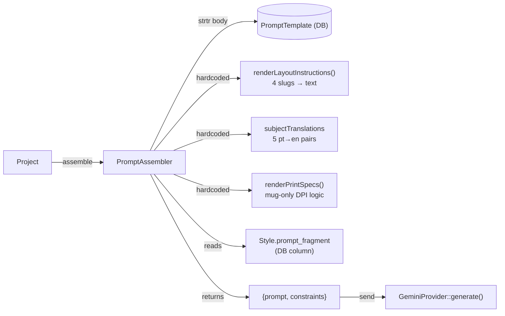
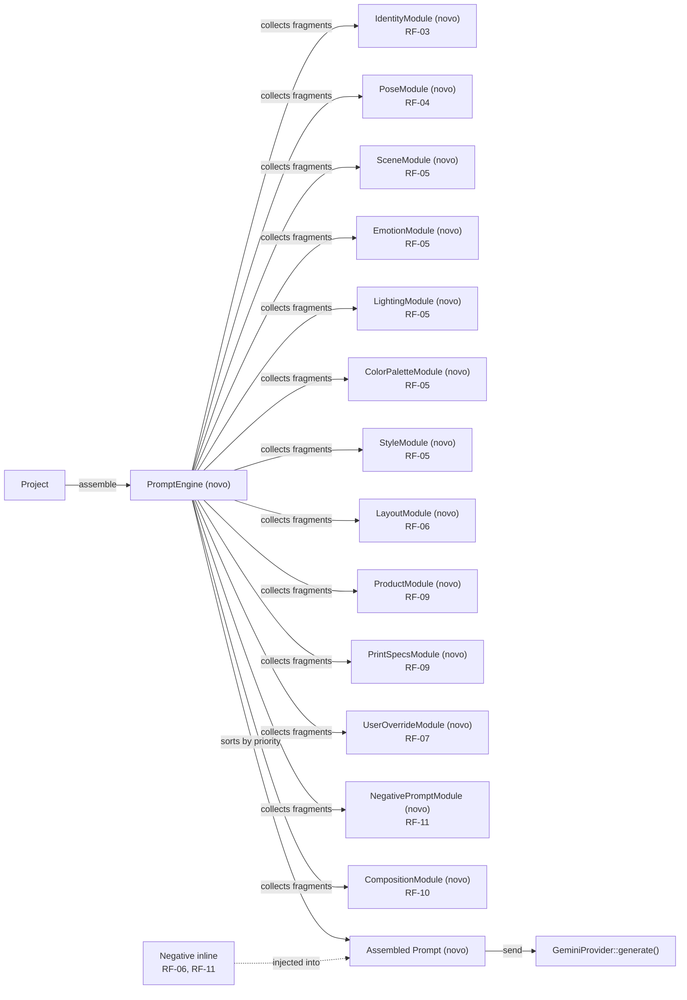

# SPEC: creative-prompt-engine

## Metadata
- Source: developer description via /plan
- Service: kindrad-canvas (Laravel 13 / PHP 8.4)
- Tier: complete
- Version: 1.0
- Architecture references: AGENTS.md (Laravel Boost guidelines, Laravel 13, PHP 8.4, Pest v4, Livewire v4)

## Context

The current prompt assembly system (`app/Services/PromptAssembler.php`) is a monolithic class that performs simple `strtr` string replacement on `PromptTemplate.body` templates. Layout instructions are hardcoded in PHP (`renderLayoutInstructions()`), pose names are passed as-is (Portuguese strings), and there is no structured way to inject scene, emotion, lighting, or color context into prompts. Negative prompts are not supported by Gemini 2.5 Flash Image natively, so any artifact avoidance must be injected inline.

The feature transforms this into a modular **Creative Prompt Engine** with 13 independent modules, each producing a `PromptFragment` (text + priority + optional negative fragment). The orchestrator (`PromptEngine`) collects fragments, sorts by priority, and concatenates them into a single rich prompt. The priority hierarchy is: **User > Identity > Product/Print > Style/Scene/Lighting**. User's `custom_prompt` gets highest priority and can override the scene.

Additionally, a **Scene Preset system** gives users visual control over the background/scene. Each category (birthday, wedding, etc.) has 4 selectable scene presets displayed as cards in the Configurator. Users pick one, and the SceneModule uses it instead of the category default. This eliminates the need for users to write prompt text to control the scene.

The active AI provider is Google Gemini 2.5 Flash Image (`app/Services/Generation/GeminiProvider.php`), which supports source images but has no native negative prompt parameter. Negative content must be woven into the positive prompt string.

## AS IS — Estado atual

<Legenda PT-BR: O PromptAssembler atual realiza substituição simples de placeholders via `strtr` em um template do banco. Instruções de layout, traduções de assunto e specs de impressão estão hardcoded em métodos privados. O único fragmento enriquecido vem do `Style.prompt_fragment`. Não há suporte a negative prompts, nem a módulos independentes para cena, emoção, iluminação ou paleta de cores.>

## TO BE — Estado proposto

<Legenda PT-BR: O novo `PromptEngine` orquestra 13 módulos independentes via interface `PromptModule`. Cada módulo retorna um `PromptFragment` com texto, prioridade e opcionalmente um negative fragment. O engine ordena por prioridade (User > Identity > Product/Print > Style/Scene/Lighting) e concatena tudo em um prompt único rico. O negative prompt é injetado inline no prompt positivo (RF-06, RF-11), pois o Gemini não suporta parâmetro nativo.>

## Scope
- **In**: PromptEngine orchestrator, 13 PromptModule implementations, PromptFragment value object, PromptModule interface, migrations for 5 tables (poses, categories, layouts, styles, products), scene_presets table (4 presets per category, ~24 records), scene_preset_id nullable FK in projects table, ScenePreset model with category relationship, BlockScene Livewire component for Configurator, SceneModule updated to read from preset or category default, CatalogSeeder updates for all 8 poses (English rich descriptions), 6 categories (scene/emotion/lighting/color), 4 layouts (prompt_fragment), styles (negative_fragment), products (product_prompt_rules), backward-compatible provider interface, existing test migration
- **Out**: Admin UI for editing fragment fields (Fase 5), visual prompt preview in Configurator, new AI providers, changes to GenerationProvider contract signature

## RIGID (Non-Negotiable)

### Functional Requirements

- RF-01 [State-Driven]: PromptEngine MUST orchestrate exactly 13 independent PromptModule implementations and collect their PromptFragment outputs into a sorted list before concatenation.
  - AC: `PromptEngine::assemble(Project $project)` returns `array{prompt: string, constraints: array}` where `prompt` is a non-empty string containing fragments from all applicable modules.
  - AC: The `PromptModule` interface defines `public function fragment(Project $project): ?PromptFragment` with return type `PromptFragment|null`.

- RF-02 [State-Driven]: PromptFragment value object MUST contain `string $text`, `int $priority`, `?string $negativeFragment` with public readonly properties.
  - AC: `new PromptFragment(text: '...', priority: 10, negativeFragment: 'no text')` is constructible.
  - AC: `negativeFragment` is nullable; when null, no negative content is contributed by that module.

- RF-03 [State-Driven]: IdentityModule MUST extract subject name from `Project.inputs['name']` (defaulting to `'the subject'` when empty) and translate `Project.subject_type` from Portuguese to English using the mapping: pessoa→person, casal→couple, familia→family, pet→pet, outra→subject. Priority: 90.
  - AC: For a project with `inputs.name = 'Alice'` and `subject_type = 'casal'`, the fragment text contains both `'Alice'` and `'couple'`.
  - AC: For a project with empty `inputs.name`, the fragment text contains `'the subject'`.

- RF-04 [State-Driven]: PoseModule MUST translate each of the 8 pose names from Portuguese to English and append a rich contextual description. Priority: 85.
  - AC: For pose slug `'abracados'`, the fragment text contains `'embracing'` (or equivalent English rich description).
  - AC: For pose slug `'beijo'`, the fragment text contains `'kissing'` (or equivalent English rich description).
  - AC: The 8 poses covered are: abracados, beijo, sentados, caminhando, natal, praia, sofa, flores.

- RF-05 [State-Driven]: SceneModule, EmotionModule, LightingModule, and ColorPaletteModule MUST each read their respective column from `Category` (`scene_prompt`, `emotion_hint`, `lighting_hint`, `color_palette`) and return a PromptFragment. Priority: 70 for scene/emotion/lighting, 65 for color_palette. Fragments are empty/null when the column is null or empty.
  - AC: For a category with `scene_prompt = 'cozy bedroom at sunset'`, the SceneModule fragment text contains `'cozy bedroom at sunset'`.
  - AC: For a category with `emotion_hint = null`, the EmotionModule returns null (no fragment contributed).

- RF-06 [Event-Driven]: LayoutModule MUST read `Layout.prompt_fragment` from the database (new column) instead of the hardcoded `renderLayoutInstructions()` method. Priority: 70.
  - AC: For layout slug `'centered'` with `prompt_fragment = 'Main subject MUST be centered...'`, the fragment text matches the database value.
  - AC: The hardcoded `renderLayoutInstructions()` method in PromptAssembler is no longer called for prompt assembly.

- RF-07 [Event-Driven]: UserOverrideModule MUST read `Project.custom_prompt` and return a PromptFragment with the highest priority (100) when the value is non-empty. When empty, returns null.
  - AC: For a project with `custom_prompt = 'Add a rainbow in the background'`, the fragment text contains `'Add a rainbow in the background'` and priority is 100.
  - AC: For a project with `custom_prompt = null`, the module returns null.

- RF-08 [State-Driven]: PromptEngine MUST sort all collected fragments by priority descending (highest first) before concatenation. Priority hierarchy: User (100) > Identity (90) > Pose (85) > Product/Print (80) > Style (75) > Scene/Emotion/Lighting (70) > Layout (70) > ColorPalette (65).
  - AC: Given fragments with priorities [65, 100, 70, 90], the concatenated prompt has the priority-100 fragment first, followed by priority-90, then priority-70, then priority-65.

- RF-09 [State-Driven]: ProductModule MUST read `Product.product_prompt_rules` (new JSON column) and emit product-specific prompt rules. PrintSpecsModule MUST compute print dimensions from `Product.print_width_mm`, `print_height_mm`, and `Product.min_dpi` (same formula as current PromptAssembler). Priority: 80 for both. PrintSpecsModule only emits when mode slug is `'mug'`.
  - AC: For a mug product with `print_width_mm = 220`, `print_height_mm = 95`, `min_dpi = 300`, the PrintSpecsModule fragment text contains `'2165'` (rounded width in px) and `'1122'` (rounded height in px).
  - AC: For mode slug `'free'`, PrintSpecsModule returns null.

- RF-10 [Event-Driven]: The generated prompt MUST contain scene context, mood/emotion, lighting direction, and composition instructions (vs current generic template). This is validated by checking the assembled prompt includes content from at least 4 distinct module categories (identity + style + scene/lighting + layout or composition).
  - AC: `PromptEngine::assemble()` for a project with category scene_prompt, style prompt_fragment, and layout prompt_fragment produces a prompt containing substrings from each of those sources.

- RF-11 [Event-Driven]: NegativePromptModule MUST generate inline restriction text (e.g., "Avoid: blurry, distorted faces, extra limbs, low quality") that is concatenated into the positive prompt string since Gemini does not support a native negative prompt parameter. Priority: 60.
  - AC: The assembled prompt contains the string `'Avoid:'` (or equivalent restriction prefix) when negative fragments are present.
  - AC: Negative content from individual modules (via `PromptFragment.negativeFragment`) is collected and merged into the single inline restriction block.

- RF-12 [State-Driven]: All existing PromptAssembler tests MUST continue passing after migration. The PromptAssembler class may be deprecated but must not be deleted until all callers are migrated.
  - AC: `php artisan test --compact --filter=PromptAssemblerTest` passes with 0 failures.
  - AC: `php artisan test --compact --filter=CatalogSeederV2Test` passes with 0 failures (if applicable).

- RF-13 [State-Driven]: SceneModule MUST check `Project.scene_preset_id` first. When set, use `ScenePreset.prompt_fragment` as the scene context. When null, fall back to `Category.scene_prompt`. The `scene_presets` table MUST contain 4 selectable presets per category with columns: `id`, `category_id` (FK), `name`, `slug`, `prompt_fragment` (text), `sort_order`, `is_default` (bool), `timestamps`. The `projects` table MUST gain a nullable `scene_preset_id` FK. The Configurator MUST display a `BlockScene` component showing scene preset cards after category selection. Priority: 70.
  - AC: For a project with `scene_preset_id` pointing to a 'balloon_party' preset, the SceneModule fragment text contains the preset's `prompt_fragment` value.
  - AC: For a project with `scene_preset_id = null`, the SceneModule falls back to `Category.scene_prompt`.
  - AC: The `scene_presets` table has 4 rows per category (24 total).
  - AC: BlockScene component displays clickable scene cards and dispatches 'scene-selected' event.

- RF-14 [Event-Driven]: BlockScene MUST filter scene presets by the currently selected `category_id`. When `categoryId` is null, the component MUST NOT render. When `categoryId` changes to a different category, `scene_preset_id` MUST be reset to null. Categories with no presets MUST show an informative empty state message.
  - AC: For project with `category_id = 1`, BlockScene displays only presets where `category_id = 1`.
  - AC: For project with `category_id = null`, BlockScene does not render.
  - AC: Changing `category_id` from 1 to 2 clears `scene_preset_id` to null.
  - AC: Category with 0 presets renders empty state message ("No scenes available for this category").

- RF-15 [State-Driven]: When a category is selected, if it has a preset with `is_default = true`, the system MUST auto-select that preset and set `scene_preset_id`. User can override by clicking another preset. Auto-selection MUST only fire on `category-selected` event, NOT on `style-selected` event.
  - AC: Selecting a category with `is_default = true` preset auto-sets `scene_preset_id` to that preset's id.
  - AC: User clicking another preset overrides the auto-selection.
  - AC: Changing style does NOT trigger auto-selection again.

- RF-16 [State-Driven]: Each category MUST have 4 scene presets seeded.
  - AC: `ScenePresetSeeder` creates 4 presets per category (24 total).
  - AC: Each preset has unique `(category_id, slug)`.
  - AC: Exactly 1 preset per category has `is_default = true`.
  - AC: Each `prompt_fragment` is non-empty and descriptive (minimum 20 characters).

### Contracts

- CT-01: `PromptModule` interface — `public function fragment(Project $project): ?PromptFragment;`
- CT-02: `PromptFragment` value object — `__construct(public readonly string $text, public readonly int $priority, public readonly ?string $negativeFragment = null)`
- CT-03: `PromptEngine` — `public function assemble(Project $project): array{prompt: string, constraints: array}`
- CT-04: `ScenePreset` model — `belongsTo(Category)`, fillable: `category_id`, `name`, `slug`, `prompt_fragment`, `sort_order`, `is_default`

### Non-Functional Requirements

- RNF-01: `PromptEngine::assemble()` MUST complete within 50ms for a project with all 13 modules resolved (excluding DB queries; measured via Pest benchmark or timing assertion).
- RNF-02: Database migrations for poses, categories, layouts, styles, products, AND scene_presets MUST be reversible (down migration drops added columns) and MUST NOT lock tables for more than 5 seconds on a dataset of 10k rows.
- RNF-03: Seeders for pose English descriptions, category scene/emotion/lighting/color fields, and layout prompt_fragments MUST be idempotent (use `firstOrCreate` or `updateOrInsert`).

## FLEXIBLE (Implementation Suggestions)

- **PromptModule namespace**: `App\Services\PromptEngine\Modules\{ModuleName}` — one class per module, each implementing `PromptModule`.
- **PromptEngine location**: `App\Services\PromptEngine\PromptEngine.php` — replaces `App\Services\PromptAssembler` as the primary entry point.
- **Service Provider registration**: Bind `PromptEngine` in `AppServiceProvider` or a dedicated `PromptEngineServiceProvider` so modules can be resolved via container injection.
- **Module discovery**: Consider auto-discovering modules via `app()->tagged('prompt.modules')` or a simple array config in `config/prompt-engine.php` listing module classes in priority order.
- **Backward compatibility**: Keep `PromptAssembler` as a thin wrapper that delegates to `PromptEngine` during migration, annotated `@deprecated`.
- **Pose English descriptions**: Store in a PHP enum or config array rather than database, since the 8 poses are fixed catalog data.
- **Testing strategy**: Unit test each module in isolation with a mocked Project. Feature test `PromptEngine::assemble()` end-to-end with CatalogSeeder data.
- **PromptFragment::negativeFragments()**: Consider a static `merge(array $fragments): string` method to consolidate all negative fragments into the inline block.

## Acceptance Criteria Summary

| ID | Criterion | Testable? |
|----|-----------|-----------|
| RF-01a | PromptEngine::assemble returns `{prompt, constraints}` with non-empty prompt | Yes — Pest test |
| RF-01b | PromptModule interface defines `fragment(Project): ?PromptFragment` | Yes — Pest arch test |
| RF-02a | PromptFragment constructible with text, priority, negativeFragment | Yes — Pest test |
| RF-02b | negativeFragment nullable | Yes — Pest test |
| RF-03a | IdentityModule includes subject name in fragment | Yes — Pest test |
| RF-03b | IdentityModule translates subject_type pt→en | Yes — Pest test |
| RF-04 | PoseModule translates all 8 poses to English with rich descriptions | Yes — Pest test |
| RF-05a | SceneModule reads Category.scene_prompt | Yes — Pest test |
| RF-05b | EmotionModule returns null when emotion_hint is null | Yes — Pest test |
| RF-06 | LayoutModule reads Layout.prompt_fragment from DB | Yes — Pest test |
| RF-07a | UserOverrideModule returns priority 100 when custom_prompt non-empty | Yes — Pest test |
| RF-07b | UserOverrideModule returns null when custom_prompt is null | Yes — Pest test |
| RF-08 | Fragments sorted by priority descending | Yes — Pest test |
| RF-09a | PrintSpecsModule computes correct pixel dimensions | Yes — Pest test |
| RF-09b | PrintSpecsModule returns null for non-mug mode | Yes — Pest test |
| RF-10 | Assembled prompt contains scene + mood + lighting + composition | Yes — Pest test |
| RF-11 | NegativePromptModule produces inline "Avoid:" block | Yes — Pest test |
| RF-12a | PromptAssemblerTest passes after migration | Yes — `php artisan test --compact --filter=PromptAssemblerTest` |
| RF-12b | CatalogSeederV2Test passes after migration | Yes — `php artisan test --compact --filter=CatalogSeederV2Test` |
| RF-13a | SceneModule reads from preset when scene_preset_id set | Yes — Pest test |
| RF-13b | SceneModule falls back to category when scene_preset_id null | Yes — Pest test |
| RF-13c | scene_presets table has 4 rows per category | Yes — Pest seeder test |
| RF-13d | BlockScene shows scene cards for selected category | Yes — Livewire test |
| RF-14a | BlockScene filters presets by category_id | Yes — Livewire test |
| RF-14b | BlockScene hides when category_id is null | Yes — Livewire test |
| RF-14c | Changing category resets scene_preset_id | Yes — Livewire test |
| RF-14d | Empty category shows empty state | Yes — Livewire test |
| RF-15a | Default preset auto-selected on category-selected | Yes — Livewire test |
| RF-15b | User click overrides default | Yes — Livewire test |
| RF-15c | Style change does NOT trigger auto-selection | Yes — Livewire test |
| RF-16a | Seeder creates 4 presets per category | Yes — Seeder test |
| RF-16b | Exactly 1 preset per category is_default | Yes — Seeder test |
| RF-16c | Each prompt_fragment has 20+ chars | Yes — Seeder test |

## Distribution by Repo

| Repo | RFs | Contracts |
|------|-----|-----------|
| kindrad-canvas | RF-01–RF-16 | CT-01, CT-02, CT-03, CT-04 |
