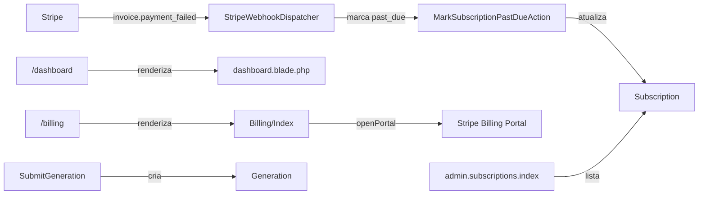
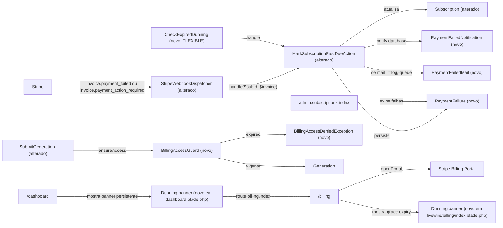

# Implementation Plan — dunning-and-communication

## Request Summary

- **Objective**: When Stripe signals a failed or 3DS-required invoice, mark the local subscription `past_due`, persist a `PaymentFailure` row, deliver a database notification (and a queued mailable outside the `log` mailer), surface a persistent dunning banner on `/dashboard` and `/billing`, and block new `Generation` rows once the configurable grace period expires. Expose the failures on `admin.subscriptions.index`.
- **Scope in**: webhook `invoice.payment_failed` + `invoice.payment_action_required`; local `past_due`; database notification + conditional queued mail; `PaymentFailure` audit row; banners; grace period; `BillingAccessDeniedException` on `Generation` creation; admin visibility; Pest suite `tests/Feature/Billing/DunningTest.php`.
- **Scope out** (see SPEC.md "Out of scope" — not duplicated here): Stripe Connect, smart retries, multi-customer dunning rules, manual charging, plan changes, communication channels other than database notification + the specified mail.
- **Tier**: standard.
- **Architecture references**: `AGENTS.md` (Laravel 13 / Pest 4 / Flux v2 / Tailwind 4 conventions), `app/Billing/StripeWebhookDispatcher.php`, `app/Actions/Billing/MarkSubscriptionPastDueAction.php`, `app/Models/Subscription.php`, `app/Models/User.php` (`Notifiable` trait present), `app/Actions/Generation/SubmitGeneration.php` (lock insertion point at `:52`), `app/Livewire/Billing/Index.php` (`openPortal` at `:32`), `routes/web.php` (no new routes).

## AS IS — Componentes impactados



Apenas `invoice.payment_failed` é roteado e a ação atual não cria notificação, e-mail, nem registro de falha. Não existe `PaymentFailure`, nem configuração de grace, nem banner de dunning, nem bloqueio de geração, nem `BillingAccessDeniedException`. Os diretórios `app/Notifications`, `app/Mail`, `app/Exceptions` ainda não existem neste repositório.

## TO BE — Componentes propostos



`StripeWebhookDispatcher` é estendido (T01) para rotear o segundo tipo de evento e propagar o objeto invoice; `MarkSubscriptionPastDueAction` é estendido (T01) para criar `PaymentFailure`, disparar a notificação e enfileirar o mail condicional; `Subscription` ganha `isPastDueAndExpired()` (T02); `BillingAccessGuard` + `BillingAccessDeniedException` (T03) interceptam `SubmitGeneration`; banners (T04) entram em `dashboard.blade.php` e `livewire/billing/index.blade.php`; admin (T05) ganha listagem de falhas; testes Pest (T06) cobrem RF-01..RF-07.

## Tasks

### T01 — Estender dispatcher + action para rotear 3DS e persistir efeitos
- **Files**:
  - `app/Billing/StripeWebhookDispatcher.php` (alterado)
  - `app/Actions/Billing/MarkSubscriptionPastDueAction.php` (alterado)
  - `app/Models/Subscription.php` (alterado, em T02)
- **Change**:
  - Dispatcher: adicionar case para `invoice.payment_action_required` no `match` que reusa `MarkSubscriptionPastDueAction`; repassar `$object` (invoice) e o `type` para a action. Preservar todas as ramificações existentes (`invoice.payment_succeeded`, `customer.subscription.*`, default).
  - Action: alterar assinatura para `handle(string $stripeSubscriptionId, array $invoice = [], string $eventType = 'invoice.payment_failed'): ?Subscription`. Dentro do `if ($subscription !== null)`, em ordem: (a) manter transição atual para `past_due`; (b) `PaymentFailure::create([...])` a partir de `$invoice` (`id` → `stripe_invoice_id`, `charge` → `stripe_charge_id`, `attempted` → `attempted_at`, `last_payment_error.message` ou `'unknown'` → `reason`, payload inteiro em `payload`, mais `user_id`/`subscription_id`); (c) `$subscription->user->notify(new PaymentFailedNotification($subscription))`; (d) `if (config('mail.default') !== 'log') { Mail::to($subscription->user)->queue(new PaymentFailedMail($subscription, $eventType)); }`. Preservar o retorno `?Subscription` (CT-02) e a atomicidade por invocação (RNF-01 — sem loops, um único `PaymentFailure`, uma única notificação).
- **Covers**: RF-01, RF-05, RF-07, RNF-01, CT-01, CT-02, CT-03.
- **Tests**: `tests/Feature/Billing/DunningTest.php` — AC1, AC5, AC7.
- **Risk**: Medium — altera dispatcher (ponto quente de webhooks) e assinatura de action consumida apenas aqui (verificado via grep). Mitigação: manter retorno `?Subscription` e log estruturado em caso de subscription desconhecida.
- **Dependencies**: T02 (model `PaymentFailure` precisa existir), T03 (notification), T04 (mail).

### T02 — Criar migration `payment_failures`, model `PaymentFailure` e helper `Subscription::isPastDueAndExpired()`
- **Files**:
  - `database/migrations/2026_07_16_000001_create_payment_failures_table.php` (novo, via `php artisan make:migration create_payment_failures_table --create=payment_failures`)
  - `database/factories/PaymentFailureFactory.php` (novo, factory companion; exigido pelas convenções do projeto por todo modelo novo)
  - `app/Models/PaymentFailure.php` (novo)
  - `app/Models/Subscription.php` (alterado)
- **Change**:
  - Migration: tabela `payment_failures` com `id`, `user_id` (FK `users`), `subscription_id` (FK `subscriptions`), `stripe_invoice_id` (string, nullable, indexado), `stripe_charge_id` (string, nullable, indexado), `attempted_at` (timestamp, nullable), `reason` (string, nullable), `payload` (json, nullable), `created_at` (timestamps sem `updated_at`). Index composto `(subscription_id, attempted_at)` para o painel.
  - Model: `$fillable` com todos os campos de CT-03 exceto `id`/`created_at`; `casts(['attempted_at' => 'datetime', 'payload' => 'array'])`. Relations `user()` e `subscription()` belongsTo. Implementar `newFactory()` espelhando `Subscription` (CT-03).
  - Factory: estados `forSubscription(Subscription $sub)`, `forUser(User $u)`; `stripe_invoice_id`/`stripe_charge_id` aleatórios `in_…`/`ch_…`.
  - `Subscription::isPastDueAndExpired(int $graceDays = null): bool`: se `! $this->isOpen() || $this->statusSlug() !== 'past_due'` retorna `false`. Caso contrário, calcula `$expiry = $this->ends_at ?? $this->current_period_end?->copy()->addDays($graceDays ?? (int) config('billing.grace_days', 7))`; retorna `now()->greaterThan($expiry)`.
- **Covers**: RF-03 (grace default 7), RF-04, RF-05, CT-03.
- **Tests**: `tests/Feature/Billing/PaymentFailureModelTest.php` (opcional) — casts e fills; em `DunningTest.php` AC3, AC4, AC5.
- **Risk**: Low — migration nova sem efeito retroativo; helper é aditivo. Garantir `current_period_end` tratado como nullable na base (verificado em `Subscription::casts()`).
- **Dependencies**: nenhuma (modelos e factories ficam prontos antes de T01 ser executado de fato, mas a ordem lógica do plano é T02 antes de T01).

### T03 — Criar `BillingAccessDeniedException`, `BillingAccessGuard` e hook em `SubmitGeneration`
- **Files**:
  - `app/Exceptions/BillingAccessDeniedException.php` (novo)
  - `app/Services/Billing/BillingAccessGuard.php` (novo, espelha `CreditLedger` em `app/Services/`)
  - `app/Actions/Generation/SubmitGeneration.php` (alterado)
- **Change**:
  - Exception: `extends RuntimeException` (alinhado a `CreditInsufficientException`), construtor `public static function for(User $user): self` com mensagem determinística contendo `past_due` e a data de expiração.
  - Guard: método `public function ensureCanSubmit(User $user): void` que carrega a assinatura mais recente do usuário (`Subscription::where('user_id', $user->id)->latest('id')->first()`); se ausente → retorno; se `isPastDueAndExpired()` → lança `BillingAccessDeniedException::for($user)`. Service dedicado cobre todos os pontos de criação de `Generation` (CT-05 + RF-04 AC).
  - `SubmitGeneration`: injetar `BillingAccessGuard` no constructor (propriedade readonly promoted); chamar `$this->guard->ensureCanSubmit($user)` imediatamente após a checagem de autorização existente em `:32` e antes de qualquer acesso a `credit_balance`/assembler, mantendo `BillingAccessDeniedException` como a exceção contratual observada pelo chamador.
- **Covers**: RF-04, CT-05.
- **Tests**: `DunningTest` AC4.
- **Risk**: Medium — altera o caminho quente de criação de geração. Mitigação: ordem de checagens preservada (autorização → billing → créditos → provider), exception específica que pode ser capturada pelo caller Livewire existente sem colapsar a transação.
- **Dependencies**: T02 (helper `isPastDueAndExpired`).

### T04 — Banner persistente em `/dashboard` com CTA `Atualizar método de pagamento`
- **Files**: `resources/views/dashboard.blade.php` (alterado)
- **Change**: dentro do `<div class="flex flex-col gap-section p-margin-page">` logo após o `session('status')` (RF-02 exige banner no topo), inserir bloco Blade que: (a) carrega `$pastDueSubscription = App\Models\Subscription::where('user_id', auth()->id())->whereHas('status', fn ($q) => $q->where('slug', 'past_due'))->latest('id)->first()`; (b) se presente, renderiza `<a href="{{ route('billing.index') }}" data-test="dashboard-dunning-banner" class="…">{{ __('Atualizar método de pagamento') }}</a>` envolvendo texto contextual e CTA literal. Renderizar tanto para usuários sem `status_id` mas com `stripe_status = past_due` (ver `Subscription::isOpen()`).
- **Covers**: RF-02, CT-04.
- **Tests**: `DunningTest` AC2 (visita `/dashboard` autenticado e asserta o CTA + link para `billing.index`).
- **Risk**: Low — extensão de view, sem alteração de controlador.
- **Dependencies**: nenhuma (independente de T03).

### T05 — Banner de grace em `/billing` e listagem de falhas em `admin.subscriptions.index`
- **Files**:
  - `app/Livewire/Billing/Index.php` (alterado, propriedade computada `?CarbonInterface $graceExpiresAt = null`)
  - `resources/views/livewire/billing/index.blade.php` (alterado)
  - `app/Livewire/Admin/Subscriptions/Index.php` (alterado, eager load `paymentFailures`)
  - `resources/views/livewire/admin/subscriptions/index.blade.php` (alterado)
- **Change**:
  - `Billing\Index`: nova propriedade computada `getGraceExpiresAtProperty(): ?CarbonInterface` retornando `$this->subscription?->ends_at ?? $this->subscription?->current_period_end?->copy()->addDays((int) config('billing.grace_days', 7))` apenas quando `statusSlug() === 'past_due'`; passar para a view no `render()` como `graceExpiresAt`.
  - View billing: no topo do bloco `data-test="billing-current-subscription"`, antes do `<header>`, se `graceExpiresAt` presente, render `<flux:callout variant="warning" icon="exclamation-triangle" data-test="billing-dunning-banner">` com heading `__('Atualize seu pagamento até :date', ['date' => $graceExpiresAt->format('d/m/Y')])`.
  - `Admin\Subscriptions\Index`: adicionar `->with(['paymentFailures' => fn ($q) => $q->latest('attempted_at')->limit(5)])` no eager load do `render()`.
  - View admin: adicionar coluna `Falhas recentes` (ou expansão por linha) com `data-test="admin-subscription-failures-{{ $sub->id }}"`, listando `attempted_at` e `reason` das últimas 5 falhas; fallback `—` quando vazio.
- **Covers**: RF-03, RF-05, CT-04.
- **Tests**: `DunningTest` AC3, AC5.
- **Risk**: Low — extensão de componente Livewire e view; nenhuma rota nova.
- **Dependencies**: T02 (`paymentFailures` relation + casts).

### T06 — Notificação `PaymentFailedNotification`, mailable `PaymentFailedMail`, opcional `PaymentActionRequiredMail` (FLEXIBLE)
- **Files**:
  - `app/Notifications/PaymentFailedNotification.php` (novo)
  - `app/Mail/PaymentFailedMail.php` (novo)
  - `app/Mail/PaymentActionRequiredMail.php` (novo, FLEXIBLE — manter opcional e simples; pode ser classe placeholder se preferir adiar)
  - `resources/views/mail/payment-failed.blade.php` (novo, opcional — pode reusar Markdown default)
   - `database/migrations/2026_07_16_000002_create_notifications_table.php` (novo, via `php artisan notifications:table`, requerido pelo canal `database`)
  - `.env.example` (edição — adicionar `MAIL_MAILER=smtp` + bloco Brevo documentado abaixo)
- **Change**:
  - **Provider de e-mail [RIGID — provider decidido: Brevo]**: configurar SMTP via Brevo (ex-Sendinblue) em produção. Variáveis esperadas adicionadas a `.env.example`:
    ```
    MAIL_MAILER=smtp
    MAIL_HOST=smtp-relay.brevo.com
    MAIL_PORT=587
    MAIL_USERNAME=<brevo-smtp-login>
    MAIL_PASSWORD=<brevo-smtp-key>
    MAIL_ENCRYPTION=tls
    MAIL_FROM_ADDRESS=noreply@kindredcanvas.com
    MAIL_FROM_NAME="Kindred Canvas"
    ```
    Bloquear AC7 em CI: o teste usa `config(['mail.default' => 'log'])` em uma metade do dataset e `config(['mail.default' => 'smtp'])` na outra para validar a condicionalidade do enqueue (sem precisar de credenciais Brevo reais).
  - Notification: `extends Notification`, `via() => ['database']`, `toDatabase($notifiable): array` retornando shape `{subscription_id, stripe_status, grace_expires_at, message}`. Não implementar `ShouldQueue` por padrão (RF-01 exige database persistido; mail separado é o canal enfileirado).
  - Mail: `extends Mailable`, `implements ShouldQueue`, `build()` retorna `$this->subject(__('Atualize seu método de pagamento'))->markdown('mail.payment-failed', ['subscription' => $this->subscription])`.
  - Migration `notifications`: gerada via `php artisan notifications:table` (Laravel 13 scaffold). Aplicada separadamente fora deste escopo (não executar migrate aqui).
- **Covers**: RF-01, RF-07.
- **Tests**: `DunningTest` AC1 (notificação visível em `$user->notifications`), AC7 (`Mail::assertQueued` quando mailer ≠ `log`, `Mail::assertNothingQueued` quando mailer = `log`).
- **Risk**: Medium — depende da tabela `notifications` ser criada antes do teste rodar. Mitigação: migration commitada no mesmo PR; Pest `RefreshDatabase` aplica o conjunto.
- **Dependencies**: T01 (action que dispara), T02 (model referenciado).

### T07 — Config `config/billing.php` com `grace_days` (default 7)
- **Files**: `config/billing.php` (novo)
- **Change**: arquivo único retornando `['grace_days' => (int) env('BILLING_GRACE_DAYS', 7)]`. Sem novas envs além desta; segue convenção do projeto (cada `config/*.php`).
- **Covers**: RF-03 (default 7), RF-04 (configurabilidade).
- **Tests**: indireto via AC3/AC4.
- **Risk**: Low — chave isolada.
- **Dependencies**: nenhuma.

### T08 — Suíte Pest `tests/Feature/Billing/DunningTest.php` + polimento
- **Files**:
  - `tests/Feature/Billing/DunningTest.php` (novo)
  - `tests/Feature/Billing/PaymentFailureModelTest.php` (novo, opcional)
- **Change**:
  - `DunningTest` cobre os 7 ACs nomeados na SPEC §"Acceptance Tests":
    1. `it_marks_subscription_past_due_and_creates_database_notification_for_failed_invoice` — `Bus::fake()` desnecessário; chamar dispatcher com payload válido; `actingAs` user; assertar `past_due`, notification e row.
    2. `it_renders_persistent_dashboard_dunning_banner_with_billing_cta` — `get('/dashboard')`, assertar link `route('billing.index')` e texto literal.
    3. `it_renders_grace_expiry_on_billing_page_using_ends_at_or_configured_period` — duas asserções (com `ends_at` e sem), `Carbon::setTestNow` para controle temporal.
    4. `it_blocks_generation_after_grace_and_allows_generation_within_grace` — `SubmitGeneration` happy path dentro do grace, e `BillingAccessDeniedException` após grace.
    5. `it_records_payment_failure_and_displays_it_in_admin_subscriptions` — `actingAs` admin, `get('/admin/subscriptions')`, assertar falha listada.
    6. `it_covers_all_dunning_acceptance_criteria_in_the_feature_suite` — meta-teste que varre os outros 6 via dataset (opcional, equivalente a AC6 "arquivo executável e todos os casos passam" verificado pelo runner).
    7. `it_treats_payment_action_required_as_dunning_and_queues_mail_except_for_log_mailer` — duas variantes de `config('mail.default')`; `Mail::fake()`.
  - `RefreshDatabase` + factories de `Subscription`, `User`, `SubscriptionStatus`, `SubscriptionPlan` já existentes.
  - Rodar `vendor/bin/pint --dirty --format agent` (lint obrigatório) e `php artisan test --compact --filter=DunningTest`.
- **Covers**: RF-06 + todos os outros RIGID indiretamente.
- **Risk**: Medium — depende de T01–T07 estáveis. Mitigação: executar em ordem; lint e teste compõem o gate final.
- **Dependencies**: T01–T07.

### T09 (FLEXIBLE) — Comando agendado `CheckExpiredDunning` + opção `php artisan make:command` (opcional)
- **Files**:
  - `app/Console/Commands/CheckExpiredDunning.php` (novo)
  - `routes/console.php` (alterado, registro `$schedule->command(...)` se mantido)
- **Change**: comando idempotente que varre assinaturas `past_due` e, quando o grace expirou, opcionalmente dispara notificação adicional ("acesso bloqueado"). Não é exigido por nenhum RIGID; manter como FLEXIBLE conforme SPEC e request.
- **Covers**: nenhum RIGID; higiene operacional.
- **Tests**: cobertura fora do escopo.
- **Risk**: Low.
- **Dependencies**: T02, T03.

## Execution Phases

| Phase | Tasks | Parallel-safe? |
|-------|-------|----------------|
| 1 — Foundation: migration + models + config + exception + guard | T02, T03, T07 | Sim — T02/T03/T07 tocam arquivos distintos; T03 depende conceitualmente de T02 (helper), mas pode ser escrito em paralelo e mergeado sequencialmente. |
| 2 — Notifications + email + dispatcher/action wiring | T01, T06 | Não — T01 consome T06 (notification/mail) e T02 (model `PaymentFailure`). Executar T06 antes de T01. |
| 3 — UI banners + admin listagem | T04, T05 | Sim — `dashboard.blade.php` e `livewire/billing/index.blade.php` + admin são views/componentes distintos. |
| 4 — Tests + lint + polish | T08, T09 (FLEXIBLE) | Não — T08 depende de T01–T07 já integrados; T09 opcional e independente, pode rodar após T08. |

## Risks

| Risk | Likelihood | Mitigation | Rollback |
|------|------------|------------|----------|
| Migration `notifications` ausente quebra AC1/AC7 em CI local | Média | Commit da migration `notifications` junto com `PaymentFailure` no mesmo PR; documentar em README; Pest `RefreshDatabase` cobre. | Reverter migration criada; channel `database` sem tabela retorna erro — fix imediato. |
| Alterar assinatura de `MarkSubscriptionPastDueAction` quebra callers externos | Baixa | Verificado via grep: único caller é `StripeWebhookDispatcher`. Atualizar ambas no mesmo commit; preservar retorno `?Subscription`. | Reverter assinatura; comunicação já foi roteada antes do deploy. |
| `BillingAccessGuard` injeta latência em `SubmitGeneration` | Baixa | Query única (`Subscription::where(...)->latest('id')->first()`) já presente em `Billing\Index::loadSubscription`; adicionar índice composto não é necessário porque `subscriptions.user_id` já é indexado (`2026_07_15_202419_create_subscriptions_table.php:26`). | Remover chamada do constructor; transações falham com `AuthorizationException` original. |
| Banner dashboard quebra layout mobile | Baixa | Usar `<flux:callout>` (já importado) com `class="mb-6"` consistente com `livewire/billing/index.blade.php:3`. | Reverter bloco Blade inserido. |
| `Mail::queue` enfileira em produção mas CI usa `sync` | Baixa | Test Pest usa `Mail::fake()` — independente do driver. Documentar `QUEUE_CONNECTION` esperado. | Trocar `Mail::queue` por `Mail::send` no caminho de teste. |
| Mudança em `Subscription::isOpen()` (já existente) conflita com helper novo | Baixa | Não tocar `isOpen()`; adicionar método novo `isPastDueAndExpired()`. | Helper isolado, fácil reverter. |
| AC7 testa com `mail.default = 'log'` (dev) e prod usa outro — flake em CI | Baixa | `config(['mail.default' => 'log'])` dentro do próprio teste AC7 antes da asserção. | Remover a variante de log se ficar instável. |

## Test Strategy

- **Framework**: Pest 4 (`tests/Feature/Billing/DunningTest.php` + opcional `PaymentFailureModelTest.php`).
- **Setup**: `RefreshDatabase`; factories de `User`, `Subscription`, `SubscriptionStatus`, `SubscriptionPlan`, `GenerationProvider`, `GenerationStatus`, `Project`, `PaymentFailure` já providas/criadas. `actingAs($user)` + `Mail::fake()` quando aplicável.
- **Cobertura direta**:
  - RF-01 → AC1 (database notification + row + status).
  - RF-02 → AC2 (dashboard banner + CTA literal + link `billing.index`).
  - RF-03 → AC3 (`ends_at` e fallback `current_period_end + grace_days`, com `Carbon::setTestNow`).
  - RF-04 → AC4 (grace vigente permite; grace expirado lança `BillingAccessDeniedException`).
  - RF-05 → AC5 (row visível em `/admin/subscriptions`).
  - RF-06 → AC6 (suite roda via Pest; meta-teste opcional).
  - RF-07 → AC7 (`invoice.payment_action_required` + duas variantes de mailer).
- **Comandos**:
  - `vendor/bin/pint --dirty --format agent` (após cada tarefa com PHP alterado).
  - `php artisan test --compact --filter=DunningTest`.
- **Factories novas obrigatórias**: `PaymentFailureFactory` (por convenção do projeto, ver `app/Models/PaymentFailure` declarado como novo). `SubscriptionFactory` já tem estado `pastDue()` (verificado).
- **Sem migrations executadas** neste escopo de plano — a migration será commitada mas o `migrate` fica para o deploy.

## Open Questions

- `[UNVERIFIED]` A SPEC menciona `PaymentFailedNotification` no canal `database`, mas a tabela `notifications` não existe nas migrations verificadas em `database/migrations/`. A solução proposta é emitir a migration via `php artisan notifications:table` (Laravel 13) dentro deste PR; **confirmar se há preferência por gerar a migration manualmente** (mesmo conteúdo) em vez do scaffold.
- A SPEC considera `PaymentActionRequiredMail` (FLEXIBLE) e o `CheckExpiredDunning` (FLEXIBLE). Ambos estão fora do caminho RIGID; o plano os cobre como opcionais (T06 e T09). Se preferir **não criar nenhum dos dois**, mantenha T01 apenas com `PaymentFailedMail` (o dispatcher pode passar o `eventType` para a mesma instância) e ignore T09.

## Assumptions

- O único caller de `MarkSubscriptionPastDueAction` é `StripeWebhookDispatcher` (verificado via grep no repositório).
- `Subscription::current_period_end` é sempre `CarbonInterface|null` (verificado em `app/Models/Subscription.php:25`).
- `User` já usa o trait `Notifiable` (verificado em `app/Models/User.php:11`), satisfazendo o canal `database`.
- O painel admin `Admin\Subscriptions\Index` aceita `with([...])` adicional sem migração de query (verificado em `app/Livewire/Admin/Subscriptions/Index.php:29`).
- `config('mail.default')` retorna string em qualquer ambiente (verificado em `config/mail.php`).
- `php artisan make:migration --create=payment_failures` gera a migration no formato `YYYY_MM_DD_HHMMSS_create_payment_failures_table.php` esperado pelo request.
- `BillingAccessGuard` será colocado em `app/Services/Billing/` espelhando a estrutura `app/Services/Generation/` (verificado).