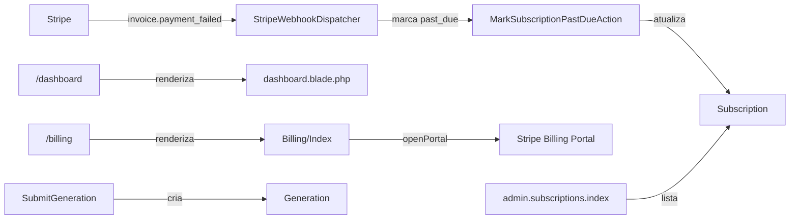
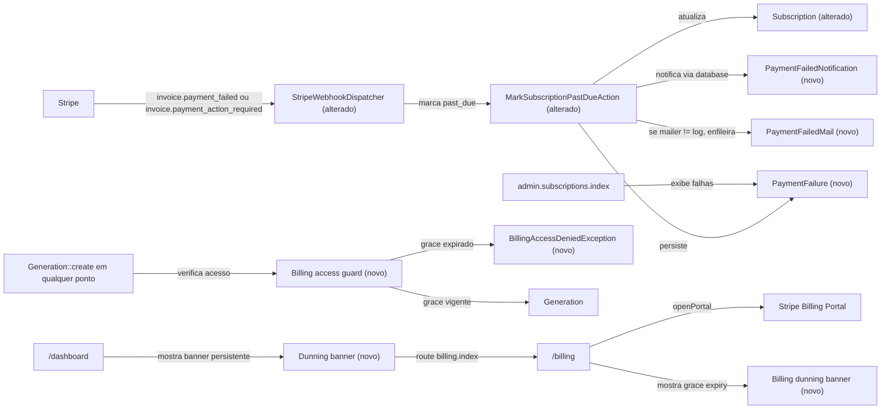

# SPEC: dunning-and-communication

**Status**: draft  
**Tier**: standard  
**Version**: 1.1

## Metadata

| Campo | Valor |
|---|---|
| created_at | 2026-07-16 |
| slug | dunning-and-communication |
| related_routes | `stripe.webhook` (verified at `routes/web.php:58`), `dashboard` (verified at `routes/web.php:21`), `billing.index` (verified at `routes/web.php:26`), `admin.subscriptions.index` (verified at `routes/web.php:35`) |
| related_models | `App\\Models\\Subscription` (verified at `app/Models/Subscription.php`), `App\\Models\\User` (verified at `app/Models/User.php`), `App\\Models\\Generation` (verified at `app/Models/Generation.php`) |
| related_actions | `App\\Actions\\Billing\\MarkSubscriptionPastDueAction` (verified at `app/Actions/Billing/MarkSubscriptionPastDueAction.php`), `App\\Actions\\Billing\\CreateBillingPortalSessionAction` (verified at `app/Actions/Billing/CreateBillingPortalSessionAction.php`), `App\\Actions\\Generation\\SubmitGeneration` (verified at `app/Actions/Generation/SubmitGeneration.php`) |

## Context

A assinatura pode entrar em atraso após uma tentativa de cobrança recusada ou exigir ação adicional de autenticação. O sistema deve comunicar o usuário por notificação persistida e, fora do mailer de desenvolvimento `log`, por e-mail enfileirado; deve manter o acesso durante o período de tolerância e impedir novas gerações quando esse período terminar. Cada falha deve permanecer auditável no painel administrativo. O fluxo atual já roteia `invoice.payment_failed` por `StripeWebhookDispatcher` para `MarkSubscriptionPastDueAction`, a tela de billing expõe `openPortal`, e a criação de geração ocorre em `SubmitGeneration`.

### Regras arquiteturais aplicadas

- Fonte arquitetural: `AGENTS.md`.
- Regra concreta: manter a estrutura existente e seguir as convenções dos arquivos vizinhos; não introduzir dependências sem aprovação.
- Regra concreta: mudanças Laravel devem usar abstrações do framework e ser cobertas por testes Pest; a implementação deve preservar o retorno `Subscription|null` de `MarkSubscriptionPastDueAction`.
- Referência operacional: documentação versionada Laravel 13 para notificações de database, notificações enfileiradas e mailables enfileirados.

## AS IS — Estado atual

O fluxo atual marca a assinatura local como `past_due` para `invoice.payment_failed`, mas não há no código verificado registro de falha, notificação, e-mail de dunning ou bloqueio de geração. A tela de billing já possui a ação `openPortal`; os banners de atraso e a exibição do grace ainda não existem.

## TO BE — Estado proposto

`StripeWebhookDispatcher` e `MarkSubscriptionPastDueAction` são alterados por RF-01 e RF-07; `PaymentFailure` e `PaymentFailedNotification` realizam RF-01 e RF-05; `PaymentFailedMail` realiza RF-07. Os banners novos realizam RF-02 e RF-03, o guard e a exceção realizam RF-04, e o painel administrativo realiza RF-05.

## Scope

- **In**: Tratamento de `invoice.payment_failed` e `invoice.payment_action_required`; status local `past_due`; notificação database; e-mail markdown condicionado ao mailer; persistência de tentativas falhas; banners em dashboard e billing; grace period configurável; bloqueio de novas gerações; visibilidade administrativa; testes Pest em `tests/Feature/Billing/DunningTest.php`.
- **Out**: Stripe Connect webhooks, smart retries, regras de dunning por múltiplos clientes, cobrança manual, alteração de planos e qualquer canal de comunicação além da notificação database e do e-mail especificado.

## RIGID (Non-Negotiable)

1. **[RIGID] RF-01 — Event-Driven**: Quando o webhook `invoice.payment_failed` chegar, o sistema SHALL localizar a assinatura pelo identificador Stripe, definir o status local como `past_due` e criar uma `PaymentFailedNotification` para o usuário pelo canal `database`, além de registrar a tentativa falha correspondente.
   - **AC**: Dado um evento `invoice.payment_failed` de uma assinatura local conhecida, quando o dispatcher processar o evento, então a assinatura terá `stripe_status = past_due`, existirá uma notificação database para o usuário com tipo `PaymentFailedNotification` e a tentativa estará registrada.

2. **[RIGID] RF-02 — State-Driven**: Enquanto o usuário autenticado possuir assinatura `past_due`, o dashboard em `/dashboard` SHALL renderizar um banner persistente no topo contendo o CTA literal `Atualizar método de pagamento`, cujo destino SHALL ser `route('billing.index')`.
   - **AC**: Com usuário autenticado e assinatura `past_due`, a resposta de `/dashboard` contém o banner no topo e um link para o resultado de `route('billing.index')`; sem assinatura `past_due`, não contém esse banner.

3. **[RIGID] RF-03 — State-Driven**: Enquanto a assinatura exibida em `Billing\\Index` estiver `past_due`, a página `/billing` SHALL exibir, no topo do card `Minha assinatura`, um banner com a data de expiração do grace; a data SHALL ser `ends_at` quando preenchida e, caso contrário, `current_period_end + config('billing.grace_days', 7)`.
   - **AC**: Para uma assinatura `past_due` com `ends_at`, o banner exibe `ends_at`; para uma sem `ends_at`, exibe a data calculada com `current_period_end` e `billing.grace_days`, cujo valor padrão é 7 dias.

4. **[RIGID] RF-04 — Conditional**: Quando qualquer fluxo do aplicativo tentar criar uma `Generation`, o sistema SHALL lançar `BillingAccessDeniedException` se o usuário tiver assinatura `past_due` e o grace period estiver expirado; durante o grace period, a criação SHALL continuar permitida.
   - **AC**: Uma tentativa após a data de expiração falha com `BillingAccessDeniedException` e não cria `Generation`; uma tentativa antes ou na data de expiração não é bloqueada por esta regra. O bloqueio SHALL abranger o ponto existente `Generation::create` em `app/Actions/Generation/SubmitGeneration.php:52` e os demais pontos de criação abrangidos pelo mecanismo escolhido.

5. **[RIGID] RF-05 — Event-Driven**: Quando `MarkSubscriptionPastDueAction` processar uma falha, SHALL ser criada uma linha em `payment_failures` com `id`, `user_id`, `subscription_id`, `stripe_invoice_id`, `stripe_charge_id`, `attempted_at`, `reason`, `payload` e `created_at`; o registro SHALL ser visível em `admin.subscriptions.index`.
   - **AC**: Após o processamento de uma falha, a tabela contém exatamente os campos exigidos preenchidos conforme o evento e o painel administrativo mostra a falha associada à assinatura/usuário.

6. **[RIGID] RF-06 — Unwanted**: O conjunto de testes Pest `tests/Feature/Billing/DunningTest.php` SHALL conter casos verificáveis para RF-01, RF-02, RF-03, RF-04, RF-05 e RF-07, incluindo passagem e falha do grace period.
   - **AC**: O arquivo existe, é executável pelo Pest 4 e todos os casos correspondentes aos sete requisitos numerados passam.

7. **[RIGID] RF-07 — Event-Driven / Conditional**: Quando `invoice.payment_failed` chegar, e também quando `invoice.payment_action_required` chegar, o sistema SHALL aplicar o mesmo tratamento `past_due`, notificação database e registro da falha; adicionalmente, se `config('mail.default') !== 'log'`, SHALL enfileirar `PaymentFailedMail` por `Mail::to($user)->queue(...)`; com mailer `log`, SHALL criar somente a notificação database entre os canais de comunicação especificados.
   - **Provider de e-mail [RIGID]**: O driver SMTP do Laravel deve ser configurado com **Brevo** (ex-Sendinblue) como provedor em produção. Variáveis esperadas: `MAIL_MAILER=smtp`, `MAIL_HOST=smtp-relay.brevo.com`, `MAIL_PORT=587`, `MAIL_USERNAME=<brevo-smtp-login>`, `MAIL_PASSWORD=<brevo-smtp-key>`, `MAIL_ENCRYPTION=tls`, `MAIL_FROM_ADDRESS=noreply@kindredcanvas.com`, `MAIL_FROM_NAME="Kindred Canvas"`. O README/AGENTS.md deve citar Brevo e o caminho `.env.example` deve incluir os placeholders. Em desenvolvimento (mailer `log`), o e-mail **não** é enfileirado, apenas a database notification.
   - **AC**: Cada um dos dois tipos de evento produz status `past_due`, notificação e registro; com mailer diferente de `log` (production-grade), `PaymentFailedMail` é enfileirado para envio via Brevo; com mailer `log` (dev), nenhum e-mail é enfileirado e a notificação database existe. `.env.example` referencia Brevo.

### Contracts

- **CT-01**: O contrato de entrada do dispatcher é um payload Stripe decodificado com `type` e `data.object`; os tipos suportados para dunning são `invoice.payment_failed` e `invoice.payment_action_required`.
- **CT-02**: `MarkSubscriptionPastDueAction::handle(string $stripeSubscriptionId): ?Subscription` mantém o retorno atual, incluindo `null` para assinatura desconhecida.
- **CT-03**: `PaymentFailure` persiste os campos `user_id`, `subscription_id`, `stripe_invoice_id`, `stripe_charge_id`, `attempted_at`, `reason` e `payload` na tabela `payment_failures`.
- **CT-04**: O CTA dos banners aponta para a rota nomeada `billing.index`; a ação de abertura do portal permanece `openPortal`, verificada em `app/Livewire/Billing/Index.php:32`.
- **CT-05**: O bloqueio de acesso expõe a exceção `BillingAccessDeniedException` ao chamador do fluxo de criação de `Generation`.

### Non-Functional Requirements

- **RNF-01**: Cada evento de dunning processado SHALL produzir no máximo uma notificação database e um registro `payment_failures` por invocação da ação; o processamento SHALL preservar a atomicidade das alterações persistidas relacionadas ao evento.

## FLEXIBLE (Implementation Suggestions)

- A decisão de acesso pode ser implementada por middleware, gate/policy, trait de domínio ou serviço dedicado, desde que cubra todos os pontos de criação de `Generation` e preserve a exceção contratual.
- `billing.grace_days` pode ser uma chave de configuração dedicada com valor padrão 7, sem congelar o nome do arquivo de configuração além do literal já prometido.
- A notificação pode implementar `ShouldQueue` conforme a configuração de fila; a persistência database continua obrigatória.
- O e-mail pode usar um mailable Markdown existente ou uma nova view Markdown; o conteúdo visual, assunto e componentes Flux do banner ficam abertos, exceto pelo CTA literal e pela posição no topo.
- **[FLEXIBLE]** Provider de e-mail: o driver e variáveis acima são **recomendados** (Brevo SMTP `smtp-relay.brevo.com:587/tls`); alternativas aceitas se o usuário configurar outro SMTP compatível (Mailgun/Postmark). A SPEC garante Brevo como default em produção.
- O painel pode mostrar as falhas como linhas, expansão ou informação associada à assinatura, desde que todos os campos exigidos sejam acessíveis ao administrador.
- A resolução do usuário, invoice, charge e motivo pode usar os campos equivalentes do payload Stripe; valores ausentes devem permanecer explicitamente nulos ou ser tratados conforme a validação definida no plano.

## Open Questions

Todos os literais desta SPEC serão introduzidos como parte deste trabalho. Confirmado como já existente no repositório: `app/Billing/StripeWebhookDispatcher.php`, `app/Actions/Billing/MarkSubscriptionPastDueAction.php`, `app/Actions/Generation/SubmitGeneration.php`, `app/Livewire/Billing/Index.php`, `app/Models/Subscription.php`, `app/Models/User.php`, `app/Models/Generation.php`, `app/Actions/Billing/CreateBillingPortalSessionAction.php`, `config/mail.php`, `config/queue.php` e `routes/web.php`. A criar no escopo desta SPEC: `PaymentFailure` (modelo + migration da tabela `payment_failures`), `PaymentFailedNotification` (database channel), `PaymentFailedMail` (mailable), `BillingAccessDeniedException` e a chave de configuração `billing.grace_days` em `config/billing.php`.

## Acceptance Tests

| AC# | Test method name |
|---|---|
| AC1 | `it_marks_subscription_past_due_and_creates_database_notification_for_failed_invoice` |
| AC2 | `it_renders_persistent_dashboard_dunning_banner_with_billing_cta` |
| AC3 | `it_renders_grace_expiry_on_billing_page_using_ends_at_or_configured_period` |
| AC4 | `it_blocks_generation_after_grace_and_allows_generation_within_grace` |
| AC5 | `it_records_payment_failure_and_displays_it_in_admin_subscriptions` |
| AC6 | `it_covers_all_dunning_acceptance_criteria_in_the_feature_suite` |
| AC7 | `it_treats_payment_action_required_as_dunning_and_queues_mail_except_for_log_mailer` |

## Traceability Summary

| ID | Criterion | Testable? |
|---|---|---|
| RF-01 | Falha de invoice marca `past_due`, notifica via database e registra tentativa | Sim |
| RF-02 | Dashboard mostra banner persistente e CTA para billing | Sim |
| RF-03 | Billing mostra data de expiração calculada ou `ends_at` | Sim |
| RF-04 | Geração é bloqueada somente após grace expirado | Sim |
| RF-05 | Falhas são persistidas e exibidas no admin | Sim |
| RF-06 | Suíte Pest cobre todos os ACs | Sim |
| RF-07 | Falha e 3DS exigido compartilham dunning; mail é condicionado ao mailer | Sim |
| RNF-01 | Persistência de dunning é limitada e atômica por invocação | Sim |
