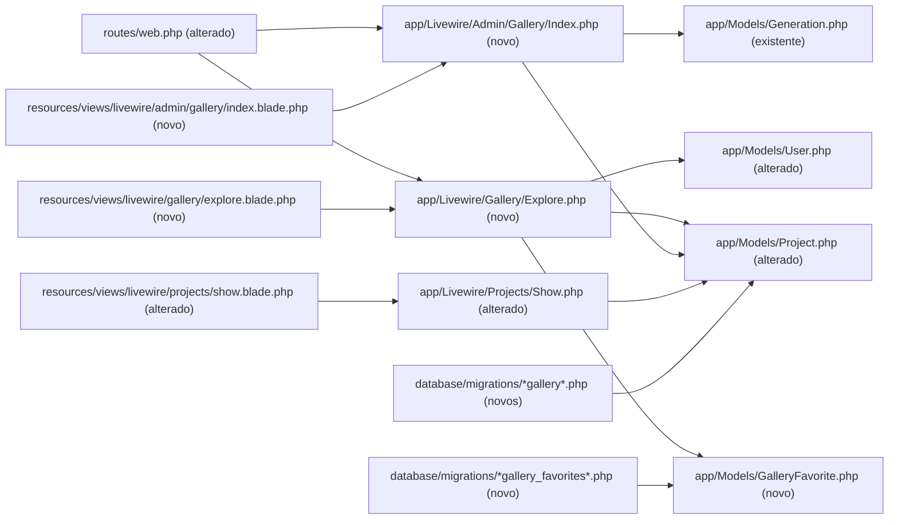
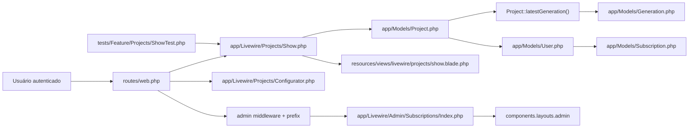
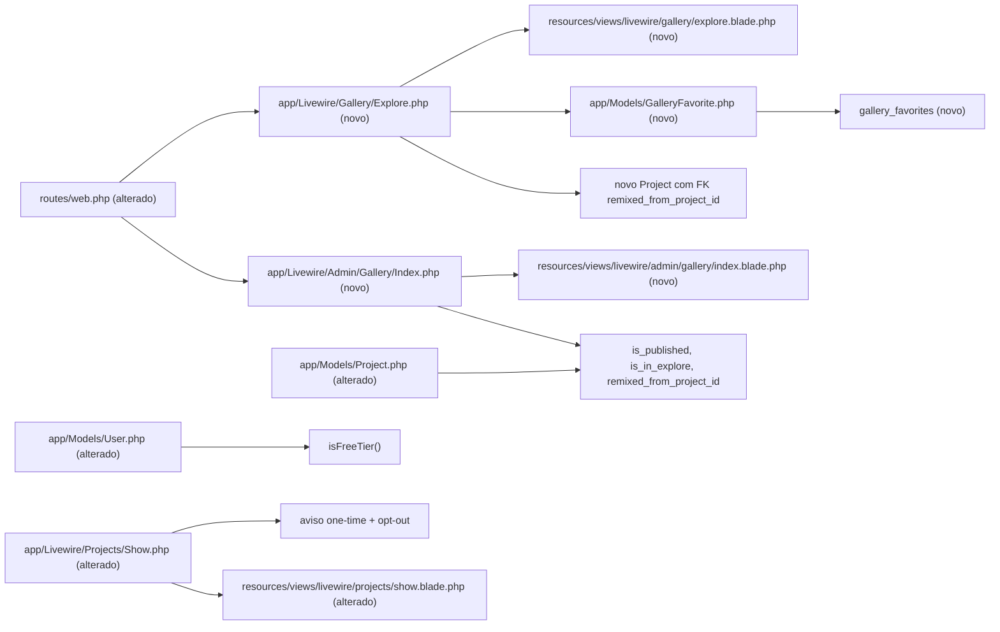

# Implementation Plan

## Request Summary
- Objective: entregar uma galeria Explore autenticada para projetos públicos de usuários free, com favoritos, remix controlado por créditos/assinatura, aviso de opt-in e moderação administrativa.
- Scope: in migrations, models, Livewire pages/actions, routes, views, and Pest feature tests; out comments, follows, reports, ML moderation, ranking, notifications, analytics, and cursor infinite scroll.
- Tier: standard
- Architecture references: `AGENTS.md` (Laravel Boost guidelines); `SPEC.md` records `docs/agents/architecture.md` and `docs/agents/domain_rules.md` as absent (`architecture_reference_status: partial`).

## Goal
Implement the public gallery and remix flow without weakening the existing authorization boundaries: `/explore` must be auth-only and show only completed, published, opted-in projects owned by free-tier users; project owners must receive a persisted one-time notice with opt-out; admins must moderate publication independently of owner visibility; favorites must be idempotent and constrained at the database layer; and remix must clone only the specified editable inputs while enforcing the credit/subscription gate and redirecting to `projects.new`.

## Architecture snapshot

### Confirmed existing components
- `routes/web.php`: current authenticated group uses `auth` + `verified`; admin routes are nested under `admin` and `admin.` naming.
- `app/Models/Project.php`: class-based Eloquent model with explicit `$fillable`, `casts()`, `user()`, `generations()`, and `latestGeneration()`.
- `app/Models/Generation.php`: `completed_at`, `result_path`, `credits_charged`, `project()` and `user()` relations; completion is also represented by the completed status scope.
- `app/Models/User.php`: Cashier `Billable`, attribute-based fillable/casts, no `isFreeTier()` yet.
- `app/Models/Subscription.php`: `isOpen()` treats `active`, `trialing`, and `past_due` as open.
- `app/Livewire/Projects/Show.php` and `resources/views/livewire/projects/show.blade.php`: owner-authorized project page, S3 URL generation through `config('generation.disk')`, existing Flux modal convention.
- `app/Livewire/Admin/Subscriptions/Index.php`: class-based paginated admin component, `mount()` admin gate, `statusFilter`, and `components.layouts.admin` layout.
- `tests/Feature/Projects/ShowTest.php`: Pest + `Livewire::test()` convention, catalog seeding, storage fake, and project/generation helpers.

### Proposed dependency flow

A legenda PT-BR: T01 cria o schema e os atributos de domínio; T02 cria o feed, card, filtro de elegibilidade e ações de favorito/remix; T03 adiciona o aviso no projeto do autor e o painel administrativo; T04 verifica todo o comportamento RIGID. As rotas são compartilhadas por T02/T03 e devem ser alteradas sequencialmente para evitar conflitos.

## AS IS — Componentes impactados

A legenda PT-BR: os nós e relações acima foram verificados no código. Não existem ainda os campos de galeria, `GalleryFavorite`, `/explore` ou `/admin/gallery`; portanto, esses elementos entram como superfícies novas, não como comportamento já disponível.

## TO BE — Componentes propostos

A legenda PT-BR: T01 produz `GalleryFields`, `FreeTier`, `FavoriteModel` e `FavoriteTable`; T02 produz `Explore`, seu template, favoritos e remix; T03 produz `AdminGallery`, template administrativo, aviso e opt-out; T04 produz os testes de todos os nós alterados/novos. O fluxo permanece class-based Livewire, usa o gate admin existente, o layout administrativo existente e a URL de storage já usada no projeto.

## Phase breakdown

### T01 — Foundation de schema e domínio
- **Files**: `database/migrations/*add_gallery_columns_to_projects_table.php` (novo); `database/migrations/*create_gallery_favorites_table.php` (novo); `app/Models/Project.php`; `app/Models/User.php`; `app/Models/GalleryFavorite.php` (novo); possivelmente `database/factories/GalleryFavoriteFactory.php` (se necessário ao padrão de testes).
- **Change**: adicionar `is_published` default `false`, `is_in_explore` default `true`, e FK nullable auto-referenciada `remixed_from_project_id` em `projects`, com índices/FK reversíveis; criar `gallery_favorites` com FKs, timestamps requeridos e unique `(user_id, project_id)`; adicionar fillable/casts e relações de origem/favoritos; adicionar `User::isFreeTier()` baseado em `subscriptions()` e `Subscription::isOpen()` sem reimplementar a semântica de status.
- **Covers**: RF-01, RF-02, RF-03, RF-04, RF-05, RF-06, RNF-03.
- **Tests**: `tests/Feature/Gallery/ExploreTest.php` — schema/defaults, relações, free-tier classification e unique favorite constraint; `tests/Feature/Gallery/AdminGalleryTest.php` — schema access used by admin rows.
- **Risk**: High — migration/FK e defaults afetam todas as criações de projeto; mitigar com migrations separadas, defaults explícitos e `down()` reversível; rollback removendo as duas migrations antes da camada de UI.
- **Dependencies**: none.

### T02 — Feed Explore, card e ações sociais
- **Files**: `routes/web.php`; `app/Livewire/Gallery/Explore.php` (novo); `resources/views/livewire/gallery/explore.blade.php` (novo); `app/Models/GalleryFavorite.php`; `app/Models/Project.php`.
- **Change**: registrar `GET /explore` em grupo `auth` sem `verified`; implementar paginação Livewire class-based e query eager-loaded que exige `latestGeneration.completed_at`, flags true e usuário sem subscription aberta; gerar URL com `Storage::disk(config('generation.disk'))->url()`; renderizar card com `data-test` exigidos, autor, contagem e ações Livewire; `toggleFavorite(int $projectId)` deve revalidar autenticação/escopo e alternar a linha; `remix(int $projectId)` deve revalidar o projeto, permitir crédito >= 1 ou subscription aberta, mostrar exatamente `Insufficient credits` sem criar quando bloqueado, ou copiar somente campos RF-05 e redirecionar para `projects.new` com flags de rascunho.
- **Covers**: RF-01, RF-04, RF-05, RF-06, RNF-01, RNF-02, RNF-04, UI-01.
- **Tests**: `tests/Feature/Gallery/ExploreTest.php` — AC1.1–AC1.4, AC1.2/guest 401, AC4.1–AC4.3, AC5.1–AC5.4, UI-01/RNF-01/RNF-02.
- **Risk**: High — query de elegibilidade, ações Livewire e remix têm risco de vazamento/duplicação; mitigar com autorização server-side, `findOrFail`, transação quando criar e eager loading; rollback removendo rota/componente/template sem alterar dados persistidos.
- **Dependencies**: T01.

### T03 — Aviso do autor e galeria administrativa
- **Files**: `routes/web.php`; `app/Livewire/Projects/Show.php`; `resources/views/livewire/projects/show.blade.php`; `app/Livewire/Admin/Gallery/Index.php` (novo); `resources/views/livewire/admin/gallery/index.blade.php` (novo).
- **Change**: no `Projects\Show`, manter policy de owner, calcular usuário free + primeira visita por projeto, renderizar/dismissir via `session` com `explore_notice_dismissed:{project_id}`, e permitir checkbox de opt-out persistindo `is_in_explore=false`; registrar `/admin/gallery` no subgroup existente (`auth` + admin middleware), com gate defensivo no `mount`, paginação de gerações completadas, eager loading de project/user/subscriptions, filtro `statusFilter` publicado/não publicado/todos, thumbnail URL, email, source `Subscribed`/`Free`, `data-test` de linha e `flux:switch` que persiste `is_published`; preservar a visibilidade do projeto em `Projects\Show`; incluir aviso discreto para free-tier conforme RF-02.
- **Covers**: RF-02, RF-03, RF-06, RNF-02, UI-02.
- **Tests**: `tests/Feature/Gallery/ExploreTest.php` — AC2.1–AC2.4 e confirmação de projeto toggled-off ainda visível ao owner; `tests/Feature/Gallery/AdminGalleryTest.php` — AC3.1–AC3.5, UI-02/RNF-02.
- **Risk**: Medium — alteração em tela existente e acesso admin compartilhado; mitigar preservando authorize/policy e espelhando `Admin\Subscriptions\Index`; rollback remove o bloco/rota/admin component, deixando o projeto original intacto.
- **Dependencies**: T01; T02 para validar hide-after-toggle e integração de rota.

### T04 — Cobertura de aceitação e verificação integrada
- **Files**: `tests/Feature/Gallery/ExploreTest.php` (novo); `tests/Feature/Gallery/AdminGalleryTest.php` (novo); se necessário, `tests/Feature/Projects/ShowTest.php` (alterado somente para regressão localizada).
- **Change**: criar testes Pest nos caminhos exatos, com `RefreshDatabase` herdado de `tests/Pest.php`, factories/seeding existentes e helpers locais; cada bloco `it/test` deve mencionar AC1.x–AC5.x ou AC6 conforme aplicável; cobrir guests, free/subscriber/past_due, gerações sem conclusão, session dismissal, opt-out, unique raw insert, contagem multiusuário, gate de créditos, clone de todos os campos, flags de draft, admin 403, filtro, toggle e storage URL; rodar filtros mínimos e documentar RNF-01 como soft benchmark sem transformar instabilidade local em falha CI.
- **Covers**: RF-01, RF-02, RF-03, RF-04, RF-05, RF-06, RNF-01, RNF-02, RNF-03, RNF-04, UI-01, UI-02.
- **Tests**: `php artisan test --compact --filter=ExploreTest`; `php artisan test --compact --filter=AdminGalleryTest`; regressão `php artisan test --compact tests/Feature/Projects/ShowTest.php`.
- **Risk**: Medium — fixtures de Cashier/status e assertions Livewire podem divergir do schema real; mitigar reutilizando factories, `CatalogSeeder`, status existentes e asserts específicos Pest; rollback é remover apenas os testes novos, sem tocar produção.
- **Dependencies**: T01, T02, T03.

## Execution Phases
| Phase | Tasks | Parallel-safe? |
|-------|-------|----------------|
| 1 | T01 | No — fundação sequencial |
| 2 | T02 | No — depende do schema e compartilha `routes/web.php` |
| 3 | T03 | No — depende de T01/T02 e compartilha rotas/tela Show |
| 4 | T04 | No — valida todos os artefatos anteriores |

## Risks
| Risk | Blast radius | Mitigation | Rollback |
|------|-------------|------------|----------|
| Defaults de publicação alteram o comportamento de projetos novos | Todos os novos projetos e o feed | `is_published=false`, `is_in_explore=true` conforme SPEC; não fazer retro-fill não especificado | Reverter migration antes de release; desativar rota se necessário |
| Query de Explore expõe projeto pago ou geração incompleta | Toda a comunidade autenticada | Testar `whereHas`/`whereDoesntHave`, conclusão e flags; manter auth server-side | Remover rota/feed e corrigir query antes de reativar |
| Ações Livewire são chamadas fora do card ou por usuário não autorizado | Dados de favoritos e criação de projetos | Revalidar auth e origem em cada ação; limitar IDs a projetos elegíveis; transação no remix | Desabilitar ações mantendo leitura; remover componente |
| Race condition em favoritos | Integridade de contagens | Unique DB `(user_id, project_id)` e tratar conflito conforme toggle | Desabilitar toggle; preservar tabela para auditoria |
| Novo FK de remix não é reversível no banco alvo | Deploy/migration e criação de projetos | Usar FK nullable auto-referenciada, índice e down explícitos; revisar ordem de drop | Rollback da migration de colunas |
| Alteração de `Projects\Show` quebra regressões existentes | Visualização, polling, download e delete de projetos | Inserir aviso sem alterar métodos existentes; rodar `ShowTest` | Reverter somente bloco de aviso/opt-out |
| Admin gallery pode gerar N+1 ou URLs inválidas | Operação administrativa e tempo de resposta | Eager load `project.user` e status/subscriptions; usar disk configurado e completed filter | Ocultar rota/admin page sem apagar projetos |

## Test strategy
- Testes de feature Livewire/Pest nos caminhos rigidamente exigidos: `tests/Feature/Gallery/ExploreTest.php` e `tests/Feature/Gallery/AdminGalleryTest.php`.
- Usar a convenção existente de `Livewire::test()`, factories, `CatalogSeeder`, `Storage::fake('s3')` e `RefreshDatabase` global; não criar testes browser ou JS-only para substituir autorização server-side.
- Mapear explicitamente pelo menos um teste para cada AC1.1–AC1.4, AC2.1–AC2.4, AC3.1–AC3.5, AC4.1–AC4.3 e AC5.1–AC5.4; AC6.x deve ser demonstrável pela existência e execução dos arquivos.
- Validar HTTP 401 para guest em `/explore` e 403 para usuário não-admin em `/admin/gallery`; validar que Livewire actions não permitem dados fora do escopo.
- Validar o índice unique via segundo insert em `DB::table('gallery_favorites')`, sem depender apenas do comportamento da action.
- Validar URL da imagem com `Storage::disk(config('generation.disk'))->url()` e benchmark de 24 cards como meta RNF-01 soft, documentando resultado local.
- Execução planejada: `php artisan test --compact --filter=ExploreTest`, `php artisan test --compact --filter=AdminGalleryTest`, e regressão de `tests/Feature/Projects/ShowTest.php`; formatting/analysis pertencem à implementação, não a este plano.

## Contracts emitted
Nenhum contrato formal emitido. Embora a SPEC contenha CT-01–CT-05, a solicitação determina “No formal contracts”; esses CTs permanecem como interfaces internas Livewire/rota a serem implementadas e testadas, não como OpenAPI.

## Open Questions
- A arquitetura de referência é parcial: `docs/agents/architecture.md` e `docs/agents/domain_rules.md` estão ausentes. Impacto: não há regra adicional documentada para escolher entre service/action para remix; o plano segue a convenção observada em `app/Livewire` e as regras de `AGENTS.md`.
- `[UNVERIFIED]` A SPEC exige `completed_at IS NOT NULL`, enquanto a aplicação existente também usa o status `completed` para `latestCompleted()`/scopes. A implementação deve preservar o filtro RIGID por `completed_at` e, se necessário para consistência de dados, verificar ambos sem excluir uma geração que satisfaça explicitamente o requisito.
- `[UNVERIFIED]` O grupo atual de rotas exige `verified` globalmente. `/explore` deve ser colocado em grupo `auth` separado ou fora do grupo atual para cumprir “auth only, NOT verified”; confirmar a disposição final das rotas antes de alterar `routes/web.php`.

## Assumptions
- O projeto usa o formato class-based Livewire em `app/Livewire` + `resources/views/livewire`; não serão introduzidos SFC/MFC.
- `Subscription::isOpen()` é a autoridade existente para classificar assinantes; `past_due` é tratado como aberto conforme o código verificado.
- Os defaults forward-only (`is_published=false`, `is_in_explore=true`) são aplicados sem retro-fill, conforme a resolução registrada na SPEC.
- O remix cria apenas a linha `Project` e não cobra/debita crédito neste fluxo, pois RF-05 exige o gate e a criação, mas não define débito; qualquer cobrança adicional seria requisito novo.
- A tela admin reutilizará `components.layouts.admin` e o padrão de `mount()`/`WithPagination` de `app/Livewire/Admin/Subscriptions/Index.php`.
- A imagem será renderizada somente quando houver geração elegível e `result_path` utilizável; não haverá fallback externo ou upload novo.
- Não serão criados contratos, migrations executadas, commits ou alterações fora de `.spec/features/public-gallery-and-remix/` durante o planejamento.
