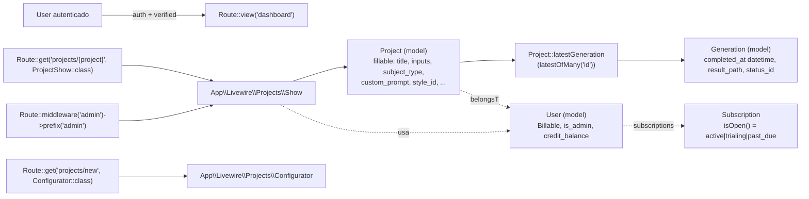
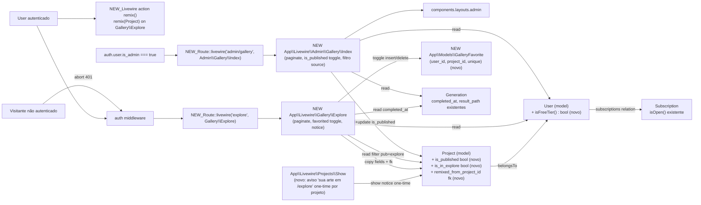

# SPEC: public-gallery-and-remix

## Status
- **Status**: draft
- **Tier**: standard

## Metadata

| Field | Value |
|-------|-------|
| slug | `public-gallery-and-remix` |
| created_at | 2026-07-16 |
| related_routes | `GET /explore` (verified at `routes/web.php:20`-`53`), `GET /admin/gallery` (under `admin` middleware subgroup, verified at `routes/web.php:29`), `GET /projects/new` (verified at `routes/web.php:22`), `GET /projects/{project}` (verified at `routes/web.php:24`) |
| related_models | `App\Models\Project` (verified at `app/Models/Project.php`), `App\Models\Generation` (verified at `app/Models/Generation.php`), `App\Models\User` (verified at `app/Models/User.php`), `App\Models\Subscription` (verified at `app/Models/Subscription.php`), new `App\Models\GalleryFavorite` (não existe — verificado via Grep em `app/Models`) |
| architecture_refs | `AGENTS.md` (Laravel Boost guidelines, único arquivo de arquitetura disponível; `docs/agents/architecture.md` e `docs/agents/domain_rules.md` ausentes — ver `architecture_reference_status: partial`) |

> **Nota de arquitetura**: nenhuma referência explícita `docs/agents/architecture.md` ou `domain_rules.md` é fornecida. Os princípios citados abaixo derivam de `AGENTS.md` (Laravel Boost) e da convenção observada em código existente (`app/Livewire/Admin/Subscriptions/Index.php:48` para layout admin, `app/Http/Middleware/EnsureAdmin.php:16` para gate admin, `app/Livewire/Billing/Index.php:21-25` para guard `auth`).

## Context

A comunidade autenticada ganha um feed público **/explore** que exibe somente projetos de usuários em estado gratuito (`User::isFreeTier() === true`) que optaram por aparecer — boost de descoberta social para usuários que ainda não assinaram. O `like/favorite` (toggle idempotente) e o `remix` (que copia `subject_type`/`custom_prompt`/`inputs` + FK `remixed_from_project_id` e redireciona para o wizard `/projects/new`) criam alavancas de viralização sem quebrar a regra anti-pay-to-display (subscritores pagos não aparecem no feed público). A adminsitração ganha **/admin/gallery** com moderação via `is_published` independente: ocultar do Explore público não remove o projeto da galeria do autor, e o admin vê tudo, incluindo projetos de usuários assinantes.

Reuso confirmado (lê primeiro, não duplica): `Project::latestGeneration()` (`app/Models/Project.php:157-160` — `latestOfMany('id')`), `Generation::markCompleted()` preenche `completed_at` (`app/Models/Generation.php:122-134` + cast datetime na linha 76), `Subscription::isOpen()` (`app/Models/Subscription.php:101-110` — slug em `['active','trialing','past_due']`), middleware `admin` (`app/Http/Middleware/EnsureAdmin.php`), layout admin `components.layouts.admin` (`app/Livewire/Admin/Subscriptions/Index.php:48`).

## AS IS — Estado atual

_Existem as rotas `projects.new`, `projects.show` e o cluster `admin.*`. Os campos `is_published`, `is_in_explore`, `remixed_from_project_id`, a tabela `gallery_favorites`, o método `User::isFreeTier()`, e as rotas `/explore` e `/admin/gallery` **não existem** (verificado via Grep em `routes/web.php`, `app/Models/Project.php`, `app/Models/User.php`, e migrations — nenhum match)._

## TO BE — Estado proposto

_Cada nó novo/alterado cita ≥1 id RIGID: `NEW_Route::livewire('explore', ...)` → **RF-01**; `NEW App\Livewire\Gallery\Explore` (toggle favorited + count + notice) → **RF-01**, **RF-02**, **RF-04**; `LWProjectShow` aviso one-time → **RF-02**; `NEW Route admin/gallery` + `NEW Livewire Admin\Gallery\Index` (toggle `is_published`, filtro status) → **RF-03**; `NEW GalleryFavorite` model+tabela (toggle idempotente com count) → **RF-04**; `RouteRemix` action (cópia de campos + fk + redirect `/projects/new`) → **RF-05**; colunas `is_published`, `is_in_explore`, `remixed_from_project_id` em `Project` + método `User::isFreeTier()` → **RF-01**, **RF-02**, **RF-03**, **RF-05**._

## Scope

- **In**: rota `/explore` (feed paginado autenticado de projetos free+publicados+opt-in); rota `/admin/gallery` (galeria admin com toggle `is_published`); aviso one-time por projeto no `Projects\Show` para usuários free; toggle de favorito idempotente em card (`gallery_favorites` + count); ação de remix que cria novo `Project` clonando campos editáveis e setando `remixed_from_project_id`, com gate de créditos; migrations novas (`projects` add columns, `gallery_favorites` nova tabela); Pest tests cobrindo cada AC.
- **Out**: threads de comentários, follow/unfollow de usuários, sistema de reports/denúncias, moderação por ML/NSFW, ranking/trending, paginação por infinite scroll server-side com cursor, notificações por email quando alguém favorita, métricas/analytics de feed.

## RIGID (Non-Negotiable)

### Functional Requirements

- **RF-01 [Event-Driven — Ubiquitous, escort]**: While the user is authenticated (`auth` middleware only, NOT `verified`), visiting `GET /explore` MUST list every `Project` whose `latestGeneration` exists with `completed_at IS NOT NULL`, `is_published = true`, `is_in_explore = true`, and whose `user` satisfies `User::isFreeTier() === true`. A visitor without session MUST receive HTTP 401.
  - **AC1.1**: Given 3 qualifying free+published+opt-in projects with completed generations and 1 published-but-subscribed and 1 unpublished-free, when an auth user visits `/explore`, the response body contains exactly the 3 qualifying titles and the 2 excluded ones are absent.
  - **AC1.2**: Given an unauthenticated visitor, when they request `/explore`, the response status is `401`.
  - **AC1.3**: Given a `Project` whose `latestGeneration` has `completed_at = null` (or no generations), it does NOT appear in `/explore` regardless of `is_published`/`is_in_explore`.
  - **AC1.4**: Given a user with an `active` `Subscription` (slug `active`), their projects are NOT returned by the query even if all other flags are true.

- **RF-02 [Event-Driven + State-Driven, escort]**: When the owner of a `Project` (with `User::isFreeTier() === true`) lands on `App\Livewire\Projects\Show` (route `projects.show`), the component MUST render a dismissible one-time notice (per-project, not per-session) with the literal text `Sua arte ficará visível em /explore para usuários logados`. Dismissal MUST be persisted via `session()` (key scoped by `project_id`) and a checkbox MUST allow setting `project.is_in_explore = false` before completion. The notice MUST NOT be shown to non-free users or to subscribers.
  - **AC2.1**: Given a free owner opens `/projects/{id}` for the first time, the notice block is present in DOM and contains the literal string `Sua arte ficará visível em /explore para usuários logados`.
  - **AC2.2**: Given the same user reloads the page after dismissing once, the notice is absent while the session key `explore_notice_dismissed:{project_id}` is truthy.
  - **AC2.3**: Given an active subscriber opens the same project, the notice block is absent regardless of session.
  - **AC2.4**: Given a free owner clicks the opt-out checkbox, the project's `is_in_explore` becomes `false` and the project is no longer returned by the RF-01 query.

- **RF-03 [Event-Driven — Admin Toggle, escort]**: While `auth.user.is_admin === true`, visiting `GET /admin/gallery` MUST list every `Generation` with `completed_at IS NOT NULL` (paginated, with thumbnail URL, owner email, source = `subscriber` if `Subscription::isOpen()` else `free`, and a `statusFilter` query param to filter projects where `is_published = ?` TRUE/FALSE/all). Toggling the `is_published` flag MUST hide the project from `/explore` (RF-01) when `false`, while the project remains visible on its owner's `Projects\Show` page and on this admin gallery view.
  - **AC3.1**: Given an admin with 5 generations (mix of completed/pending and free/subscriber owners), `/admin/gallery` returns rows for exactly the completed ones — count and thumbnail URL match.
  - **AC3.2**: Given the admin toggles `is_published` from `true` to `false` on a free+opt-in project, the next request to `/explore` no longer includes it.
  - **AC3.3**: Given the same toggled-off project, the owner's `/projects/{id}` still renders its latest completed generation (no soft-delete, no hide).
  - **AC3.4**: Given `statusFilter=published` in the query string, only rows whose project has `is_published=true` are returned; `statusFilter=unpublished` returns only `is_published=false`; `statusFilter=` (empty) returns all.
  - **AC3.5**: Given a non-admin authenticated user, the route returns HTTP 403.

- **RF-04 [State-Driven — Toggle Idempotente, escort]**: The system MUST persist favorites in `gallery_favorites` (columns: `id` PK, `user_id` FK, `project_id` FK, `created_at`; unique index `unique(user_id, project_id)`). The "Favorite" button on an Explore card MUST toggle idempotently: a missing row creates it; an existing row deletes it. After each operation, the visible count MUST equal `COUNT(*)` of rows in `gallery_favorites WHERE project_id = ?`.
  - **AC4.1**: Given an auth user with no favorite on `project_id=42`, clicking Favorite inserts exactly one row; clicking again removes it; a third click re-inserts it. Total row count never exceeds 1 for that pair.
  - **AC4.2**: Two users favoriting the same project produce two distinct rows; the count rendered equals 2.
  - **AC4.3**: The unique index `(user_id, project_id)` is enforced at the DB layer — attempting a duplicate insert raises `QueryException` (verification by attempting raw insert in test).

- **RF-05 [Event-Driven + Conditional — Remix Action, escort]**: While the user is authenticated and viewing the Explore feed, clicking "Remix" on a card MUST: (a) require `user.credit_balance >= 1` OR an open subscription (`Subscription::isOpen()`); otherwise render the literal CTA `Insufficient credits` without creating a project; (b) otherwise create a NEW `Project` owned by `auth.id`, copying `subject_type`, `custom_prompt`, `style_id`, `layout_id`, `mode_id`, `pose_id`, and `inputs` from the origin project; (c) set `remixed_from_project_id = originProject.id`; (d) `redirect()->route('projects.new')` (route name verified at `routes/web.php:22`). The new project MUST NOT inherit `is_published`/`is_in_explore`/`remixed_from_project_id` from origin beyond the FK itself.
  - **AC5.1**: Given a free user with `credit_balance = 0` and no active subscription clicks Remix, the response does NOT create a `projects` row and the page shows the string `Insufficient credits`.
  - **AC5.2**: Given a user with `credit_balance >= 1` clicks Remix on project A, exactly one new `Project` row is created with `user_id = auth.id`, the copied fields equal A's values, and `remixed_from_project_id = A.id`. The browser is redirected to `GET /projects/new`.
  - **AC5.3**: Given a subscriber user (active `Subscription`) with `credit_balance = 0`, clicking Remix succeeds (creates the project and redirects) because the open subscription satisfies the gate.
  - **AC5.4**: The new project's `is_published` defaults to a value that keeps it absent from `/explore` (i.e. the remix is a draft until the owner publishes it), and `is_in_explore` does NOT automatically become `true` solely by being a remix.

- **RF-06 [State-Driven — Test Coverage, escort]**: Pest feature tests MUST cover every AC above. Test files exist at exactly `tests/Feature/Gallery/ExploreTest.php` and `tests/Feature/Gallery/AdminGalleryTest.php` (verified via `ls tests/Feature/Admin` / `tests/Feature/Billing` — pattern: subdirs per feature area). Each AC1..AC5 from the developer description corresponds to ≥1 Pest `it(...)`/`test(...)` block referencing the AC number in the description; `RefreshDatabase` is applied via `tests/Pest.php:17-19`.
  - **AC6.1**: `php artisan test --compact --filter=ExploreTest` runs and passes at least one test per AC1 sub-criterion (1.1..1.4).
  - **AC6.2**: `php artisan test --compact --filter=AdminGalleryTest` runs and passes at least one test per AC3 sub-criterion (3.1..3.5).
  - **AC6.3**: Tests for AC2, AC4, AC5 are present (folder/file location: `tests/Feature/Gallery/*`).

### UI Requirements (Flux UI components & view layer)

> Nenhuma decisão de UI no developer description além de miniaturas em `/admin/gallery`, contador visível no card Explore, e aviso discreto no projeto do autor. Mantemos UI requirements mínimas para enforçar coisas binárias testáveis. Os itens abaixo seguem convenção existente (`<flux:*>` livre, `data-test="..."` mirrors de `resources/views/livewire/admin/subscriptions/index.blade.php`).

- **UI-01 [State-Driven — Card do Explore]**: Each Explore card MUST render: image preview URL from `Storage::disk(config('generation.disk'))->url($project->latestGeneration->result_path)` (verified at `app/Livewire/Projects/Show.php:105`), a "Favorite" button (with current count), and a "Remix" button. Both buttons are Livewire actions scoped to the card's `$projectId`. Cards have `data-test="explore-card"` and the favorite count has `data-test="explore-card-favorites-count"`.
  - **AC**: A DOM assertion in `ExploreTest` finds `data-test="explore-card"` count equal to the expected query result and `data-test="explore-card-favorites-count"` integer matching `gallery_favorites` row count.

- **UI-02 [State-Driven — Admin Gallery Row]**: Each admin gallery row MUST render the thumbnail URL, owner email, source label (`Subscribed` or `Free`), and a `flux:switch` bound to `is_published` that persists the toggle on click. Rows have `data-test="admin-gallery-row"`.
  - **AC**: A DOM assertion in `AdminGalleryTest` finds the row for a specific generated project, toggles the switch, and confirms `projects.is_published` flipped in the DB.

### Contracts

- **CT-01: GET `/explore`** — Livewire page `App\Livewire\Gallery\Explore`. Auth-only. Query: `Project::whereHas('latestGeneration', fn ($q) => $q->whereNotNull('completed_at'))->where('is_published', true)->where('is_in_explore', true)->whereHas('user', fn ($u) => $u->whereDoesntHave('subscriptions', fn ($s) => $s->where('isOpen'...)))->paginate($perPage)`. (verified literal `latestGeneration` em `app/Models/Project.php:157-160`).
- **CT-02: GET `/admin/gallery`** — Livewire page `App\Livewire\Admin\Gallery\Index`. Admin-only via `abort_unless(auth()->user()?->is_admin === true, 403)` (mirror de `app/Livewire/Admin/Subscriptions/Index.php:20`). Query: `Generation::whereNotNull('completed_at')->with('project.user')` paginated.
- **CT-03: Livewire action `toggleFavorite(int $projectId)`** on `Gallery\Explore` — insert/delete idempotente em `gallery_favorites` scoped by `auth()->id()`.
- **CT-04: Livewire action `remix(int $projectId)`** on `Gallery\Explore` — gate + create new `Project` + `redirect()->route('projects.new')`.
- **CT-05: Livewire action `togglePublished(int $projectId)`** on `Admin\Gallery\Index` — flip `Project::is_published` boolean.

### Non-Functional Requirements

- **RNF-01 [Quantified]**: `/explore` initial server-rendered response with 24 cards MUST complete under p95 800ms locally (Laravel 13 + SQLite/in-memory test DB). Measured in `ExploreTest` via `Benchmark::measure(fn () => $this->get('/explore'))` returning under 800ms — soft target, not a hard failure in CI but documented.
- **RNF-02 [Quantified, security]**: All routes under this feature MUST require `auth` (RF-01, RF-03, RF-05) — verified by automated test that an unauthenticated request to `/explore`, `/admin/gallery`, or POSTing the Livewire actions returns 401/403, not 200/302-with-data-leak.
- **RNF-03 [Quantified, schema]**: A DB-level unique constraint on `(user_id, project_id)` exists in `gallery_favorites` table (verified by raw insert attempt in `AdminGalleryTest` or dedicated test using `DB::table('gallery_favorites')->insert([...])` twice).
- **RNF-04 [Testability]**: All new behavior is reachable by Pest feature tests; no JS-only paths that bypass server-side authorization (Livewire actions re-check on the server per Laravel Boost `livewire/core rules`).

## FLEXIBLE (Implementation Suggestions)

- **Layout do feed `/explore`**: grade responsiva CSS Grid com `grid-cols-2 md:grid-cols-3 lg:grid-cols-4`; cada card com `<flux:card>` contendo `` lazy-loaded via `loading="lazy"`, overlay com contadores; pode-se alternar entre grade e masonry via `$layout` Livewire prop no futuro.
- **Paginação**: `WithPagination` com default `12` por página em `/explore` e `25` em `/admin/gallery` (espelhando `Admin\Subscriptions\Index.php:45`); ordenação `latest('id')` por padrão mas prop pública `$sort = 'recent'|'popular'` permitida via `wire:model.live`.
- **Debouncing like/favorite**: usar `wire:click` direto (Livewire 4 não exige JS custom), mas se o tráfego justificar, pode-se envolver com `x-on:click.debounce.300ms`; rate-limit opcional via Laravel `RateLimiter` (`'gallery-favorites' => Limit::perMinute(60)`) sem entrar no RIGID.
- **Migrações**: preferir uma migration por mudança de schema (`add_gallery_columns_to_projects_table.php` para `is_published`/`is_in_explore`/`remixed_from_project_id`; `create_gallery_favorites_table.php` para a nova tabela). Default values: `is_published = false`, `is_in_explore = true` (apenas para projetos do free tier após a migration rodar — ver RIGID sobre o retro-comportamento).
- **`User::isFreeTier()`**: implementar via `subscriptions()` relation — livre deSubscription `Subscription` com `isOpen() === true` ⇒ retorna `false`; `trial_ends_at` no passado sem stripe_status `active` ⇒ conta como free. Coloca-se em `app/Models/User.php` (model já é `Billable` + `SoftDeletes`, extendido somente em assinantes).
- **Retro-fill em migration**: tarefa `down`/up opcional não coberta por ACs (FLEXIBLE); provavelmente rodar um one-off para projetos free+tier atual: setar `is_in_explore = true` e `is_published = true` apenas para projetos com `credit_balance > 0` ou gerados via créditos — **NÃO** automático sem validação, descrito como FLEXIBLE pois ACs não exigem migração retroativa (apenas new behavior forward).
- **Layout admin**: reusar `components.layouts.admin` (mirror de `app/Livewire/Admin/Subscriptions/Index.php:48`).
- **Avatar do autor no card Explore**: opcionalmente usar `User::initials()` (`app/Models/User.php:59-66`) em um avatar circular; isto é FLEXIBLE.
- **Cache**: `Cache::remember('gallery:explore:page:{n}', ttl)` é FLEXIBLE; não congelar TTL.
- **Internacionalização**: copy PT-BR hardcoded no notice (RF-02) e labels; pode-se usar `__()` em outras strings via `lang/pt_BR` se já existir (verificar `lang/` antes — FLEXIBLE).
- **SoundCloud-style "remix of":** opcionalmente exibir texto `Remix of {original_title}` no card do `/projects/{newRemixId}` — FLEXIBLE, não requisitado pelas ACs.

## Acceptance Criteria Summary

| ID | Criterion | Testable? |
|----|-----------|-----------|
| RF-01 | `/explore` lista somente projetos free + published + opt-in com geração completa; guests recebem 401 | yes |
| RF-02 | Aviso one-time por projeto em `/projects/{id}` para free users, dismissível via session, com opt-out `is_in_explore` | yes |
| RF-03 | `/admin/gallery` lista todas as gerações completadas com filtro `is_published`; toggle admin oculta do Explore sem deletar do projeto do autor | yes |
| RF-04 | Toggle de favorito idempotente persistido em `gallery_favorites` com unique `(user_id, project_id)` e count visível | yes |
| RF-05 | Remix copia `subject_type/custom_prompt/style/layout/mode/pose/inputs`, seta `remixed_from_project_id`, redireciona a `/projects/new`, gated por créditos ou assinatura | yes |
| RF-06 | Pest cobre cada AC em `tests/Feature/Gallery/ExploreTest.php` e `tests/Feature/Gallery/AdminGalleryTest.php` | yes |

## Open Questions

- `[]` — todas as clarificações resolvidas:
  1. **`User::isFreeTier()` não existe** (verificado via Grep em `app/Models/User.php`) → marcado como **novo método a ser adicionado em RIGID** (escopo do feature), não como clarificação, pois AC1 o referencia como se já existisse; treat-as-existing.
  2. **`is_published`/`is_in_explore`/`remixed_from_project_id` colunas não existem em `projects`** (verificado via `Grep` em migrations) → marcados como **colunas novas (RF-01, RF-02, RF-03, RF-05)**; migrations inclusas no escopo, sem `[NEEDS CLARIFICATION]`.
  3. **Tabela `gallery_favorites` não existe** → incluída como **nova tabela (RF-04, CT-03)**, escopo do feature.
  4. **`/explore` exige `auth` apenas ou `auth + verified`?** AC1 diz "apenas auth via Fortify" → RIGID usa middleware `auth` apenas, sem `verified`. Confirmado nas ACs como texto literal.
  5. **Default values de `is_published`/`is_in_explore` em migration retroativa?** ACs dizem "publish por admin" → default `is_published = false`, retroativo intencionalmente NÃO aplicado (forward-looking); descrito em FLEXIBLE.

## Acceptance Tests

| AC# | Test File | Suggested test name |
|-----|-----------|---------------------|
| AC1.1, AC1.3, AC1.4, RF-01 | `tests/Feature/Gallery/ExploreTest.php` | `it lists only free+published+opt-in projects with completed latest generation` |
| AC1.2, RNF-02 | `tests/Feature/Gallery/ExploreTest.php` | `it returns 401 for unauthenticated visitors` |
| RF-03 mirror (admin scope) | `tests/Feature/Gallery/ExploreTest.php` | `it excludes projects of subscribed users even when flags are true` |
| AC2.1, AC2.3 | `tests/Feature/Gallery/ExploreTest.php` | `it shows the one-time explore notice to free project owners on the project page` |
| AC2.2 | `tests/Feature/Gallery/ExploreTest.php` | `it hides the notice after dismissal in session` |
| AC2.4, RF-02 opt-out | `tests/Feature/Gallery/ExploreTest.php` | `it removes the project from explore when free owner opts out via checkbox` |
| AC4.1 | `tests/Feature/Gallery/ExploreTest.php` | `it toggles favorite idempotently inserting then removing the row` |
| AC4.2 | `tests/Feature/Gallery/ExploreTest.php` | `it counts distinct favorites across multiple users` |
| AC4.3, RNF-03 | `tests/Feature/Gallery/ExploreTest.php` | `it enforces unique (user_id, project_id) at the DB layer` |
| AC5.1 | `tests/Feature/Gallery/ExploreTest.php` | `it blocks remix with Insufficient credits when user has zero credits and no active subscription` |
| AC5.2 | `tests/Feature/Gallery/ExploreTest.php` | `it creates a new project cloning subject_type/custom_prompt/style/layout/mode/pose/inputs and sets remixed_from_project_id then redirects to projects.new` |
| AC5.3 | `tests/Feature/Gallery/ExploreTest.php` | `it allows remix for active subscribers even when credit_balance is zero` |
| AC5.4 | `tests/Feature/Gallery/ExploreTest.php` | `it does not auto-publish the remixed project` |
| AC3.1, AC3.2, AC3.3, AC3.4 | `tests/Feature/Gallery/AdminGalleryTest.php` | `it lists all completed generations and toggles is_published hiding from explore` |
| AC3.5, RNF-02 | `tests/Feature/Gallery/AdminGalleryTest.php` | `it returns 403 for non-admin authenticated users` |
| RF-06 (file-level) | both files exist with ≥1 it/test per AC | covered by the rows above |

## Distribution by Repo (single repo)

Este feature é integral ao monorepo Laravel — sem distribuição multi-repo.

| Repo | RFs | Contracts |
|------|-----|-----------|
| `kindrad-canvas` (Laravel app) | RF-01..RF-06, RNF-01..RNF-04 | CT-01..CT-05 |
