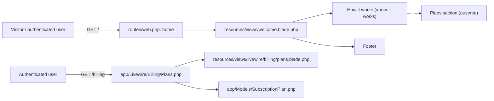
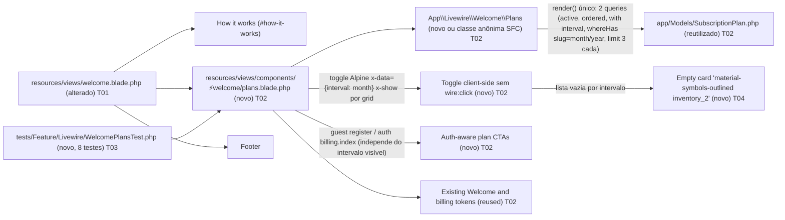

# Implementation Plan

## Goal
Adicionar à Welcome uma seção pública de planos, entre `#how-it-works` e o `<footer>`, implementada como componente Livewire 4 SFC guest-safe. A seção reutilizará `SubscriptionPlan` como fonte única, executará **uma única `render()`** que carrega **duas listas** (mensal e anual, cada uma limitada a 3), apresentará um **toggle client-side Alpine.js** entre `Monthly` e `Annual` (sem `wire:click`, sem round-trip), manterá os tokens visuais e o card do billing, exibirá empty state por intervalo quando a lista vier vazia, e direcionará cada CTA para cadastro ou billing conforme autenticação (independente do intervalo visível).

## Architecture snapshot
- Arquivos existentes reutilizados:
  - `resources/views/welcome.blade.php` — ponto de composição; preservar header, hero, How it works e footer.
  - `app/Livewire/Billing/Plans.php` — referência de consulta e separação de responsabilidades; não alterar o guard auth-gated.
  - `resources/views/livewire/billing/plans.blade.php` — referência visual do card e estados de preço/créditos; não alterar.
  - `app/Models/SubscriptionPlan.php` — modelo, scopes `active()`/`ordered()`, relação `interval()` (BelongsTo, verificada) e `formattedPrice()`.
  - `app/Models/SubscriptionInterval.php` — coluna `slug` (verificada); relação `interval` da SubscriptionPlan resolve para esta tabela.
  - `database/seeders/CatalogSeeder.php:307` — popula `slug='month'` e `slug='year'` em `SubscriptionInterval`.
  - `resources/views/components/projects/⚡show.blade.php` — convenção verificada de SFC Livewire 4 com prefixo `⚡`.
  - `AGENTS.md` — regras Laravel 13, Livewire 4, Pest 4, Pint e testes.
- Novos arquivos criados:
  - `resources/views/components/⚡welcome/plans.blade.php` — SFC guest-safe com **dual query** + **toggle Alpine** + **empty state por intervalo** + markup da seção.
  - `tests/Feature/Livewire/WelcomePlansTest.php` — **8 testes Pest** definidos na SPEC (RF-06), incluindo os 2 novos do toggle.

## AS IS — Componentes impactados

Legenda PT-BR: A Welcome não renderiza planos nem toggle; a visualização existente está no fluxo `/billing` e aborta guests. Os nós acima foram verificados nos arquivos listados.

## TO BE — Componentes propostos

Legenda PT-BR: T01 insere o componente sem alterar as seções vizinhas; T02 cria a implementação guest-safe com **dual query**, **toggle Alpine** (RF-07) e **CTAs auth-aware**; T03 expande a suíte para 8 testes cobrindo toggle e cap-dual; T04 adiciona empty state por intervalo (RF-08).

## Tasks

### T01 — Compor a seção no fluxo da Welcome
- **Files**: `resources/views/welcome.blade.php`
- **Change**: Inserir o tag do SFC `<livewire:welcome.plans />` imediatamente após o fechamento da seção `#how-it-works` e antes da abertura de `<footer>`. Não modificar rotas, layout, header, hero, How it works ou footer.
- **Covers**: RF-01, RF-03
- **Tests**: `tests/Feature/Livewire/WelcomePlansTest.php` — verificar a posição renderizada e resolução do componente.
- **Risk**: Low — somente ponto de composição da view; risco principal é posicionamento incorreto.
- **Dependencies**: T02

### T02 — Criar SFC de planos guest-safe com dual query + toggle Alpine + cards compatíveis
- **Files**: `resources/views/components/⚡welcome/plans.blade.php`; opcionalmente `app/Livewire/Welcome/Plans.php` se a convenção adotada separar classe da view
- **Change**: Implementar SFC Livewire 4 auto-descoberto sob `resources/views/components/`; **uma única `render()`** que retorna `['plans' => ['month' => …, 'year' => …]]` construindo ambas as listas com a cadeia `SubscriptionPlan::query()->active()->ordered()->with('interval')->whereHas('interval', fn ($q) => $q->where('slug', '<key>'))->limit(3)->get()`, **sem** `mount()` auth abort. Renderizar, no topo da seção, o **toggle Alpine** (wrapper único com `x-data="{ interval: 'month' }"`, dois botões `Monthly`/`Annual` ligados via `x-on:click="interval = '…'"`, contêiner pill conforme RF-07). Renderizar dois grids independentes: `x-show="interval === 'month'"` na lista mensal e `x-show="interval === 'year'"` na lista anual. Se uma das listas vier vazia, renderizar empty card `inventory_2` (RF-08 — coberto também em T04). Renderizar header no padrão How it works, no máximo três cards visualmente idênticos ao billing, badge Popular no primeiro, nome/descrição/preço/intervalo/créditos com `bolt`, CTA `<a>` full-width com `@guest` para `route('register')` e `@auth` para `route('billing.index')` (estado de auth avaliado uma vez por `render()`, sem mudança no toggle — RF-04). Envolver todas as strings novas em `__()` e usar apenas tokens existentes. O `render()` resolve o estado de auth via `auth()->check()` ou `@auth`/`@guest` no Blade — qualquer mecanismo é aceitável desde que não dependa do clique do toggle.
- **Covers**: RF-02, RF-03, RF-04, RF-05, RF-07, RNF-01, RNF-02, RNF-03, RNF-04
- **Tests**: `tests/Feature/Livewire/WelcomePlansTest.php` — quatro planos ativos mensais + quatro anuais + um inativo, guest/auth CTAs em ambos os grids, SFC, tokens, query log, ausência de `wire:click` no toggle e presença do wrapper `x-data`.
- **Risk**: Medium — markup e consulta compartilhados conceitualmente com billing, mas novo componente pode divergir visualmente ou reusar indevidamente o guard; o toggle Alpine pode degenerar em estado Livewire se o implementador confundir com `wire:click`.
- **Dependencies**: none

### T03 — Expandir a cobertura Pest para 8 testes
- **Files**: `tests/Feature/Livewire/WelcomePlansTest.php`
- **Change**: Atualizar o arquivo para conter **8 testes** Pest (`it_…`): os 6 prévios (posição; filtro+ordem+limite-dual via 4 month + 4 year; SFC; CTA guest/auth; tokens; factory) **mais** `it_renders_monthly_and_yearly_grids_with_toggle` (AC7) e `it_caps_each_interval_at_three_plans` (AC8). Para AC7: asserir que o response contém um wrapper `x-data="{ interval: 'month' }"`, os dois grids rotulados por intervalo, e que **nenhum** `wire:click` aparece dentro do container do toggle. Para AC8: criar 4 planos mensais ativos + 4 anuais ativos + 1 inativo, renderizar a página e contar cards em `data-test="welcome-plans-grid-month"` e `data-test="welcome-plans-grid-year"` — cada um deve ter exatamente 3; o inativo não aparece em nenhum grid. Manter `RefreshDatabase` herdado de `tests/Pest.php`, `actingAs()` para auth e query log para RNF-01.
- **Covers**: RF-01, RF-02, RF-03, RF-04, RF-05, RF-06, RF-07, RNF-01, RNF-02, RNF-04
- **Tests**: o próprio `tests/Feature/Livewire/WelcomePlansTest.php` — `php artisan test --compact --filter=WelcomePlansTest` (roda os 8) **e** filtros individuais `it_renders_monthly_and_yearly_grids_with_toggle` e `it_caps_each_interval_at_three_plans` conforme exigido em RF-06.
- **Risk**: Medium — asserções de posição e contagem podem depender do HTML final; o teste do toggle pode falhar se os atributos Alpine forem normalizados pelo compilador Blade.
- **Dependencies**: T01, T02

### T04 — Empty state por intervalo (RF-08)
- **Files**: `resources/views/components/⚡welcome/plans.blade.php`
- **Change**: Quando `count($plans['month']) === 0`, o grid mensal exibe um único card muted com `material-symbols-outlined inventory_2` e mensagem `__('No plans available for this interval right now.')`. O mesmo comportamento aplica-se independentemente a `year`. O card vazio compartilha `glass-card`, `text-on-surface/60` e `border-white/10` com o restante da seção. Implementar **inline na view** (não precisa de classes adicionais); classless.
- **Covers**: RF-08
- **Tests**: o teste AC8 deve garantir que o card vazio **não** aparece quando ambos os intervalos têm 3+ planos; um novo cenário implícito no AC7 (se o seeder `CatalogSeeder` não popular `slug='year'`, o grid anual exibe o card vazio enquanto o mensal exibe cards).
- **Risk**: Low — variação condicional isolada por branch; contingenciado em T02.
- **Dependencies**: T02

## Phase breakdown

### Phase 1 — Implementação e verificação da seção
- **T02** cria a unidade Livewire guest-safe com **dual query**, **toggle Alpine** e CTAs; deve ser concluída antes da composição e dos testes.
- **T04** é parte da mesma unidade de markup que T02 — o empty state é inline na view; pode ser entregue junto ou em commit imediatamente posterior.
- **T01** conecta o SFC à Welcome depois que o nome/tag final do componente estiver definido.
- **T03** fecha a entrega com os **8 testes** (incluindo AC7 toggle + AC8 cap-dual) e valida regressões do comportamento novo.
- Paralelismo: T02 (com T04 embutido) é independente; T01 depende de T02; T03 depende de T01 e T02. Como tier light, todos permanecem em uma única fase executável.

### Phase 2 — Refinamento de query log e contagem de queries
- Após T03 verde, revalidar o query log durante `render()` garantindo que continua ≤ 5 (RNF-01) e que o toggle não dispara nenhuma query adicional (RNF-04). Sem código novo; apenas verificação.
- Sem testes novos além dos já cobertos em T03.

## Risk register

| risk | likelihood | mitigation |
|---|---|---|
| SFC `⚡` não ser descoberto ou tag resolver incorretamente | Low | Seguir `resources/views/components/projects/⚡show.blade.php`, manter caminho exato sob `resources/views/components/` e cobrir AC3. |
| Componente herdar inadvertidamente o `abort(401)` do billing | Medium | Implementar consulta/render independente, sem `mount()` guard, e testar `/` como guest (AC4). |
| Divergência visual do card de billing | Medium | Usar `resources/views/livewire/billing/plans.blade.php` como referência e verificar badge, `text-4xl`, créditos/bolt e CTA full-width (AC5). |
| N+1 ao acessar `interval` (uma vez por branch) | Medium | Manter `with('interval')` em **ambas** as queries, medir query log no teste (RNF-01). |
| Toggle degenerar em estado Livewire (`wire:click` acidental) | Medium | RF-07/RNF-04 fixam o uso de `x-data` + `x-on:click` puros; AC7 assere ausência de `wire:click` dentro do container. |
| Empty state confuso quando `year` não está seeded | Medium | RF-08 explicita o empty card por intervalo; T04 o implementa. Teste AC8 mantém ambos populados para evitar divergência. |
| `intervals` table vazia em DB de teste isolado | Medium | `CatalogSeeder:307` popula ambos os slugs; ainda assim, AC7 deve tolerar `year` vazio (card vazio presente em `year`, grid mensal renderiza). |
| Asserção de posição frágil no HTML | Low | Usar marcadores estáveis (`#how-it-works`, data-test da seção e `<footer>`) e verificar ordem no response body. |

## Test strategy

- **Unit/feature location**: `tests/Feature/Livewire/WelcomePlansTest.php`, seguindo Pest 4 e `RefreshDatabase` herdado de `tests/Pest.php`.
- **Coverage**: **8 testes** correspondentes a AC1–AC8: posição; dual cap-3/ordem/ativo; resolução SFC; CTAs guest/auth; design tokens; factory-created plan; **toggle Alpine + ambos os grids (AC7)**; **cap por intervalo independente (AC8)**.
- **Performance/architecture assertion**: habilitar query log ao renderizar `/` e assegurar no máximo 5 queries conforme RNF-01 (2× plans + 2× intervals + session/auth), sem alterar o componente de billing. Cobertura explícita de ausência de round-trip em RNF-04 validada em AC7.
- **Execution**: durante T03, rodar `php artisan test --compact --filter=WelcomePlansTest` (roda os 8); para isolamento do toggle: `php artisan test --compact --filter=it_renders_monthly_and_yearly_grids_with_toggle`. Para isolamento do cap-dual: `php artisan test --compact --filter=it_caps_each_interval_at_three_plans`. Para isolamento do cap prévio (renovado): `php artisan test --compact --filter=it_renders_only_active_plans_in_sort_order_and_caps_at_three`. Rodar `vendor/bin/pint --dirty --format agent` como lint do PHP modificado (SFC não tem PHP válido para Pint, mas é o comando oficial do projeto).
- **Final gate**: `php artisan test --compact --filter=WelcomePlansTest` deve passar antes de considerar a fase concluída, com os **8 testes** verdes.

## Out of scope reminders

- Consultar `.spec/features/welcome-plans-section/SPEC.md`, seções **Scope**, **Out of scope** e **RIGID**, para não incluir checkout, CRUD, rotas, billing existente, layout ou otimizações fora de `with('interval')`.
- Não modificar `app/Livewire/Billing/Plans.php` nem `resources/views/livewire/billing/plans.blade.php`; são referências de comportamento/visual.
- Não criar contratos, feature flags, analytics, cache, persistência do toggle ou internacionalização do conteúdo legado do billing.
- Não introduzir `wire:click` / `wire:model` no toggle (RF-07 / RNF-04).

## Assumptions

- A SPEC e `AGENTS.md` são as fontes de arquitetura; `config/livewire.php` permanece ausente conforme a SPEC.
- O diretório SFC solicitado será criado em `resources/views/components/⚡welcome/`; a classe pode ser anônima no SFC ou `App\Livewire\Welcome\Plans`, conforme a convenção que o implementador confirmar nos SFCs.
- Alpine.js está disponível no projeto (assume-se carregado por `resources/views/welcome.blade.php` ou `resources/js/` — verificar antes de T02; caso não esteja, adicionar via `@push('scripts')` ou similar sem alterar escopo).
- As rotas `home`, `register` e `billing.index`, a factory `SubscriptionPlanFactory`, os scopes do modelo, a relação `interval()` e a coluna `slug` em `SubscriptionInterval` permanecem sem alteração, conforme verificado na SPEC.
- A tabela `intervals` está populada por `CatalogSeeder:307` com `slug='month'` e `slug='year'`; o teste AC8 tolera ambas populadas, AC7 tolera `year` vazio.
