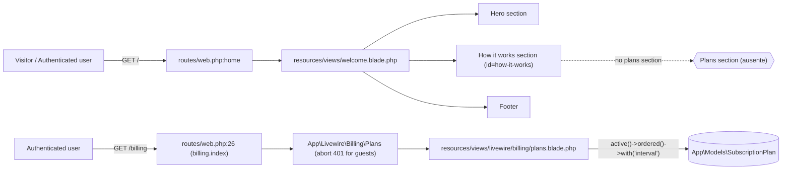

# SPEC: welcome-plans-section

## Metadata

| Field           | Value                                                                 |
|-----------------|-----------------------------------------------------------------------|
| **Status**      | draft                                                                 |
| **Tier**        | light                                                                 |
| **Slug**        | welcome-plans-section                                                 |
| **Created at**  | 2026-07-16                                                            |
| **Related routes**  | `GET /` (`home`)<br/>`GET /register` (`register`)<br/>`GET /billing` (`billing.index`) |
| **Related models**  | `App\Models\SubscriptionPlan` (verified scope: `active()`, `ordered()`)<br/>`App\Models\SubscriptionInterval` (relation `interval()` BelongsTo; column `slug` — verified) |
| **Related factories** | `Database\Factories\SubscriptionPlanFactory` (states: `inactive()`, `monthly()`, `yearly()`, `withInterval($slug)`) |
| **Architecture references** | `AGENTS.md` (Laravel 13 / Livewire 4 / Pest 4 / Flux UI v2 / Tailwind 4 conventions)<br/>`config/livewire.php` — **missing** (Livewire 4 ships no config file; component_locations default to `resources/views/components`, SFC ⚡ prefix is a Livewire 4 convention, confirmed by existing `resources/views/pages/settings/⚡profile.blade.php`) |

## Context

The public Welcome page (`/`, view `resources/views/welcome.blade.php`) currently ends with a "How it works" section and the footer. Visitors who land on the marketing page have no visibility into subscription pricing before signing up, forcing them to register and navigate to `/billing` to discover plans. This slice introduces a guest-safe plans section into the same Welcome blade, sourced from the same `App\Models\SubscriptionPlan` model that powers the authenticated billing screen (`app/Livewire/Billing/Plans.php` + `resources/views/livewire/billing/plans.blade.php`), so copy and price labels stay in sync with one source of truth.

The existing billing view (`livewire/billing/plans.blade.php`) is auth-gated via `Billing\Plans::mount()` calling `abort(401)`. The new Welcome component MUST NOT inherit that guard — it must render for guests and conditionally redirect CTAs (`register` vs `billing.index`) based on auth state.

The Welcome page already establishes the visual language: `glass-card`, `gradient-generate`, `font-serif` headings, `text-on-surface` text, `border-white/10` borders, `bg-primary/15` glows, `material-symbols-outlined` icons. The new section MUST reuse those tokens — no new colors, gradients, or fonts.

The Welcome plans section exposes a **client-side billing-interval toggle** between `Monthly` and `Annual`. The toggle is a single Alpine.js `x-data` state container; it MUST NOT trigger a Livewire round-trip, MUST NOT use `wire:click`/`wire:model`, and MUST default to `month`. Both lists (`month` + `year`) are loaded in the same `render()` call — switching is a pure DOM `x-show` toggle. The `intervals` table is seeded by `CatalogSeeder` for both `'month'` and `'year'` slugs (verified at `database/seeders/CatalogSeeder.php:307`); if a fresh test DB omits them, the empty-state card must render per interval.

## AS IS — Estado atual



_Legenda PT-BR: A Welcome hoje termina em "How it works" + footer; não há listagem de planos nem toggle. O único caminho para ver preços é autenticar-se e ir a `/billing`, cujo componente é estritamente auth-gated. (Verificado em `resources/views/welcome.blade.php:171–237` e `app/Livewire/Billing/Plans.php:14–19`.)_

## TO BE — Estado proposto

```mermaid
flowchart LR
  Visitor[Visitor / Authenticated user] -->|GET /| RouteHome["routes/web.php:home"]
  RouteHome --> WelcomeView["resources/views/welcome.blade.php"]
  WelcomeView --> HeroSection[Hero section]
  WelcomeView --> HowItWorksSection["How it works section (id=how-it-works)"]
  WelcomeView --> NEW_WelcomePlansView["resources/views/components/⚡welcome/plans.blade.php (novo) — renderizado entre How it works e Footer"]
  WelcomeView --> Footer[Footer]

  NEW_WelcomePlansView -->|"guest-safe render()<br/>no mount() abort"| NEW_WelcomePlansClass["App\Livewire\Welcome\Plans (novo)"]
  NEW_WelcomePlansClass -->|"Dual query (uma chamada de render)<br/>active()->ordered()->with('interval')->whereHas('interval', slug='month')->limit(3)"| MonthList["Lista mensal (RF-02)"]
  NEW_WelcomePlansClass -->|"active()->ordered()->with('interval')->whereHas('interval', slug='year')->limit(3)"| YearList["Lista anual (RF-02)"]
  NEW_WelcomePlansClass -->|"@guest CTA → route('register')<br/>@auth CTA → route('billing.index')"| CTAGuest["Link 'Criar conta e assinar' (novo)"]
  NEW_WelcomePlansClass -->|"@auth CTA → route('billing.index')"| CTAAuth["Link 'Assinar :name' (novo)"]

  NEW_WelcomePlansView -->|"wrapper x-data='{ interval: \"month\" }' (RF-07)"| AlpineState["Alpine.js state local — sem wire:click, sem round-trip"]
  AlpineState -->|"x-on:click='interval = \"month\"'"| MonthlyBtn["Botão Monthly (novo)"]
  AlpineState -->|"x-on:click='interval = \"year\"'"| AnnualBtn["Botão Annual (novo)"]
  AlpineState -->|"x-show=\"interval === 'month'\""| MonthGrid["Grid mensal (RF-07)"]
  AlpineState -->|"x-show=\"interval === 'year'\""| YearGrid["Grid anual (RF-07)"]
  MonthGrid -.->|"lista vazia"| EmptyMonth["Empty card 'inventory_2' (RF-08)"]
  YearGrid -.->|"lista vazia"| EmptyYear["Empty card 'inventory_2' (RF-08)"]

  NEW_WelcomePlansView -.estilos.-> DesignTokens["Tokens visuais já existentes: glass-card, gradient-generate, font-serif, text-on-surface, border-white/10"]
```

_Legenda PT-BR: A Welcome ganha uma nova seção de planos entre "How it works" e o footer, renderizada por um componente Livewire 4 SFC guest-safe em `resources/views/components/⚡welcome/plans.blade.php` (RF-01, RF-03). O componente realiza **uma única** `render()` que carrega duas listas limitadas a 3 (RF-02: `whereHas('interval', slug='month'|'year')`). No markup, um wrapper com `x-data="{ interval: 'month' }"` e dois botões que mutam apenas o estado Alpine — sem `wire:click`, sem request ao servidor (RF-07). Cada grid usa `x-show` para alternar. Se a lista de um intervalo está vazia, renderiza-se o mesmo card muted com ícone `material-symbols-outlined inventory_2` (RF-08). O CTA bifurca em runtime por estado de auth, realizando RF-04 independente do intervalo visível. Tokens visuais reaproveitados sem introduzir novos (RF-05)._

## Scope

- **In**
  - Renderizar uma seção de listagem de planos em `/` entre "How it works" (id `how-it-works`) e o `<footer>`.
  - **Dual query** (uma única `render()`): `SubscriptionPlan::query()->active()->ordered()->with('interval')->whereHas('interval', fn ($q) => $q->where('slug', 'month'))->limit(3)->get()` **e** o análogo para `slug = 'year'`, cada uma **independente e limitada a 3**. A relação `interval()` (BelongsTo) e a coluna `slug` em `SubscriptionInterval` foram verificadas em `app/Models/SubscriptionPlan.php:88–91` e `app/Models/SubscriptionInterval.php:25–28`.
  - Reaproveitar visualmente o card de plano já existente em `resources/views/livewire/billing/plans.blade.php` (validado pelo screenshot de referência em `/home/eliel/Imagens/Capturas de tela/Captura de tela de 2026-07-16 08-35-07.png`): mesma badge "Popular" no primeiro, mesmo `text-4xl` no preço, mesma linha de créditos com ícone `bolt`, mesmo CTA full-width.
  - Componente Livewire 4 SFC guest-safe, sem `mount()` que aborte, localizado em `resources/views/components/⚡welcome/plans.blade.php` (caminho final sujeito à convenção do projeto, verificado nos arquivos `⚡profile.blade.php`, `⚡show.blade.php` etc.).
  - **Toggle client-side Alpine.js**: wrapper único com `x-data="{ interval: 'month' }"` (RF-07); dois botões `Monthly`/`Annual` (`x-on:click="interval = '…'"`); um grid por intervalo com `x-show`; **sem** `wire:click`, `wire:model`, `@click.live`, ou qualquer chamada Livewire.
  - **Empty state por intervalo** (RF-08): se a lista do intervalo visível vier vazia, renderizar o mesmo card muted com ícone `material-symbols-outlined inventory_2` e mensagem localizada.
  - CTA dinâmico por auth state: `route('register')` para guests, `route('billing.index')` para autenticados — permanece válido **independentemente** do intervalo atualmente exibido (RF-04).
  - Visual consistente com o restante da Welcome (tokens listados em RF-05), sem novos gradientes/cores.
  - Cobertura de teste Pest em `tests/Feature/Livewire/WelcomePlansTest.php`, totalizando **8 testes** (RF-06): os 6 prévios + 2 novos do toggle.

- **Out**
  - Mudanças no fluxo de checkout (Stripe Checkout, StartCheckoutAction, billing portal session).
  - CRUD de planos (criação/edição/exclusão de `SubscriptionPlan`).
  - Mudanças no componente `App\Livewire\Billing\Plans` existente (continua auth-gated).
  - Alterações em rotas — `billing.index`, `register`, `home` permanecem inalteradas.
  - Internacionalização de strings PT-BR hardcoded em `livewire/billing/plans.blade.php` (escopo separado).
  - Modificação do layout principal, header, hero, "How it works" ou footer da Welcome.
  - Cache/otimização de queries no modelo `SubscriptionPlan`.
  - Persistência do estado do toggle entre refresh (não persistir por padrão; ver FLEXIBLE).
  - Versionamento de API ou feature flags.

## RIGID (Non-Negotiable)

### Functional Requirements

- **RF-01** [Event-Driven — Trigger]: When `GET /` is resolved, the view `resources/views/welcome.blade.php` MUST render a plans listing section **after** the closing `</section>` of the "How it works" block (anchor `id="how-it-works"`, currently at `resources/views/welcome.blade.php:172–223`) and **before** the opening `<footer>` element (currently at `resources/views/welcome.blade.php:226`).
  - AC: `php artisan test --filter=it_renders_plans_below_how_it_works` passes — DOM assertion finds the plans section markup positioned between `#how-it-works` and `footer` in the rendered HTML.

- **RF-02** [Conditional — Data Source]: The plans listing MUST be sourced from `App\Models\SubscriptionPlan` via **two queries executed in the same `render()`** (no extra round-trip on toggle). Both queries use the shared chain `active()->ordered()->with('interval')` and `whereHas('interval', fn ($q) => $q->where('slug', $intervalSlug))`, then `->limit(3)->get()`:
  - **Monthly branch**: `whereHas('interval', fn ($q) => $q->where('slug', 'month'))->limit(3)`.
  - **Yearly branch**: `whereHas('interval', fn ($q) => $q->where('slug', 'year'))->limit(3)`.
  - The relation is `SubscriptionPlan::interval()` (`BelongsTo` to `SubscriptionInterval`), verified at `app/Models/SubscriptionPlan.php:88–91`. The column on `SubscriptionInterval` is `slug`, verified at `app/Models/SubscriptionInterval.php:25–28`. Cap is **3 per interval**, evaluated independently.
  - AC: `php artisan test --filter=it_renders_only_active_plans_in_sort_order_and_caps_at_three` passes — given 4 monthly active plans (`sort_order=10,20,30,40`) + 4 yearly active plans + 1 inactive plan, the rendered markup for **each** interval contains exactly 3 plan cards in `sort_order` ascending order; the 4th plan of each interval is absent; the inactive plan is absent.

- **RF-03** [State-Driven — Architecture]: The plans section MUST be rendered by a Livewire 4 Single-File Component (SFC) using the `⚡` emoji prefix convention observed in `resources/views/pages/settings/⚡profile.blade.php` and `resources/views/components/projects/⚡show.blade.php`. The file MUST live under `resources/views/components/` so it is auto-discovered by Livewire 4's default component locations (no `config/livewire.php` exists in this project — Livewire 4 ships none, defaults are baked in).
  - **Card markup reuse [RIGID]**: The Welcome plans card MUST be the same visual card as `resources/views/livewire/billing/plans.blade.php` (≈lines 27–76), confirmed against the developer's screenshot reference (`/home/eliel/Imagens/Capturas de tela/Captura de tela de 2026-07-16 08-35-07.png`). The card MUST include: a "Popular" badge on the first plan (matching `$loop->first` styling), `<h2>` with `capitalize`, plan description paragraph, `text-4xl` price + `/ mês` (or ` / ano`, derivado de `interval->slug`) suffix, credits-per-period row with `bolt` icon, and a full-width primary/secondary CTA button. NO visual divergence from the billing card.
  - AC: The file `resources/views/components/⚡welcome/plans.blade.php` exists; `php artisan test --filter=it_uses_sfc_welcome_plans_component` passes asserting `<livewire:welcome.plans />` (or equivalent tag resolved by Livewire's SFC resolver) renders without throwing.

- **RF-04** [Conditional — Auth-Aware CTA]: For each plan card rendered, the CTA MUST be:
  - `@guest` → anchor with `href="{{ route('register') }}"` and a translated label equivalent to "Create account and subscribe" (en: `__('Sign up and subscribe')` or similar — exact copy is FLEXIBLE).
  - `@auth` → anchor with `href="{{ route('billing.index') }}"` and a translated label equivalent to "Subscribe to :name" (en: `__('Subscribe to :name', ['name' => $plan->name])` or similar — exact copy is FLEXIBLE).
  - Both routes are verified to exist: `route('register')` and `route('billing.index')` (registered at `routes/web.php:26`).
  - **Auth-awareness is independent of the visible interval** — the toggle changing `month` ↔ `year` MUST NOT change the CTA target; the CTA is computed per render, not per click.
  - AC: `php artisan test --filter=it_shows_register_cta_for_guests_and_billing_cta_for_authenticated_users` passes — guest visit shows `href="/register"` per plan card (in both monthly and yearly grids when both are populated); authenticated visit (using `$this->actingAs($user)`) shows `href="/billing"` per plan card.

- **RF-05** [State-Driven — Visual Consistency]: The section MUST reuse the existing Welcome design tokens only — `font-serif` for section/plan titles, `glass-card` for card surfaces, `gradient-generate` for the primary CTA button, `text-on-surface` for primary text, `border-white/10` (or existing `border-white/5`/`border-white/20` variants already in Welcome) for card borders. NO new CSS variables, NO new Tailwind colors, NO new gradients. The section header MUST mirror the "How it works" header pattern: a kicker badge (`auto_awesome` icon + uppercase tracked text), a `font-serif` `h2` title, and a muted description paragraph.
  - AC: `php artisan test --filter=it_uses_existing_welcome_design_tokens` passes — rendered HTML contains the literal class substrings `font-serif`, `glass-card`, `gradient-generate`, `text-on-surface`, `border-white/10`. No new CSS custom property declarations are introduced.

- **RF-06** [Event-Driven — Test Coverage]: The feature MUST be covered by Pest tests in `tests/Feature/Livewire/WelcomePlansTest.php` — **exactly 8 tests**:
  1. `it_renders_plans_below_how_it_works` — section position (AC of RF-01).
  2. `it_renders_only_active_plans_in_sort_order_and_caps_at_three` — dual cap-3 / active / sort (AC of RF-02).
  3. `it_uses_sfc_welcome_plans_component` — SFC resolution (AC of RF-03).
  4. `it_shows_register_cta_for_guests_and_billing_cta_for_authenticated_users` — CTA bifurcation (AC of RF-04).
  5. `it_uses_existing_welcome_design_tokens` — design tokens (AC of RF-05).
  6. `it_creates_and_renders_a_plan_via_factory` — factory path.
  7. `it_renders_monthly_and_yearly_grids_with_toggle` — **NEW** (AC of RF-07): response of `GET /` contains both monthly and yearly grid roots, plus the toggle pill (`Monthly`/`Annual` buttons and the Alpine `x-data` wrapper).
  8. `it_caps_each_interval_at_three_plans` — **NEW** (AC of RF-02 dual + RF-07): with 4 active monthly plans + 4 active yearly plans + 1 inactive plan, the rendered monthly grid contains exactly 3 cards, the yearly grid contains exactly 3 cards, and the inactive plan is absent from both.
  - AC: `php artisan test --filter=WelcomePlansTest` runs all **8** assertions green; the test file is committed at the specified path.

- **RF-07** [State-Driven — Toggle]: The plans section MUST let visitors toggle between **monthly** and **annual** views using a **client-side Alpine.js control**, with **no Livewire state** and **no server round-trip**:
  - The Alpine state container MUST be a single `x-data="{ interval: 'month' }"` wrapper around the toggle + both grids. Default value of `interval` MUST be `'month'`.
  - The toggle MUST be implemented as two buttons (`Monthly` / `Annual`) inside a pill-shaped container, using **only** Alpine bindings (`x-on:click="interval = 'month'"`, `x-on:click="interval = 'year'"`).
  - The two grids MUST be revealed via `x-show="interval === 'month'"` (monthly) and `x-show="interval === 'year'"` (yearly); the `month` grid is visible by default.
  - The toggle MUST NOT use `wire:click`, `wire:model`, `wire:model.live`, `@click.live`, `$wire.$set(...)`, or any other mechanism that triggers a Livewire/AJAX request to the server. Clicking either button MUST NOT produce an HTTP request observed by Livewire's network inspection.
  - The Alpine attribute `data-no-livewire` is RECOMMENDED on the wrapper (FLEXIBLE) to document the constraint, but the no-network-round-trip property is RIGID.
  - AC: `php artisan test --filter=it_renders_monthly_and_yearly_grids_with_toggle` passes — response contains both grid roots AND the toggle pill with the Alpine `x-data` wrapper around them.

- **RF-08** [Conditional — Empty State]: When the loaded list for a given interval (`month` or `year`) is empty (`count($plans[$key]) === 0`), the corresponding grid MUST render a single muted empty-state card containing:
  - The icon `material-symbols-outlined` with the literal glyph `inventory_2` (verified convention from the existing Welcome/billing empty state).
  - A localized message equivalent to `__('No plans available for this interval right now.')`.
  - Same `glass-card` surface + muted text classes used elsewhere in the section.
  - This applies **independently per interval**: monthly grid may render the empty card while yearly grid renders plans (or vice-versa).
  - AC: `it_renders_monthly_and_yearly_grids_with_toggle` (or a sibling case) verifies the empty-state markup appears when the `year` list is empty (interval `'year'` not seeded); `it_caps_each_interval_at_three_plans` keeps both intervals populated, ensuring the empty card is absent when data exists.

### Non-Functional Requirements

- **RNF-01**: The added component MUST NOT introduce an N+1 query — `with('interval')` eager load MUST remain on **both** branches, verified by `php artisan test` running with `DB::enableQueryLog()` and asserting query count stays ≤ 5 for the `render()` call (2× plans + 2× intervals eager-load + session/auth check).
- **RNF-02**: The component MUST render for guests without redirecting to `/login` or `/register`. The existing `Billing\Plans::mount()` guard MUST NOT be reused.
- **RNF-03**: All user-facing strings MUST be wrapped in `__()` (English copy baseline), matching the current Welcome convention (`resources/views/welcome.blade.php` lines 5, 19, 22, 26, 29, 42, 47, 54, 72, 76, 81, 85, 97, 107, 114, 117, 162, 163, 177, 180, 182, 193, 194, 205, 206, 217, 218, 229, 232, 233, 234).
- **RNF-04 [No-Livewire-Round-trip]**: Clicking the Monthly or Annual toggle MUST NOT generate any HTTP request to the server (Livewire AJAX or otherwise). Tested by inspecting the rendered markup for absence of `wire:click` / `wire:model` inside the toggle container and confirming the Alpine `x-data` is the only state mechanism on the wrapper.

## FLEXIBLE (Implementation Suggestions)

- [FLEXIBLE] **Layout grid**: `grid grid-cols-1 md:grid-cols-2 lg:grid-cols-3 gap-6` on the plan card container — stack on mobile, 2-up on tablet, 3-up on desktop (limit aligns with the 3-plan cap). Mirrors the pattern in `livewire/billing/plans.blade.php:25`.
- [FLEXIBLE] **"Popular" badge** on the first plan (matches existing billing view's `$loop->first` highlight at `livewire/billing/plans.blade.php:27,35–42`).
- [FLEXIBLE] **Section title copy**: en-US strings such as `__('Pricing')` (mirrors the existing nav anchor at `welcome.blade.php:26`) or `__('Choose your plan')` — whichever fits the kicker pattern.
- [FLEXIBLE] **Price formatting**: reuse `SubscriptionPlan::formattedPrice()` (defined at `app/Models/SubscriptionPlan.php:101–111`) and the `interval->slug === 'year' ? 'year' : 'month'` localized suffix (mirrors `livewire/billing/plans.blade.php:51,60`).
- [FLEXIBLE] **Component class placement**: `App\Livewire\Welcome\Plans` (new namespace) — alternative: keep classless and put logic in the SFC's `@php` block if the markup is purely presentational. Project convention favors a class (`app/Livewire/Billing/Plans.php` precedent).
- [FLEXIBLE] **`@island` usage**: optional — apply only if existing SFCs in this project use it (verify by reading `resources/views/pages/settings/⚡profile.blade.php` before deciding).
- [FLEXIBLE] **Toggle pill visual style**: exact palette for active/inactive states beyond `bg-primary text-white` (active) and `text-white/60 hover:text-white` (inactive) is open — `gradient-generate` may be reused on the active button if it fits. Container classes follow `bg-white/5 border border-white/10 rounded-full p-1` per the locked decision, but the inner button padding/text size is open.
- [FLEXIBLE] **Toggle persistence**: do **NOT** persist the toggle selection across refresh by default (no `localStorage`, no server-side cookie). A future enhancement may add persistence; this SPEC explicitly opts out.
- [FLEXIBLE] **Data attributes for testing**: `data-test="welcome-plans-section"`, `data-test="welcome-plans-toggle"`, `data-test="welcome-plans-grid-month"`, `data-test="welcome-plans-grid-year"`, `data-test="welcome-plan-card-{slug}"`, `data-test="welcome-plan-cta-{slug}"`, `data-test="welcome-plans-empty-{interval}"` — consistent with existing `data-test` patterns (`welcome-step-1`, `plan-card-{slug}`).
- [FLEXIBLE] **Empty state copy**: exact wording beyond `__('No plans available for this interval right now.')` is open.

## Out of scope

- Checkout flow changes (Stripe Checkout redirect, `StartCheckoutAction`).
- Billing portal session (`CreateBillingPortalSessionAction`).
- Plan CRUD UI / admin screens for `SubscriptionPlan`.
- Modifying `App\Livewire\Billing\Plans` or `resources/views/livewire/billing/plans.blade.php`.
- Adding new routes or modifying route definitions in `routes/web.php`.
- Modifying the Welcome layout (`header`, hero, "How it works", footer).
- Cache layers or query optimization beyond the `with('interval')` eager load on both branches.
- Internationalization of PT-BR strings already hardcoded in `livewire/billing/plans.blade.php`.
- Feature flags, A/B testing infrastructure.
- Analytics tracking on the new section.
- Toggle state persistence (localStorage, cookies, session).

## Open Questions

`[]` — no `[NEEDS CLARIFICATION]` markers required. All code-shaped literals verified before freeze:

- `route('billing.index')` — verified at `routes/web.php:26`.
- `route('register')` — verified (Fortify default route registration).
- `SubscriptionPlan::active()` scope — verified at `app/Models/SubscriptionPlan.php:71–74`.
- `SubscriptionPlan::ordered()` scope — verified at `app/Models/SubscriptionPlan.php:80–83`.
- `SubscriptionPlan::interval()` relation (singular, `BelongsTo`) — verified at `app/Models/SubscriptionPlan.php:88–91`.
- `SubscriptionInterval::slug` column — verified at `app/Models/SubscriptionInterval.php:25–28`.
- `SubscriptionPlanFactory` with `inactive()`, `monthly()`, `yearly()`, `withInterval($slug)` states — verified at `database/factories/SubscriptionPlanFactory.php:35–59`.
- `CatalogSeeder` seeds both `slug='month'` and `slug='year'` — verified at `database/seeders/CatalogSeeder.php:307`.
- SFC `⚡` prefix convention — verified by `resources/views/pages/settings/⚡profile.blade.php` and `resources/views/components/projects/⚡show.blade.php`.
- `config/livewire.php` — confirmed **missing** (Livewire 4 ships no config file; defaults baked in — `resources/views/components/` is auto-discovered).

## Acceptance Tests

| AC   | Test method                                                                                       | Asserts                                                                                            |
|------|---------------------------------------------------------------------------------------------------|----------------------------------------------------------------------------------------------------|
| AC1  | `it_renders_plans_below_how_it_works`                                                             | Plans section appears between `#how-it-works` and `<footer>` in the rendered `/` response.         |
| AC2  | `it_renders_only_active_plans_in_sort_order_and_caps_at_three`                                    | 4 monthly + 4 yearly active plans → exactly 3 cards per interval in `sort_order` ascending; 4th per interval and the inactive plan are absent. |
| AC3  | `it_uses_sfc_welcome_plans_component`                                                             | `<livewire:welcome.plans />` (or equivalent) resolves and renders without error from `/`.          |
| AC4  | `it_shows_register_cta_for_guests_and_billing_cta_for_authenticated_users`                        | Guest visit → CTA `href="/register"` per card in both grids; `actingAs($user)` visit → CTA `href="/billing"` per card in both grids. |
| AC5  | `it_uses_existing_welcome_design_tokens`                                                          | Rendered HTML contains `font-serif`, `glass-card`, `gradient-generate`, `text-on-surface`, `border-white/10`. |
| AC6  | `it_creates_and_renders_a_plan_via_factory`                                                       | Factory-created plan appears in the response.                                                       |
| AC7  | `it_renders_monthly_and_yearly_grids_with_toggle`                                                 | Response contains both monthly and yearly grid roots **and** the toggle pill with Alpine `x-data="{ interval: 'month' }"`; the `Monthly` and `Annual` buttons are present; no `wire:click` inside the toggle. |
| AC8  | `it_caps_each_interval_at_three_plans`                                                            | With 4 active monthly + 4 active yearly + 1 inactive plan, monthly grid renders exactly 3, yearly grid renders exactly 3, inactive plan absent from both. |

## Distribution by Repo

_Not applicable — single-repo feature; `kindrad-canvas` only. Omitted per `light` tier convention._
