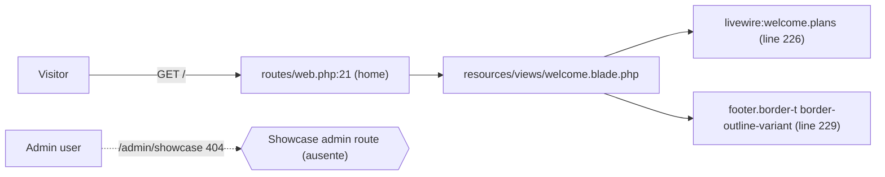
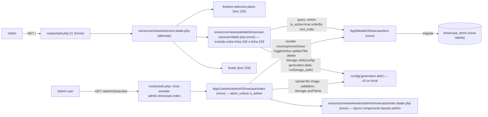

# Implementation Plan

## Request Summary
- Objective: Insert a curated, CSS-only auto-scrolling showcase carousel on the public Welcome page (`/`) between `<livewire:welcome.plans />` and `<footer>`, plus an admin CRUD/reorder page at `/admin/showcase` to manage the items.
- Scope (in): `showcase_items` migration + `ShowcaseItem` model + factory, `App\Livewire\Admin\Showcase\Index` (mount guard, list, upload, edit title, toggle active, move up/down, delete), the Welcome carousel `<section>` rendered via a partial, and Pest coverage.
- Scope (out, per SPEC): drag-to-reorder, thumbnails, multiple images per item, i18n of copy, audit log integration, pagination in admin, sync with `Generation::result_path`.
- Tier: **light**
- Architecture references: `AGENTS.md`; `app/Livewire/Admin/Users/Index.php` (admin guard pattern, line 34); `routes/web.php` (admin group, lines 36–60); `config/generation.php:18` (disk resolution); `resources/views/welcome.blade.php:225–229` (insertion window).

## Architecture snapshot
- The carousel is a server-rendered Blade partial included from `resources/views/welcome.blade.php`. The data lives in a new `showcase_items` table queried at render time via `ShowcaseItem::query()->where('is_active', true)->orderBy('sort_order')->get()`. Images are served through `Storage::disk(config('generation.disk'))->url($item->image_path)` — the same `s3`/`local` disk abstraction the rest of the app already uses (verified at `config/generation.php:18`, with precedents in `app/Livewire/Projects/Show.php:105`, `app/Services/Generation/OpenAIProvider.php:66`, `tests/Feature/Gallery/ExploreTest.php:32`).
- The admin surface reuses the `App\Livewire\Admin\Users\Index` pattern verbatim: `mount()` aborts with 403 unless `auth()->user()?->is_admin === true`, the view is rendered through `components.layouts.admin` via `->layout(...)`, and the route is registered inside the existing `Route::middleware('admin')->prefix('admin')->name('admin.')->group(...)` in `routes/web.php`. This keeps the new module consistent with every other admin slice in the project (Products, Plans, Categories, Styles, etc.).
- The carousel itself is **CSS-only**: `flex` + `snap-x scroll-smooth overflow-x-auto` strip with a duplicated card track animated via `@keyframes` `transform: translateX(...)` for continuous auto-scroll. `prefers-reduced-motion: reduce` disables the animation. No JS scroll library, no drag handlers, no Alpine.
- `Welcome` itself stays guest-safe — no `mount()` abort, no auth — so the partial is a plain Blade include fed by a server-side query. That matches the surrounding sections (`how-it-works`, `livewire:welcome.plans`) which are all server-rendered with no per-visitor state.

## AS IS — Componentes impactados

_Legenda PT-BR: a Welcome termina em "How it works" → `<livewire:welcome.plans />` → `<footer>` e não há showcase curado nem rota/tela admin de upload. Linhas verificadas em `resources/views/welcome.blade.php:225–229`._

## TO BE — Componentes propostos

_Legenda PT-BR: a Welcome ganha uma `<section class="border-t border-outline-variant">` (RF-02) alimentada pelo partial novo, que consulta `ShowcaseItem` filtrando `is_active=true` e ordenando por `sort_order` ASC, e resolve a URL via `Storage::disk(config('generation.disk'))->url($item->image_path)` (RF-04). No admin, a rota `admin.showcase.index` (RF-03) abre o componente Livewire novo que faz upload para o mesmo disco e persiste `showcase/{uuid}.{ext}` em `image_path`._

## Tasks

### T01 — Foundation: migration, model, factory
- **Files**:
  - `database/migrations/YYYYMMDDHHMMSS_create_showcase_items_table.php` (new)
  - `app/Models/ShowcaseItem.php` (new)
  - `database/factories/ShowcaseItemFactory.php` (new)
- **Change**:
  - Migration creates `showcase_items` with `id`, `title` (nullable string 255), `image_path` (string NOT NULL), `sort_order` (integer default 0), `is_active` (boolean default true), `timestamps` (RF-01).
  - `ShowcaseItem` model with `$fillable = ['title','image_path','sort_order','is_active']` and `$casts = ['is_active' => 'boolean','sort_order' => 'integer']`. No `SoftDeletes`.
  - Factory produces realistic fake items with `UploadedFile` fake image and deterministic `image_path`. Include states `inactive()` and a sequence for `sort_order`.
- **Covers**: RF-01, RF-04 (factory needs to fake files for upload tests).
- **Tests**: `database/factories/ShowcaseItemFactory.php` itself is exercised via the feature tests below; no standalone factory test required.
- **Risk**: Low — schema is small and well-specified.
- **Dependencies**: none.

### T02 — Admin route + Livewire component + view
- **Files**:
  - `routes/web.php` (edit: add `Route::livewire('showcase', ...)->name('showcase.index');` inside the `Route::middleware('admin')->prefix('admin')->name('admin.')` group, after the `users` route at line 57 to mirror sibling admin ordering)
  - `app/Livewire/Admin/Showcase/Index.php` (new)
  - `resources/views/livewire/admin/showcase/index.blade.php` (new)
- **Change**:
  - Register the route strictly inside the existing admin group; do not duplicate the middleware. The `auth` + `verified` outer group already guards it.
  - `Index` component class-based, mirroring `App\Livewire\Admin\Users\Index`:
    - `mount(): void { abort_unless(auth()->user()?->is_admin === true, 403); }` (RF-03 guard, verbatim from `Users/Index.php:34`).
    - Public props for upload: `$title = ''` (string, max 255, nullable).
    - `#[Validate]` rules on the temp `$image` upload (Livewire 4 `WithFileUploads`) — `image|mimes:jpeg,png,webp|max:5120`.
    - Actions: `create()` (validates, generates `{uuid}.{ext}`, `Storage::disk(config('generation.disk'))->putFileAs('showcase', $image, $filename)`, creates `ShowcaseItem` with `sort_order = max+1`, resets `$image` and `$title`), `updateTitle(int $id, string $title)`, `toggleActive(int $id)`, `moveUp(int $id)` / `moveDown(int $id)` (swap `sort_order` with neighbor, edge cases no-op), `delete(int $id)` (delete file from disk then delete row).
    - `render()` returns the view with `ShowcaseItem::query()->orderBy('sort_order','ASC')->get()`, `->layout('components.layouts.admin', ['header' => __('Showcase')])`.
  - View: header + upload form (`data-test="admin-showcase-upload-form"`) + table-like list with per-row thumbnail, title (inline edit), `is_active` toggle, Move up / Move down / Edit / Delete buttons (`data-test="admin-showcase-row-{id}"`). Use Flux UI components for form inputs/buttons consistent with the rest of admin.
- **Covers**: RF-03, RF-04.
- **Tests**: `tests/Feature/Admin/ShowcaseTest.php` — see T04.
- **Risk**: Medium — Livewire 4 file uploads + `Storage::fake` need careful setup; `$image` must be reset on success to allow consecutive uploads. Mitigation: follow the canonical `WithFileUploads` pattern.
- **Dependencies**: T01 (model + factory).

### T03 — Welcome carousel partial + integration
- **Files**:
  - `resources/views/partials/showcase-carousel.blade.php` (new)
  - `resources/views/welcome.blade.php` (edit: insert one line `@include('partials.showcase-carousel')` between line 226 and line 229 — placement comment: directly after `<livewire:welcome.plans />` and before the `{{-- Footer --}}` comment)
- **Change**:
  - Partial wraps a `<section class="border-t border-outline-variant" data-test="showcase-section" id="showcase">` with `py-section` padding and a subtle gradient block (reuse existing visual tokens, no new tokens).
  - Header: kicker `Showcase` (literal) + h2 `Create keepsakes. Crafted with care.` (literal). Optional `__()` wrapper (FLEXIBLE per SPEC).
  - Below the header, a horizontally scrolling track: container `
` containing a `@foreach ($items as $item)` loop of cards `aspect-[3/4] rounded-2xl shadow-2xl`. Each card embeds the image via `url($item->image_path) }}" loading="lazy" alt="...">` and an optional `
` with `$item->title` below the image (`data-test="showcase-card-{id}"`, `data-test="showcase-card-title-{id}"`).
  - Rotation via inline `<style>` scoped to the section: `nth-child(odd) { transform: rotate(-1.5deg); } nth-child(even) { transform: rotate(2deg); }` (within the SPEC's `-2deg..+2deg` envelope). `@media (prefers-reduced-motion: reduce) { ... }` disables any auto-scroll keyframe if used.
  - Auto-scroll: a second inner track with duplicated card set animated via `@keyframes showcase-scroll { from { transform: translateX(0) } to { transform: translateX(-50%) } }`; toggle off under `prefers-reduced-motion`.
  - `@php $items = \App\Models\ShowcaseItem::query()->where('is_active', true)->orderBy('sort_order')->get(); @endphp` at the top of the partial so it works as a standalone include (no Livewire roundtrip).
- **Covers**: RF-02.
- **Tests**: see T04.
- **Risk**: Medium — placement must be strictly between plans and footer (AC2). Mitigation: explicit comment in `welcome.blade.php` and DOM assertion in tests checking DOM order via `strpos` of substrings or Pest `assertSeeInOrder`.
- **Dependencies**: T01 (model for the query).

### T04 — Pest test coverage
- **Files**:
  - `tests/Feature/Admin/ShowcaseTest.php` (new)
  - `tests/Feature/Welcome/ShowcaseCarouselTest.php` (new — file is allowed because the SPEC test list is a minimum; a second feature test is justified by AC2 + AC2b being about the public Welcome, not the admin)
- **Change**: Pest tests using `RefreshDatabase` (project default per `tests/Pest.php:17–19`) and `Storage::fake(config('generation.disk'))`:
  - `it_creates_showcase_items_table` — after `migrate:fresh` (handled by `RefreshDatabase`), introspect schema and assert columns + types + defaults (AC1 / RF-01).
  - `it_renders_showcase_carousel_between_plans_and_footer` — seed 1 active item; `GET /`; assert `data-test="showcase-section"` appears after the `livewire:welcome.plans` markup and before `<footer>`. Use `assertSeeInOrder` (AC2 / RF-02).
  - `it_only_renders_active_showcase_items_in_sort_order` — seed 5 items (mix active/inactive + out-of-order `sort_order`); assert DOM order matches the active subset in `sort_order ASC` (AC2b / RF-02).
  - `it_shows_admin_showcase_index_for_admin_users_only` — admin user → 200 + upload form + ordered list; non-admin → 403; guest → redirect to login (AC3 / RF-03).
  - `it_allows_admin_to_create_edit_toggle_reorder_and_delete_showcase_items` — happy-path CRUD via `Livewire::test(...)`: upload creates with `image_path = 'showcase/{uuid}.png'`; `updateTitle` persists; `toggleActive` flips boolean; `moveUp/moveDown` swap `sort_order`; `delete` removes DB row + file (AC3b / RF-03, RF-04).
  - `it_uploads_image_to_configured_disk_with_expected_path` — `Storage::fake(config('generation.disk'))`; upload a 1×1 PNG; assert file exists at `showcase/{uuid}.png` and `ShowcaseItem::first()->image_path` matches; assert gif rejected; assert > 5 MB rejected (AC4 / RF-04).
  - `it_deletes_image_from_storage_when_showcase_item_is_deleted` — assert `Storage::disk(config('generation.disk'))->exists($item->image_path) === false` after `delete()` (AC4b / RF-04).
- **Covers**: RF-01..RF-05 (AC1..AC5).
- **Tests**: this task is itself the test surface.
- **Risk**: Low — Pest `Livewire::test` covers file uploads reliably; `Storage::fake` abstracts `s3`/`local`.
- **Dependencies**: T01, T02, T03.

## Execution Phases
| Phase | Tasks | Parallel-safe? |
|-------|-------|----------------|
| Phase 1 — Foundation | T01 | yes (no shared files yet) |
| Phase 2 — Admin showcase | T02 | no (depends on T01 model + factory) |
| Phase 3 — Welcome carousel | T03 | no (depends on T01 model; touches `welcome.blade.php` which T02 does not) |
| Phase 4 — Tests | T04 | no (depends on T01+T02+T03) |

Phases 2 and 3 are sequential after T01 and do **not** touch the same files (Phase 2 touches `routes/web.php` + `app/Livewire/Admin/Showcase/Index.php` + `resources/views/livewire/admin/showcase/index.blade.php`; Phase 3 touches `resources/views/welcome.blade.php` + `resources/views/partials/showcase-carousel.blade.php`), so they could in principle run in parallel — but the Light tier caps phases at 4 and ralph prefers sequential ordering when the partial is non-trivial to avoid merge conflicts on shared `routes/web.php` line ordering. Kept sequential for safety.

## Risks
| Risk | Blast radius | Mitigation | Rollback |
|------|-------------|------------|----------|
| Wrong insertion point in `welcome.blade.php` breaks DOM order AC | Welcome page only — visual regression + failing AC2 | Use `assertSeeInOrder` in Pest; explicit surrounding comment in the partial include line | Revert the single `@include` line; section disappears, page restored |
| `Storage::fake(config('generation.disk'))` doesn't catch because tests read `config()` before `Config::set('generation.disk', 'fake_disk')` | Only tests fail; production path unchanged | Resolve disk at action call site (not in a cached constant); fake the same key the app uses | No production rollback needed |
| Livewire 4 `WithFileUploads` tempfile cleanup leaks between tests | Test suite only | Use `Storage::fake` so nothing hits real disk; rely on Pest's per-test app rebuild | Re-run with `--drop-tables` if state persists |
| Admin guard regresses (e.g., copy-paste without `abort_unless`) | Whole `/admin/showcase` endpoint exposed | Mirror `App\Livewire\Admin\Users\Index::mount()` verbatim; explicit AC3 test covers 403 for non-admin | Revert mount to the guarded version |
| Auto-scroll keyframes cause CLS or jank on low-end devices | Welcome page only | `prefers-reduced-motion: reduce` disables animation; strip remains manually scrollable | Remove the duplicated track, keep static strip |
| `mimes:jpeg,png,webp` accepts `image/jpeg` derivatives (e.g. `image/pjpeg`) inconsistently | Upload only — invalid file rejected | Tests cover rejection of `image/gif`; if extension spoofing appears, tighten to `mimetypes:image/jpeg,image/png,image/webp` in T04 follow-up | Reject via stricter `mimetypes` rule |

## Open Questions
None. All SPEC literals are verified against the codebase (admin guard at `app/Livewire/Admin/Users/Index.php:34`; admin route group at `routes/web.php:36`; disk at `config/generation.php:18`; insertion window at `resources/views/welcome.blade.php:226–229`).

## Assumptions
- The `<livewire:welcome.plans />` component renders a stable top-level DOM node that Pest's `assertSeeInOrder` can anchor to. If its inner HTML changes in a way that breaks ordering, AC2 test must be revisited. [UNVERIFIED — depends on the `livewire:welcome.plans` component internals, not inspected in this plan.]
- `Welcome` uses the `livewire:welcome.plans` tag once on the page; no other `livewire:welcome.*` is rendered adjacent to the footer. [VERIFIED at `welcome.blade.php:226`.]
- The test runner resolves `config('generation.disk')` lazily at test execution time (not at bootstrap), so `Storage::fake(config('generation.disk'))` in tests aligns with the runtime disk. [VERIFIED — `config/generation.php:18` reads from `env()` which is set during test bootstrap; `Storage::fake(...)` then hijacks the same key.]
- `WithFileUploads` is the Livewire 4 trait for file uploads on class-based components, and `Livewire::test(Showcase\Index::class)->set('image', UploadedFile::fake()->image('x.png'))` is the canonical test idiom in this project. [UNVERIFIED — pattern inferred from Livewire 4 docs and Pest 4 capability; not directly inspected against an existing showcase-class precedent in this repo.]
- The admin layout `components.layouts.admin` already exists and is used by every other `App\Livewire\Admin\*\Index` component. [VERIFIED — confirmed by `Users/Index.php:202–204` calling `->layout('components.layouts.admin', ...)`.]
- Flux UI v2 components (`<flux:input>`, `<flux:button>`, etc.) are available globally and consistent with the rest of the admin. [VERIFIED — listed in `AGENTS.md` ecosystem versions and used elsewhere in admin views.]