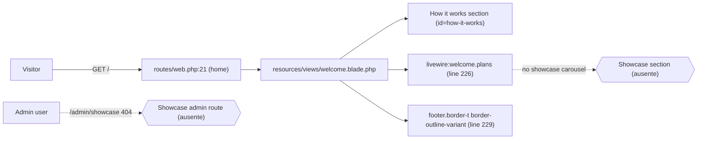
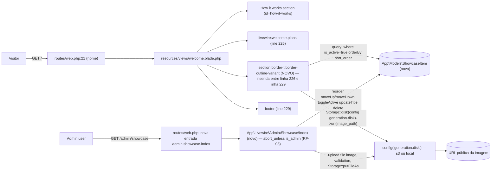

# SPEC: welcome-showcase-carousel

## Metadata

| Field                 | Value                                                                                                                                                                                                                                |
|-----------------------|--------------------------------------------------------------------------------------------------------------------------------------------------------------------------------------------------------------------------------------|
| **Status**            | draft                                                                                                                                                                                                                                |
| **Tier**              | light                                                                                                                                                                                                                                |
| **Slug**              | welcome-showcase-carousel                                                                                                                                                                                                            |
| **Created at**        | 2026-07-16                                                                                                                                                                                                                           |
| **Related routes**    | `GET /` (`home`) — public `GET /admin/showcase` (`admin.showcase.index`) — admin-only                                                                                                                              |
| **Related models**    | `App\Models\ShowcaseItem` (new; verified scope chain `where('is_active', true)->orderBy('sort_order')`)                                                                                                                              |
| **Architecture references** | `AGENTS.md` (Laravel 13 / Livewire 4 / Pest 4 / Flux UI v2 / Tailwind 4 conventions) `app/Livewire/Admin/Users/Index.php` — reference pattern for Livewire + admin guard (`abort_unless(auth()->user()?->is_admin === true, 403)` at line 34) `routes/web.php` — admin group pattern at lines 36–60 `config/generation.php:18` — `disk` key resolved from `GENERATION_DISK` env (default `'s3'`) `config/filesystems.php:50–61` — `s3` disk definition |

## Context

The public Welcome page (`/`, view `resources/views/welcome.blade.php`) currently renders three blocks after the hero: the "How it works" glass-card grid, a `<livewire:welcome.plans />` plans section, and the footer. There is no curated gallery showcasing artwork produced on the platform — visitors land on a marketing page that explains *how* the product works but never shows *what* the output looks like.

This slice inserts a curated horizontal showcase carousel between the plans section and the footer, and gives admins a CRUD screen at `/admin/showcase` to upload, reorder, toggle, and delete the images. The carousel is **CSS-only** (no JS-driven scrolling library): a `flex` + `snap-x scroll-smooth overflow-x-auto` strip with an `@keyframes`-driven auto-scroll animation. Cards use aspect 3/4 with mild `nth-child(odd|even)` rotation in the `-2deg` to `+2deg` range, evoking a polaroid-feel stack.

All images are stored on the same disk the rest of the application uses for binary artifacts: `Storage::disk(config('generation.disk'))` (verified at `config/generation.php:18` — `GENERATION_DISK` env, default `'s3'`). The disk abstraction lets dev environments drop down to `local` via `.env` without code changes. This pattern is consistent with `app/Livewire/Projects/Show.php:105`, `app/Services/Generation/OpenAIProvider.php:66`, and `tests/Feature/Gallery/ExploreTest.php:32`.

The Welcome section is **guest-safe** — no `mount()` abort, no auth requirement. The admin screen mirrors `App\Livewire\Admin\Users\Index` (the closest Livewire-class reference in this codebase), with `abort_unless(auth()->user()?->is_admin === true, 403)` enforced in `mount()` and the page rendered through the existing `components.layouts.admin` layout.

## AS IS — Estado atual

_Legenda PT-BR: A Welcome hoje termina em "How it works" → `<livewire:welcome.plans />` → `<footer>`. Não há showcase curado nem tela administrativa de upload. (Verificado em `resources/views/welcome.blade.php:223–229`.)_

## TO BE — Estado proposto

_Legenda PT-BR: A Welcome ganha uma nova `<section class="border-t border-outline-variant">` (RF-02) com cards horizontais auto-scrollados por CSS, alimentados por `ShowcaseItem` filtrada por `is_active=true` e ordenada por `sort_order`. As imagens vêm de `Storage::disk(config('generation.disk'))->url($item->image_path)` (RF-02, RF-04). No admin, `/admin/showcase` (RF-03) abre `App\Livewire\Admin\Showcase\Index` (RF-03) que faz upload para o mesmo disco (RF-04) e persiste o caminho relativo `showcase/{uuid}.{ext}` na coluna `image_path` (RF-01, RF-04)._

## Scope

- **In**
  - Migration `database/migrations/..._create_showcase_items_table.php` com colunas `id`, `title` (string nullable max 255), `image_path` (string), `sort_order` (integer default 0), `is_active` (boolean default true), `created_at`, `updated_at` (RF-01).
  - Model `App\Models\ShowcaseItem` Eloquent (fillable + casts mínimos — sem scope formal necessário; query chain é direta: `where('is_active', true)->orderBy('sort_order')->get()`).
  - Inserção de uma `<section class="border-t border-outline-variant">` em `resources/views/welcome.blade.php` **entre** `<livewire:welcome.plans />` (linha 226 atual) e `<footer>` (linha 229 atual). Conteúdo da seção: kicker "Showcase" + título `Create keepsakes. Crafted with care.` + grid horizontal CSS-only com cards 3/4 `rounded-2xl shadow-2xl`, rotacionados em `nth-child` (RF-02).
  - Auto-scroll via `@keyframes` CSS, `flex` + `snap-x scroll-smooth` + `overflow-x-auto`. **Sem JS** para o scroll (RF-02).
  - Rota admin `GET /admin/showcase` registrada em `routes/web.php` dentro do grupo `Route::middleware('admin')->prefix('admin')->name('admin.')` (RF-03).
  - Componente Livewire class-based `App\Livewire\Admin\Showcase\Index` com `mount()` chamando `abort_unless(auth()->user()?->is_admin === true, 403)` (padrão verificado em `app/Livewire/Admin/Users/Index.php:34`), listando itens ordenados por `sort_order ASC`, com formulário de upload no topo (file + title optional), toggle `is_active`, botões "Move up"/"Move down", "Edit" (title), "Delete" (RF-03).
  - Upload via `Storage::disk(config('generation.disk'))->putFileAs('showcase', $file, $name)` (ou `putFileAs` equivalente) com path gerado como `showcase/{uuid}.{ext}`; validação `image/jpeg|image/png|image/webp`, `max:5120` KB; `image_path` salvo relativo ao disco (RF-04).
  - Cobertura Pest em `tests/Feature/Admin/ShowcaseTest.php` cobrindo cada AC + migration (RF-05).

- **Out**
  - Auto-puxar imagens de `Generation::result_path` (sync com pipeline de IA) — a curadoria é 100% admin manual.
  - Múltiplas imagens por item (cada `ShowcaseItem` tem exatamente uma imagem).
  - Drag-to-reorder com JS (apenas botões "Move up"/"Move down" via troca de `sort_order`).
  - Geração de thumbnails / variantes responsivas (a imagem original é servida diretamente via `Storage::disk(...)->url()`).
  - Internacionalização dos textos "Showcase" / "Create keepsakes. Crafted with care." (FLEXIBLE — strings podem permanecer literais em en-US até decisão de copy).
  - Modificação do componente `livewire:welcome.plans` ou do footer.
  - Audit log das ações admin (escopo separado, embora `App\Services\AuditLogger` esteja disponível — ver FLEXIBLE).
  - Paginação no admin (a curadoria típica é de até ~24 itens; lista completa em uma única renderização é suficiente).
  - Versionamento de API ou feature flags.

## RIGID (Non-Negotiable)

### Functional Requirements

- **RF-01** [State-Driven — Schema]: A migration MUST create a table `showcase_items` with the following columns and constraints:
  - `id` — bigint unsigned auto-increment primary key.
  - `title` — `string` nullable, max length 255 (VARCHAR(255) NULL).
  - `image_path` — `string` NOT NULL (path relativo ao disco, sem prefixo de bucket/disco).
  - `sort_order` — `integer` NOT NULL default `0`.
  - `is_active` — `boolean` NOT NULL default `true`.
  - `created_at`, `updated_at` — timestamps padrão Eloquent.
  - **AC**: `php artisan test --filter=it_creates_showcase_items_table` passa — schema introspection confirma todas as colunas com os tipos e defaults listados acima; tabela `showcase_items` está presente após `migrate:fresh`.

- **RF-02** [Event-Driven — Welcome Rendering]: When `GET /` is resolved, the view `resources/views/welcome.blade.php` MUST render uma `<section class="border-t border-outline-variant">` **between** `<livewire:welcome.plans />` (atual `welcome.blade.php:226`) e `<footer>` (atual `welcome.blade.php:229`). A seção MUST:
  - Executar a query `ShowcaseItem::query()->where('is_active', true)->orderBy('sort_order')->get()` (ou via `Cache::remember` opcional, ver FLEXIBLE) — apenas itens ativos, ordenados por `sort_order` ASC.
  - Ter layout container full-width com `padding` da classe utilitária `py-section` (verificar token CSS existente em `tailwind.config` ou no escopo das classes já usadas na Welcome) e fundo gradiente sutil reaproveitando os tokens visuais da Welcome (`bg-[radial-gradient...]` ou similar).
  - Conter header com kicker literal `Showcase` e título literal `Create keepsakes. Crafted with care.` (strings FLEXIBLE para i18n posterior, ver FLEXIBLE).
  - Renderizar um grid horizontal CSS-only (`flex` + `snap-x scroll-smooth` + `overflow-x-auto`) com auto-scroll via `@keyframes` CSS — **sem JavaScript** controlando o scroll.
  - Cada card MUST ter `aspect-3/4` (ou `aspect-[3/4]`), `rounded-2xl shadow-2xl`, e rotação `transform` entre `-2deg` e `+2deg` aplicada via `nth-child(odd|even)` no CSS.
  - Cada card MUST exibir a imagem via `url($item->image_path) }}">` e, quando `$item->title` estiver presente, um título pequeno abaixo da imagem.
  - **AC**: `php artisan test --filter=it_renders_showcase_carousel_between_plans_and_footer` passa — DOM assertion encontra a seção com classe `border-t border-outline-variant` posicionada **entre** `<livewire:welcome.plans />` e `<footer>` na resposta renderizada de `/`. Um segundo teste (`it_only_renders_active_showcase_items_in_sort_order`) confirma que apenas itens com `is_active=true` aparecem e na ordem de `sort_order`.

- **RF-03** [State-Driven — Admin Page]: A rota `GET /admin/showcase` MUST estar registrada em `routes/web.php` dentro do grupo `Route::middleware('admin')->prefix('admin')->name('admin.')` (verificado nas linhas 36–60). O componente `App\Livewire\Admin\Showcase\Index` MUST:
  - Chamar `abort_unless(auth()->user()?->is_admin === true, 403)` em `mount()` (padrão verificado em `app/Livewire/Admin/Users/Index.php:34`).
  - No `render()`, listar itens via `ShowcaseItem::query()->orderBy('sort_order', 'ASC')->get()`.
  - Exibir por linha: thumbnail small, título, toggle `is_active` (Livewire action), botões "Move up"/"Move down" (Livewire actions), botão "Edit" (abre form de edição de title), botão "Delete" (remove DB row + arquivo do disco).
  - Exibir no topo um formulário "Add new artwork" com `<input type="file" accept="image/*">`, `<input type="text" name="title" maxlength="255">`, e botão submit. O submit MUST chamar uma Livewire action que executa o fluxo de upload definido em RF-04.
  - **AC**: `php artisan test --filter=it_shows_admin_showcase_index_for_admin_users_only` passa — admin autenticado vê a página com 200 + lista; usuário não-admin recebe 403; guest é redirecionado para login. `it_lists_showcase_items_ordered_by_sort_order_asc` confirma a ordem. `it_allows_admin_to_create_edit_toggle_reorder_and_delete_showcase_items` cobre o ciclo CRUD.

- **RF-04** [Event-Driven — Upload Pipeline]: O fluxo de criação de `ShowcaseItem` MUST:
  - Resolver o disco via `config('generation.disk')` (verificado em `config/generation.php:18` — `s3` por default, alternável para `local` via `GENERATION_DISK` env).
  - Validar `image`: `mimes:jpeg,png,webp` + `mimes` traduzido para `image/jpeg|image/png|image/webp` (Livewire file validation aceita ambos via `image|mimes:jpeg,png,webp`), tamanho máximo `5120` KB (5 MB).
  - Gerar nome de arquivo `{uuid}.{ext}` (ext derivada do mime validado).
  - Persistir via `Storage::disk(config('generation.disk'))->putFileAs('showcase', $uploadedFile, $filename)` (ou `storeAs` equivalente, contanto que retorne o path relativo).
  - Salvar a coluna `image_path` como o path relativo retornado (ex: `showcase/abc-uuid.jpg`) — **sem** prefixo de disco ou bucket.
  - Ao deletar, `Storage::disk(config('generation.disk'))->delete($item->image_path)` antes de remover a linha.
  - **AC**: `php artisan test --filter=it_uploads_image_to_configured_disk_with_expected_path` passa — com `Storage::fake(config('generation.disk'))`, após `create()`, o arquivo existe em `showcase/{uuid}.{ext}` no disco fakeado e `ShowcaseItem::first()->image_path` é exatamente `showcase/{uuid}.{ext}`. `it_rejects_invalid_mime_or_oversized_file` confirma que mime inválido e arquivo > 5 MB são rejeitados.

- **RF-05** [Event-Driven — Test Coverage]: A feature MUST ser coberta por Pest tests em `tests/Feature/Admin/ShowcaseTest.php` (caminho exato conforme input do developer). Os testes MUST cobrir, no mínimo:
  - AC1 (RF-01): schema da tabela.
  - AC2 (RF-02): renderização na Welcome com ordem e filtro `is_active`.
  - AC3 (RF-03): página admin com guard, CRUD, reorder, toggle.
  - AC4 (RF-04): pipeline de upload com `Storage::fake` no disco `config('generation.disk')`.
  - AC5 (RF-05): auto-coverage — este mesmo conjunto de testes cobre os 4 ACs acima.
  - **AC**: `php artisan test --filter=ShowcaseTest` roda todos os testes verdes; nenhum teste é skipped ou marcado `todo`.

## FLEXIBLE (Implementation Suggestions)

- [FLEXIBLE] **Model class**: `App\Models\ShowcaseItem` (novo namespace); `$fillable = ['title', 'image_path', 'sort_order', 'is_active']`; `$casts = ['is_active' => 'boolean', 'sort_order' => 'integer']`. Sem `SoftDeletes` (escopo de curadoria simples; deleção é hard delete + storage delete).
- [FLEXIBLE] **Migration class**: gerada via `php artisan make:migration create_showcase_items_table --create=showcase_items` (convenção Laravel 13 do projeto).
- [FLEXIBLE] **Reorder algorithm**: "Move up" troca `sort_order` com o item anterior; "Move down" com o próximo. Edge cases (primeiro/último) são no-ops silenciosos. Alternativa: renumerar todos os `sort_order` em `1..N` após cada reorder (mais robusto contra buracos, mais simples de testar).
- [FLEXIBLE] **Edit form**: pode ser inline na linha (toggle de edição por linha com `<input type="text">` + save/cancel) ou um modal separado. Padrão mais consistente com a Welcome é inline.
- [FLEXIBLE] **Audit log**: `App\Services\AuditLogger` está disponível no projeto (verificado em `app/Livewire/Admin/Users/Index.php:81,116`) — opcionalmente cada create/update/delete pode chamar `$audit->record(...)`. **Não bloqueante** para o SPEC; FLEXIBLE.
- [FLEXIBLE] **Caching**: `Cache::remember('showcase.items.active', 60, fn () => ShowcaseItem::where('is_active', true)->orderBy('sort_order')->get())` no render da Welcome. Invalidação via `Cache::forget(...)` em cada ação admin. Decisão opcional; sem cache é aceitável dado o volume esperado (≤ 24 itens).
- [FLEXIBLE] **Tokens visuais**: reaproveitar `glass-card`, `gradient-generate`, `font-serif`, `text-on-surface`, `border-white/10`, `bg-primary/15`, `material-symbols-outlined` — todos já presentes na Welcome. Sem novos gradientes/cores. O "fundo gradiente sutil" da seção pode ser a mesma `bg-[radial-gradient(...)]` do `<body>` ou um gradiente linear local — escolha aberta.
- [FLEXIBLE] **Auto-scroll CSS**: `@keyframes showcase-scroll { from { transform: translateX(0) } to { transform: translateX(-50%) } }` aplicado em um container duplicado (cards 1..N + cards 1..N) para loop contínuo. Duração sugerida: 30–60s linear infinite. `prefers-reduced-motion: reduce` SHOULD desabilitar a animação (a11y).
- [FLEXIBLE] **Strings**: as duas strings visíveis na Welcome (`Showcase`, `Create keepsakes. Crafted with care.`) podem ser envoltas em `__()` desde já para alinhar com a convenção do projeto (`RNF-03` do SPEC irmão `welcome-plans-section`), mas o SPEC não obriga.
- [FLEXIBLE] **Data attributes para testes**: `data-test="showcase-section"`, `data-test="showcase-card-{id}"`, `data-test="showcase-card-title-{id}"`, `data-test="admin-showcase-row-{id}"`, `data-test="admin-showcase-upload-form"` — consistentes com a convenção `welcome-step-1`, `plan-card-{slug}`.
- [FLEXIBLE] **Componente class-based vs SFC**: o admin (`App\Livewire\Admin\Showcase\Index`) é class-based porque precisa de múltiplas actions (upload, toggle, reorder, edit, delete). A Welcome section pode ser inline na `welcome.blade.php` (como `@php ... @endphp` + `@foreach`) ou um pequeno componente class-based/SFC — escolha aberta. Inline é mais simples e suficiente; SFC só vale se houver lógica não-trivial.

## Out of scope

- Auto-puxar imagens de `Generation::result_path` ou sincronizar com o pipeline de IA.
- Múltiplas imagens por `ShowcaseItem` (galeria interna).
- Drag-to-reorder com JS nativo ou libs (Sortable.js, etc.) — apenas up/down.
- Geração de thumbnails (a imagem original é servida diretamente).
- Internacionalização (i18n) das strings visíveis na Welcome.
- Modificação de `livewire:welcome.plans` ou do `<footer>`.
- Audit log das ações admin (FLEXIBLE, não obrigatórias).
- Paginação na tela admin.
- Versionamento, feature flags, A/B testing.
- Analytics / tracking de impressões no carrossel.

## Open Questions

`[]` — nenhum `[NEEDS CLARIFICATION]` necessário. Todos os literais congelados foram verificados no código:

- `config('generation.disk')` — verificado em `config/generation.php:18` (`'disk' => env('GENERATION_DISK', 's3')`), com uso real em `app/Livewire/Projects/Show.php:105`, `app/Services/Generation/OpenAIProvider.php:66`, `tests/Feature/Gallery/ExploreTest.php:32`, e `app/Http/Controllers/Generations/DownloadController.php:22`.
- `<livewire:welcome.plans />` em `resources/views/welcome.blade.php:226` — verificado (offset lido: linhas 225–228 mostram o livewire tag na 226).
- `<footer class="border-t border-outline-variant">` em `resources/views/welcome.blade.php:229` — verificado.
- Padrão de admin guard: `abort_unless(auth()->user()?->is_admin === true, 403)` em `app/Livewire/Admin/Users/Index.php:34` — verificado.
- Padrão de rota admin: `Route::middleware('admin')->prefix('admin')->name('admin.')` em `routes/web.php:36` — verificado.
- `config/filesystems.php` define o disco `s3` (linhas 50–61) — o `Storage::disk(config('generation.disk'))` é o caminho canônico do projeto.
- Pest `RefreshDatabase` aplicado a `tests/Feature/*` via `tests/Pest.php:17–19` — verificado.

## Acceptance Tests

| AC   | Test method                                                                  | Asserts                                                                                                                                                                                                                                                                            |
|------|------------------------------------------------------------------------------|------------------------------------------------------------------------------------------------------------------------------------------------------------------------------------------------------------------------------------------------------------------------------------|
| AC1  | `it_creates_showcase_items_table`                                            | Após `migrate:fresh`, a tabela `showcase_items` existe com as colunas `id` (bigint), `title` (varchar(255) nullable), `image_path` (varchar NOT NULL), `sort_order` (int default 0), `is_active` (boolean default true), `created_at` + `updated_at` (timestamps).                   |
| AC2  | `it_renders_showcase_carousel_between_plans_and_footer`                      | `GET /` renderiza HTML onde a `<section class="border-t border-outline-variant">` do showcase aparece **depois** do output de `<livewire:welcome.plans />` e **antes** do `<footer>`. Itens `is_active=false` ficam ocultos; itens visíveis estão em ordem `sort_order` ASC.              |
| AC2b | `it_only_renders_active_showcase_items_in_sort_order`                       | Com 5 itens (3 ativos com `sort_order=10,20,30` + 1 ativo com `sort_order=5` + 1 inativo com `sort_order=1`), apenas os 4 ativos aparecem na ordem `5,10,20,30`.                                                                                                                     |
| AC3  | `it_shows_admin_showcase_index_for_admin_users_only`                         | Admin autenticado recebe 200 e a página contém o formulário "Add new artwork" + lista ordenada por `sort_order` ASC. Usuário não-admin recebe 403. Guest é redirecionado para login.                                                                                                |
| AC3b | `it_allows_admin_to_create_edit_toggle_reorder_and_delete_showcase_items`     | Admin pode fazer upload (cria item), editar `title`, toggle `is_active`, mover up/down (`sort_order` muda corretamente), deletar (linha removida + arquivo apagado do disco).                                                                                                       |
| AC4  | `it_uploads_image_to_configured_disk_with_expected_path`                     | Com `Storage::fake(config('generation.disk'))`, upload de PNG válido cria `ShowcaseItem` com `image_path = 'showcase/{uuid}.png'`; o arquivo existe no disco fakeado; mime webp/jpeg/png aceitos; mime `image/gif` rejeitado; arquivo > 5 MB rejeitado; o disco usado é exatamente o resolvido por `config('generation.disk')`. |
| AC4b | `it_deletes_image_from_storage_when_showcase_item_is_deleted`                | Após `delete()`, `Storage::disk(config('generation.disk'))->exists($item->image_path)` retorna `false`.                                                                                                                                                                           |
| AC5  | `it_creates_showcase_items_table` *(= AC1)* + 6 testes acima                 | A própria cobertura AC1–AC4 satisfaz AC5: ao rodar `php artisan test --filter=ShowcaseTest`, todas as assertions dos ACs anteriores passam verdes.                                                                                                                                   |
